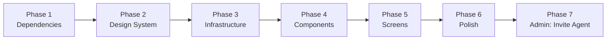

# Implementation Plan — Auth UI (`app-guideme`)

> **Stack:** React 19 · MUI v6 · TanStack Query · Zustand · React Hook Form + Zod · React Router v7  
> **Specs:** `docs/auth/frontend.spec.md`  
> **Architecture:** `CLAUDE.md`

---

## Phases

```
Phase 1 → Dependencies
Phase 2 → Design System (MUI theme)
Phase 3 → Infrastructure (router, services, store)
Phase 4 → Shared components
Phase 5 → Auth screens
Phase 6 → Polish and review
Phase 7 → Admin: Send Agent Invitation
```

---

## Phase 1 — Dependencies

### Task 1.1 — Install packages

```bash
pnpm --filter app-guideme add \
  @mui/material @mui/icons-material @emotion/react @emotion/styled \
  @tanstack/react-query \
  zustand \
  react-hook-form @hookform/resolvers zod \
  react-router-dom
```

### Task 1.2 — Google Fonts

In `app-guideme/index.html`: add link to **Inter** from Google Fonts.

### Task 1.3 — Clean up template

- Remove Cloudflare template code in `src/App.tsx`
- Clean up `src/App.css` and `src/index.css`
- Remove unused assets

**Deliverable:** The project runs without errors with the new stack installed.

---

## Phase 2 — Design System (MUI Theme)

### Task 2.1 — Create `src/config/theme.ts`

Define `createTheme()` with:

| Token | Value |
|---|---|
| `palette.primary` | Charcoal/Slate — `#1C1C2E` |
| `palette.secondary` | Indigo — `#4F46E5` |
| `palette.background.default` | `#F8F9FA` (off-white) |
| `palette.background.paper` | `#FFFFFF` |
| `typography.fontFamily` | `Inter, sans-serif` |
| `typography.h5.fontWeight` | `600` |
| `shape.borderRadius` | `8` |
| `shadows` | Reduce to subtle ones (max `0 2px 8px rgba(0,0,0,0.08)`) |

Component overrides:
- **`MuiButton`**: `borderRadius: 8`, `textTransform: none`, `fontWeight: 500`
- **`MuiTextField`**: `borderRadius: 8` on `OutlinedInput`
- **`MuiCard`**: `elevation: 0`, `border: 1px solid divider`, `borderRadius: 12`
- **`MuiLink`**: no underline by default, underline on hover

### Task 2.2 — Configure `src/main.tsx`

```tsx
<ThemeProvider theme={theme}>
  <CssBaseline />
  <QueryClientProvider client={queryClient}>
    <App />
  </QueryClientProvider>
</ThemeProvider>
```

**Deliverable:** MUI components adopt the elegant-minimalist style.

---

## Phase 3 — Infrastructure

### Task 3.1 — Routing (`src/config/routes.ts` + `src/App.tsx`)

```ts
export const ROUTES = {
  LOGIN: '/login',
  REGISTER: '/register',
  VERIFY: '/verify',
  FORGOT_PASSWORD: '/forgot-password',
  RESET_PASSWORD: '/reset-password',
  INVITE_ACCEPT: '/invite/accept',
  DASHBOARD: '/dashboard',
}
```

`<BrowserRouter>` with `<Routes>` in `App.tsx`. Lazy loading with `React.lazy` for each page.

### Task 3.2 — API Service (`src/services/authService.ts`)

| Function | Endpoint |
|---|---|
| `register(data)` | `POST /api/auth/register` |
| `verifyEmail(token)` | `GET /api/auth/verify?token=` |
| `login(data)` | `POST /api/auth/login` |
| `forgotPassword(email)` | `POST /api/auth/forgot-password` |
| `resetPassword(data)` | `POST /api/auth/reset-password` |
| `getInvite(token)` | `GET /api/auth/invite/accept?token=` |
| `completeInvite(data)` | `POST /api/auth/invite/complete` |
| `getMe()` | `GET /api/me` |
| `logout()` | `POST /api/auth/logout` |

### Task 3.3 — Zustand Store (`src/store/authStore.ts`)

```ts
interface AuthState {
  user: UserPayload | null
  isAuthenticated: boolean
  setUser: (user: UserPayload) => void
  clear: () => void
}
```

### Task 3.4 — Types (`src/features/auth/types.ts`)

```ts
interface UserPayload {
  name: string
  email: string
  role: 'admin' | 'agent'
  organizationId: string
}
```

### Task 3.5 — Zod Schemas (`src/features/auth/schemas.ts`)

- `registerSchema`, `loginSchema`, `forgotPasswordSchema`
- `resetPasswordSchema` (with `refine` to confirm passwords)
- `inviteCompleteSchema` (with `refine` to confirm passwords)

**Deliverable:** The infrastructure compiles. Services are importable.

---

## Phase 4 — Shared Components

### Task 4.1 — `AuthLayout` (`src/layout/AuthLayout.tsx`)

- `Box minHeight: 100vh` centered with flex, `bgcolor: background.default`
- `Container maxWidth="sm"`
- Logo at the top
- `Card elevation={0}`, subtle border, `borderRadius: 12px`, `p: 4`
- Slot for `children` and `footer`

### Task 4.2 — `AuthGuard` (`src/features/auth/components/AuthGuard.tsx`)

- Calls `useMe()` on mount
- **Loading:** centered `CircularProgress`
- **200:** render `children`, populate `authStore`
- **401:** `<Navigate to="/login?redirect=..." />`

### Task 4.3 — `PasswordInput` (`src/features/auth/components/PasswordInput.tsx`)

- MUI `TextField` with visibility toggle (`InputAdornment` + `IconButton`)
- Integration with `react-hook-form` via `Controller`

### Task 4.4 — `PasswordStrength` (`src/features/auth/components/PasswordStrength.tsx`)

- `LinearProgress` with dynamic color: `error` / `warning` / `success`
- Label: "Débil", "Regular", "Fuerte" (Weak, Fair, Strong)

### Task 4.5 — `SuccessScreen` (`src/features/auth/components/SuccessScreen.tsx`)

Props: `icon`, `title`, `description`, `action?: { label, href | onClick }`

### Task 4.6 — TanStack Query Hooks (`src/features/auth/hooks/`)

| Hook | Type | Service function |
|---|---|---|
| `useRegister` | `useMutation` | `register()` |
| `useVerify` | `useQuery` | `verifyEmail(token)` |
| `useLogin` | `useMutation` | `login()` |
| `useForgotPassword` | `useMutation` | `forgotPassword()` |
| `useResetPassword` | `useMutation` | `resetPassword()` |
| `useInviteAccept` | `useQuery` | `getInvite(token)` |
| `useInviteComplete` | `useMutation` | `completeInvite()` |
| `useMe` | `useQuery` | `getMe()`, `staleTime: 5min` |
| `useLogout` | `useMutation` | `logout()` + clear store + redirect |

**Deliverable:** All components render with mock props. Hooks are importable.

---

## Phase 5 — Auth Screens

### Task 5.1 — `/register`

Files: `src/pages/RegisterPage.tsx` + `src/features/auth/components/RegisterForm.tsx`

Fields: `name`, `email`, `password` (+ `PasswordStrength`), `company_name`, `phone`

| Response | UI |
|---|---|
| 201 | `SuccessScreen` with email icon |
| 409 | Inline error under email field |
| 400 | Inline errors per field |

Link to `/login`.

### Task 5.2 — `/verify`

File: `src/pages/VerifyPage.tsx`

| State | UI |
|---|---|
| Loading | Spinner + "Verifying your account..." |
| 200 | `SuccessScreen` → redirect to `/dashboard` after 2.5s |
| 400 | Error `SuccessScreen` + link to `/register` |
| No token | Immediate error |

### Task 5.3 — `/login`

Files: `src/pages/LoginPage.tsx` + `src/features/auth/components/LoginForm.tsx`

Fields: `email`, `password`

| Response | UI |
|---|---|
| 200 | Redirect to `/dashboard` (or `?redirect=`) |
| 401 `INVALID_CREDENTIALS` | Generic `Alert severity="error"` (does not reveal which field failed) |
| 403 `EMAIL_NOT_VERIFIED` | `Alert` with specific message |
| 400 | Inline errors |

Links to `/register` and `/forgot-password`.

### Task 5.4 — `/forgot-password`

Files: `src/pages/ForgotPasswordPage.tsx` + `src/features/auth/components/ForgotPasswordForm.tsx`

| Response | UI |
|---|---|
| 200 (always) | `SuccessScreen` — same message always (does not reveal email existence) |

"Back to login" link → `/login`.

### Task 5.5 — `/reset-password`

Files: `src/pages/ResetPasswordPage.tsx` + `src/features/auth/components/ResetPasswordForm.tsx`

Fields: `password`, `confirmPassword`

| State | UI |
|---|---|
| No token in URL | Immediate error |
| 200 | `SuccessScreen` + button to `/login` (no automatic session) |
| 400 `INVALID_TOKEN` | Error `SuccessScreen` + link to `/forgot-password` |

### Task 5.6 — `/invite/accept`

Files: `src/pages/InviteAcceptPage.tsx` + `src/features/auth/components/InviteCompleteForm.tsx`

**Step 1 — Load invitation:** `GET /api/auth/invite/accept?token=`
- Loading → spinner
- 200 → show readonly data (email, organization) + form
- 400 → error screen

**Step 2 — Complete profile:** `POST /api/auth/invite/complete`
- Fields: `name`, `password`, `confirmPassword`
- 200 → redirect to `/dashboard`
- 400 → inline error

### Task 5.7 — `/dashboard`

File: `src/pages/DashboardPage.tsx`

Basic layout: greeting with `name` and `role` from `authStore` + logout button. Will be expanded in future iterations.

**Deliverable:** 7 navigable screens. All spec scenarios pass manually.

---

## Phase 6 — Polish and Review

### Task 6.1 — Page transitions

- `React.lazy` + `Suspense` with fallback `CircularProgress`
- MUI `Fade` on entry of each screen

### Task 6.2 — Global 401 interceptor

- In `authService.ts`: any `401` → clears `authStore` → redirect to `/login`

### Task 6.3 — Basic accessibility

- Fields with `label` or `aria-label`
- Errors via MUI `helperText` (`aria-describedby`)
- Post-login error → focus to password field

### Task 6.4 — Review against spec

Review all scenarios from `docs/auth/frontend.spec.md` and check ✅ or ❌.

---

## Phase 7 — Admin: Send Agent Invitation

> Covers `frontend.spec.md` Screen 7. Frontend half of `docs/auth/agent-invitation.spec.md` (admin side; the agent-acceptance side is Screen 6 / Task 5.6). Lives under `features/agents/`, not `features/auth/`, since the endpoint is `/api/agents/invite` and the action belongs to agent management.

### Task 7.1 — Service (`src/services/agentsService.ts`)

| Function | Endpoint |
|---|---|
| `inviteAgent({ identity })` | `POST /api/agents/invite` |

Reuse `ServiceError` + `request()` wrapper from `authService.ts` (extract to `services/http.ts` if duplication grows).

### Task 7.2 — Zod schema (`src/features/agents/schemas.ts`)

```ts
inviteAgentSchema = z.object({ identity: z.string().email() })
```

### Task 7.3 — Hook (`src/features/agents/hooks/useInviteAgent.ts`)

`useMutation` wrapping `inviteAgent()`. No cache to invalidate yet (no "list invitations" query in this phase).

### Task 7.4 — `RoleGuard` (`src/features/auth/components/RoleGuard.tsx`)

- Reads `user.role` from `authStore`
- `role` matches → render `children`
- mismatch → `<Navigate to={ROUTES.DASHBOARD} replace />`
- Always composed inside `AuthGuard` so `authStore` is guaranteed populated

### Task 7.5 — Page + Form

Files: `src/pages/InviteAgentPage.tsx` + `src/features/agents/components/InviteAgentForm.tsx`

Field: `identity` (email)

| Response | UI |
|---|---|
| 201 | `SuccessScreen` with mail icon + "Send another" action that resets the form |
| 409 `IDENTITY_ALREADY_EXISTS` | Inline error under email |
| 403 `FORBIDDEN` (fallback) | Alert + `queryClient.invalidateQueries(['me'])` |
| 400 | Inline errors |

Route registered in `App.tsx`:

```tsx
<Route
  path={ROUTES.INVITE_AGENT}
  element={
    <AuthGuard>
      <RoleGuard role="admin">
        <InviteAgentPage />
      </RoleGuard>
    </AuthGuard>
  }
/>
```

### Task 7.6 — Route constant + dashboard entry point

- Add `INVITE_AGENT: '/agents/invite'` to `src/config/routes.ts`
- In `DashboardPage.tsx`, render a button "Invite agent" → `/agents/invite` only when `user.role === 'admin'`

**Deliverable:** Admin can navigate to `/agents/invite`, send an invitation, and see the success state. Agents are redirected to `/dashboard` from the route.

---

## Phase Dependencies



Phases must be executed in order. In Phase 5, tasks 5.1–5.7 can be implemented in any sequence. Phase 7 depends on Phase 6 only because it consumes the populated `authStore` + global 401 interceptor.

---

## Checklist

### Phase 1 — Dependencies
- [x] MUI v6 installed
- [x] TanStack Query installed
- [x] Zustand installed
- [x] React Hook Form + Zod installed
- [x] React Router v7 installed
- [x] Default template cleaned up

### Phase 2 — Design System
- [x] `src/config/theme.ts` created
- [x] Elegant-minimalist palette configured
- [x] Inter typography configured
- [x] MUI component overrides applied
- [x] `ThemeProvider` + `CssBaseline` in `main.tsx`

### Phase 3 — Infrastructure
- [x] `src/config/routes.ts` with constants
- [x] Router with lazy loading in `App.tsx`
- [x] `src/services/authService.ts` complete
- [x] `src/store/authStore.ts` with Zustand
- [x] `src/features/auth/types.ts`
- [x] `src/features/auth/schemas.ts` with all Zod schemas

### Phase 4 — Shared Components
- [x] `AuthLayout`
- [x] `AuthGuard`
- [x] `PasswordInput`
- [x] `PasswordStrength`
- [x] `SuccessScreen`
- [x] All hooks implemented

### Phase 5 — Screens
- [x] `/register` — spec scenarios
- [x] `/verify` — spec scenarios
- [x] `/login` — spec scenarios
- [x] `/forgot-password` — spec scenarios
- [x] `/reset-password` — spec scenarios
- [x] `/invite/accept` — spec scenarios
- [x] `/dashboard` — basic layout with logout

### Phase 6 — Polish
- [x] Page transitions (`Fade` in `AuthLayout` + `DashboardPage`; `Suspense` + `CircularProgress` already in `App.tsx`)
- [x] Global 401 interceptor (`authService.ts` → clears `authStore`, redirects to `/login?redirect=…`; skips `/api/auth/*` so login's `401 INVALID_CREDENTIALS` stays inline)
- [x] Basic accessibility (MUI `label` + `helperText` carry `aria-describedby`; `LoginForm` calls `setFocus('password')` on `401`; `PasswordInput` toggle has `aria-label`)
- [x] Full review against `frontend.spec.md` (see Phase 6 — Spec Review below)

### Phase 7 — Admin: Send Agent Invitation
- [x] `src/services/agentsService.ts` with `inviteAgent()` (reuses exported `request()` from `authService.ts`)
- [x] `src/features/agents/schemas.ts` with `inviteAgentSchema`
- [x] `src/features/agents/hooks/useInviteAgent.ts`
- [x] `src/features/auth/components/RoleGuard.tsx`
- [x] `src/pages/InviteAgentPage.tsx` + `src/features/agents/components/InviteAgentForm.tsx`
- [x] `INVITE_AGENT` constant in `routes.ts`; route wired with `AuthGuard` + `RoleGuard role="admin"`
- [x] Dashboard renders "Invite agent" entry point for admins only
- [ ] Spec scenarios 7.1–7.6 manually verified

---

## Phase 6 — Spec Review

Scenario-by-scenario walk through `docs/auth/frontend.spec.md`.

### Screen 1 — Register
- 1.1 Successful registration → ✅ `RegisterForm` swaps to `SuccessScreen` on `201`
- 1.2 Email already registered → ✅ `409 EMAIL_ALREADY_EXISTS` maps to inline error under email
- 1.3 Client-side validation → ✅ Zod `registerSchema` via `@hookform/resolvers`
- 1.4 Navigation links → ✅ Link to `/login` rendered in footer

### Screen 2 — Email Verification
- 2.1 Successful verification → ✅ `useVerify` query + `setTimeout(2500)` redirect to `/dashboard`
- 2.2 Invalid/expired token → ✅ Error `SuccessScreen` + link to `/register`
- 2.3 Missing token → ✅ Immediate error screen, no API call (`enabled: !!token`)

### Screen 3 — Login
- 3.1 Successful login → ✅ Redirects to `redirect` query or `/dashboard`
- 3.2 Invalid credentials → ✅ Generic `Alert`, password cleared, focus moved to password
- 3.3 Unverified account → ✅ `403 EMAIL_NOT_VERIFIED` → specific message
- 3.4 Client-side validation → ✅ Zod `loginSchema`
- 3.5 Navigation links → ✅ `/register` + `/forgot-password`

### Screen 4 — Forgot Password
- 4.1 Request submitted → ✅ Always shows the same `SuccessScreen` (no email-existence leak)
- 4.2 Navigation links → ✅ "Back to login"

### Screen 5 — Reset Password
- 5.1 Successful reset → ✅ `SuccessScreen` + manual link to `/login` (no auto-session)
- 5.2 Invalid/expired token → ✅ `400 INVALID_TOKEN` → error screen + link to `/forgot-password`
- 5.3 Mismatched passwords → ✅ Zod `refine`
- 5.4 Missing token → ✅ Immediate error screen

### Screen 6 — Accept Invitation
- 6.1 Load valid invitation → ✅ Spinner → readonly identity/org panel + form
- 6.2 Complete onboarding → ✅ Redirect to `/dashboard`
- 6.3 Invalid/expired invitation → ✅ Error screen, no form
- 6.4 Token already used → ✅ Same path as 6.3 (`400 INVALID_TOKEN`)

### Session Management
- S.1 Protected route without session → ✅ `AuthGuard` → `Navigate to /login?redirect=…`
- S.2 Logout → ✅ `useLogout` clears store, navigates to `/login`, fires `POST /api/auth/logout`
- S.3 Session expires mid-navigation → ✅ Global 401 interceptor catches non-auth `401`, clears store, hard-redirects to `/login?redirect=…`

### Open Items (known mismatches to address before "Done")

**Functional / spec-level**
- ⚠️ `LoginForm`, `RegisterForm`, `ResetPasswordForm`, and `InviteCompleteForm` wrap `<PasswordInput>` in `<Controller>` and spread `{...field}` — but `PasswordInput` already integrates its own `Controller` (it expects `name` + `control` props). Align all five call sites: either pass `name={…}` + `control={control}` to `PasswordInput`, or rewrite `PasswordInput` as a plain controlled `TextField`.
- ⚠️ `useLogin` / `useRegister` / `useInviteComplete` should invalidate the `['me']` query (or call `setUser` from the mutation response) so `AuthGuard` doesn't re-fetch a `401` immediately after login. `LoginForm` currently does `setUser(res.user as any)` directly — that works but bypasses TanStack Query's cache and casts away types.
- ⚠️ `?redirect=` should be validated against open redirects (spec §Security): only allow values starting with `/` and not `//`. Currently `LoginForm` uses the raw param.

**TypeScript / build hygiene** (surface via `pnpm exec tsc -b` — does not block Vite dev server)
- ⚠️ `@mui/material@^9` is stricter than v6 about polymorphic component props: `Typography fontWeight`, `Stack alignItems`/`textAlign`, etc. need either a typed `component` prop or migration to `Box sx={{ … }}`. Affects `AuthLayout`, `SuccessScreen`, `InviteAcceptPage`.
- ⚠️ `tsconfig` has `verbatimModuleSyntax`, so all type-only imports need `import type` (currently failing for `ReactNode`, the `…FormData` schema types, etc.).
- ⚠️ Several pages import `ErrorOutline` from `@mui/icons-material`, which in v9 is `ErrorOutlined`. (`VerifyPage`, `ResetPasswordForm`, `InviteAcceptPage`.)
- ⚠️ `AuthGuard.tsx` imports `useEffect` but never uses it; `VerifyPage.tsx` destructures `error` and never uses it — both fail `noUnusedLocals`.
