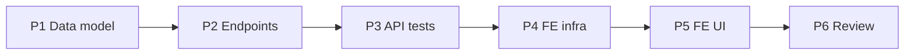

# Implementation Plan — Total Folio Cancellation (US-A21)

> **Spec:** `docs/cancellation/total-folio-cancellation.spec.md`
> **Stack (API):** Hono · Drizzle · Cloudflare D1 · Vitest (`cloudflare:test`)
> **Stack (App):** React · MUI · TanStack Query · React Hook Form + Zod
> **Builds on:** POS / `folios` + `folio_lines` + `slots.booked` (the inventory counters to
> reverse), the scanner's existing `CANCELLED` gate (no change), the cash drawer's
> `cancelled`-exclusion (no change), `authMiddleware`, `requireRole`, the multitenancy
> Enforcement Contract, the `AppLayout` shell, and the money helpers in
> `features/catalog/types`.

This is the **last MUST-HAVE** and a small one: no new tables, no new `ErrorCode`, no
scanner/cash-drawer changes. The whole feature is **one admin router** + three nullable
audit columns + one **atomic D1 batch** that releases every line's spots and flips the
folio to `cancelled`. Backend first (a shippable slice), then a lean admin UI to find and
cancel a folio.

---

## Phases

```
Phase 1 → Data model (1 migration + 3 Drizzle columns)
Phase 2 → API: schema + handlers + the admin /api/folios router
Phase 3 → API tests (Scenarios 1–9 + multitenancy 10–11)
Phase 4 → Frontend infra (service, types, hooks)
Phase 5 → Frontend UI (admin Folios list + Folio detail w/ Cancel)
Phase 6 → Review against spec + SPEC checklist + TECH_DEBT note
```

Phases 1→3 (backend) are independently shippable. Phases 4→5 depend on the backend.

---

## Phase 1 — Data Model

Additive, nullable columns on `folios`. No new `ErrorCode`, no new table.

### Task 1.1 — Migration `migrations/0017_add_cancellation_to_folios.sql`

```sql
ALTER TABLE `folios` ADD COLUMN `cancelled_at` integer;
--> statement-breakpoint
ALTER TABLE `folios` ADD COLUMN `cancelled_by` text REFERENCES `users`(`id`);
--> statement-breakpoint
ALTER TABLE `folios` ADD COLUMN `cancellation_reason` text;
```

- All three nullable → safe on the populated `folios` table (no backfill), mirroring
  `0013`'s `qr_token`. The `status` enum already includes `cancelled` (no enum migration).

### Task 1.2 — Drizzle schema (`src/db/schema.ts`)

Add to the `folios` table definition (after `amountPaid`, before `createdAt`):

```ts
  cancelledAt: integer('cancelled_at', { mode: 'timestamp' }),
  cancelledBy: text('cancelled_by').references(() => users.id),
  cancellationReason: text('cancellation_reason'),
```

`Folio` / `NewFolio` inferred types pick the columns up automatically.

**Deliverable:** migration applies cleanly; `folios.cancelledAt/cancelledBy/cancellationReason`
available on the `Folio` type.

---

## Phase 2 — API Endpoints

New router `src/routes/folios/` (mirrors `cash-drawers/` layout). **Admin-only:**
`authMiddleware` + `requireRole('admin')` on `*`.

### Task 2.1 — Schema (`src/routes/folios/schema.ts`)

```ts
import { z } from 'zod'

export const cancelFolioSchema = z.object({
  reason: z.string().trim().min(1).nullable().optional(),
})

export type CancelFolioInput = z.infer<typeof cancelFolioSchema>
```

> No `organizationId` / `status` / `cancelled_by` fields (Rules 1 & 3; Zod strips unknowns).

### Task 2.2 — Handlers (`src/routes/folios/handler.ts`)

`FoliosContext = Context<{ Bindings; Variables: AppVariables }>`. Reuse `utcToday()` style
for the `date` filter. Money serialized as-is (integer minor units).

- **`listFolios`** (admin) — org-scoped list. Optional `status` / `date`
  (`strftime('%Y-%m-%d', created_at, 'unixepoch') = date`) / `agent_id` filters. Join
  `users` for the agent name. Order `created_at DESC`. Return the **lean** row shape from
  the spec (`id`, `agent`, `customer_name`, `status`, `total`, `amount_paid`, `created_at`,
  `cancelled_at`). → `{ folios: [...] }`.

- **`getFolioDetail`** (admin) — load folio by `(id, org)` → `404` if unknown/cross-org.
  Attach `agent`, lines (+ extras), totals, customer, and the cancellation audit
  (`cancelled_at`, `cancelled_by`, `cancellation_reason`). Reuse the line/extra read shape
  from `pos/handler.ts` (without the QR echo — admin doesn't scan). → `{ folio }`.

- **`cancelFolio`** (admin, **the core**) —
  1. Load folio by `(id, org)` → `404` if unknown/cross-org.
  2. If `folio.status === 'cancelled'` → `409 CONFLICT` (no double-release).
  3. Load the folio's lines (`slotId`, `quantity`), org-scoped.
  4. **One atomic D1 batch** (`db.batch([...])`):
     - per line: `UPDATE slots SET booked = MAX(0, booked − quantity), updated_at = now
       WHERE id = slotId AND organization_id = org`;
     - `UPDATE folios SET status = 'cancelled', cancelled_at = now,
       cancelled_by = admin.userId, cancellation_reason = input.reason ?? null,
       updated_at = now WHERE id = folioId AND organization_id = org AND status != 'cancelled'`
       (guarded — race backstop).
  5. Re-read and return the cancelled folio detail. → `{ folio }`.

```ts
// sketch — the release + flip, one batch
const statements: BatchItem<'sqlite'>[] = lines.map((l) =>
  db.update(slots)
    .set({ booked: sql`MAX(0, ${slots.booked} - ${l.quantity})`, updatedAt: new Date() })
    .where(and(eq(slots.id, l.slotId), eq(slots.organizationId, org))),
)
statements.push(
  db.update(folios)
    .set({
      status: 'cancelled',
      cancelledAt: new Date(),
      cancelledBy: admin.userId,
      cancellationReason: input.reason ?? null,
      updatedAt: new Date(),
    })
    .where(and(
      eq(folios.id, id),
      eq(folios.organizationId, org),
      ne(folios.status, 'cancelled'),
    )),
)
await db.batch(statements as [BatchItem<'sqlite'>, ...BatchItem<'sqlite'>[]])
```

> Every query org-filters (Rules 2 & 4); the folio `UPDATE` sets `cancelled_by` from
> context (Rule 3). Totals/inventory are server-computed from `folio_lines`, never the body.

### Task 2.3 — Routes (`src/routes/folios/index.ts`)

```ts
const foliosRouter = new Hono<{ Bindings: CloudflareBindings; Variables: AppVariables }>()
const validationHook = (r: { success: boolean }) => {
  if (!r.success) throw new ApiError('VALIDATION_ERROR', 400, 'Invalid request payload')
}
foliosRouter.use('*', authMiddleware)
foliosRouter.use('*', requireRole('admin')) // admin-only resource

foliosRouter.get('/', listFolios)
foliosRouter.get('/:id', getFolioDetail)
foliosRouter.post('/:id/cancel', zValidator('json', cancelFolioSchema, validationHook), cancelFolio)

export default foliosRouter
```

### Task 2.4 — Mount (`src/index.tsx`)

```ts
import foliosRouter from './routes/folios'
// …
app.route('/api/folios', foliosRouter)
```

> Distinct from the agent receipt read at `GET /api/pos/folios/:id` (left untouched).

**Deliverable:** three endpoints respond per spec; `curl` smoke (list → detail → cancel →
re-cancel `409`) passes; spots released; non-admin → `403`.

---

## Phase 3 — API Tests (`test/folios/folio-cancellation.test.ts`)

Reuse `seedUser` / `seedTwoOrgs` / `clearTenancyDb` (`test/helpers/tenancy.ts`) and
`buildFakeJwt`. Add local seeders: `seedSlot` (with `booked`), `seedFolio` (+ `seedFolioLine`)
with configurable `agent_id` / `status` / `total` / `amount_paid` / `created_at`, and reuse
the QR mint path (POS confirm) for the scanner integration test. `beforeEach` clears
`folio_line_extras → folio_lines → folios → slots → schedules → service_extras → services`,
then the tenancy clear.

| Test | Spec scenario |
|---|---|
| Cancel releases every line's spots (`booked → 0`); re-sellable | 1 |
| Records `cancelled_at` / `cancelled_by` / `cancellation_reason`; no-reason → `null` | 2 |
| A `booking` folio can be cancelled; held spots released | 3 |
| Double cancellation → `409`; `booked` unchanged; audit unchanged | 4 |
| Atomic: on a forced batch failure, status stays `paid` & no `booked` changes | 5 |
| Cancelled cash drops out of a **live** drawer (`GET /me`) | 6 |
| Cancelled folio's QR ticket → scan `{ invalid, CANCELLED }`; `redeemed_count` not bumped | 7 |
| Admin list (org, newest-first) + detail (lines/extras/audit) | 8 |
| Non-admin (agent) → `403` on list/detail/cancel | 9 |
| **B3** cross-org folio by id → `404`; `org_b` folio untouched (`seedTwoOrgs`) | 10 |
| **B4/B1** list org-scoped; injected `organizationId`/`cancelled_by` ignored | 11 |

> Scenario 6 reuses the cash-drawer income derivation as a black-box: seed a `paid` folio
> today, assert the agent's live `total_collected`, cancel it, assert it drops.
> Scenario 7 mints a real token via POS confirm, cancels the folio, then scans.

**Deliverable:** `pnpm --filter api-guideme test` green.

---

## Phase 4 — Frontend Infrastructure

New feature dir `app-guideme/src/features/folios/`. Reuse `request()` + `ServiceError`
from `authService.ts` and the money helpers from `features/catalog/types`.

### Task 4.1 — Types (`src/features/folios/types.ts`)

```ts
export type FolioStatus = 'paid' | 'booking' | 'cancelled'
export interface FolioListItem {
  id: string; agent: { id: string; name: string }
  customer_name: string | null; status: FolioStatus
  total: number; amount_paid: number
  created_at: number; cancelled_at: number | null
}
export interface FolioDetail extends FolioListItem {
  customer_email: string | null; customer_phone: string | null
  subtotal: number; discount_total: number
  cancelled_by: string | null; cancellation_reason: string | null
  lines: FolioDetailLine[]
}
// FolioDetailLine mirrors the POS line shape (service_name, slot_date, quantity,
// unit_price, line_total, extras[]) — reuse/keep in sync with features/pos/types.ts.
```

### Task 4.2 — Service (`src/services/foliosService.ts`)

| Function | Endpoint |
|---|---|
| `listFolios({status?, date?, agentId?})` | `GET /api/folios` |
| `getFolio(id)` | `GET /api/folios/:id` |
| `cancelFolio(id, { reason? })` | `POST /api/folios/:id/cancel` |

### Task 4.3 — Hooks (`src/features/folios/hooks/`)

| Hook | Type | Notes |
|---|---|---|
| `useFolios(filters)` | `useQuery(['folios', filters])` | admin list |
| `useFolio(id)` | `useQuery(['folios', id])` | admin detail |
| `useCancelFolio()` | `useMutation` | invalidate `['folios']` (list + the detail) |

**Deliverable:** service + hooks + types importable; types compile.

---

## Phase 5 — Frontend UI

Routes in `config/routes.ts` (note: distinct from the agent receipt `FOLIO`):

```ts
FOLIOS: '/folios',           // admin list
FOLIO_DETAIL: '/folios/:id', // admin detail + cancel
```

Nav (`AppLayout`): admin-only **Folios** (`ReceiptRounded` — distinct from Closures'
`ReceiptLongRounded`). `App.tsx`: lazy `RoleGuard role="admin"` routes.

### Task 5.1 — `FoliosListPage` (admin) — US-A21

- `useFolios()` cards/rows: customer, agent, date, total, and a **status chip**
  (`paid`/`booking` neutral, `cancelled` in error color). Optional status filter
  (`ToggleButtonGroup`, mirroring `ClosuresListPage`). Row → `FOLIO_DETAIL`.

### Task 5.2 — `FolioDetailPage` (admin) — US-A21

- `useFolio(id)`: customer block, line items (service, slot date/time, qty, unit price,
  line total) + extras, totals (subtotal, discount, total, amount paid).
- **Cancel folio** button — shown only when `status !== 'cancelled'` — opens a confirm
  `Dialog` with an optional **reason** `TextField`: "Cancelling releases all spots for this
  folio and can't be undone." → `useCancelFolio`.
- When already cancelled: hide the action; show an `Alert` with `cancellation_reason` and
  the cancelled date (mirrors `ClosureDetailPage`'s rejected-note treatment).
- Elegant-minimalist: `Card elevation={0}`, generous spacing, the single accent; the cancel
  action is the one `color="error"` affordance.

**Deliverable:** an admin can browse folios, open one, and cancel it (with an optional
reason); the freed spots immediately reappear in POS availability — end-to-end.

---

## Phase 6 — Review

- Walk spec Scenarios 1–11; mark ✅/❌.
- Confirm the Enforcement Contract: every query org-filtered; no
  `organizationId`/`status`/`cancelled_by` in the Zod schema; the folio `UPDATE` sets
  `cancelled_by` from context; inventory released from `folio_lines`, never the body.
- Confirm **atomicity**: the slot releases + folio flip are one `db.batch`; a forced failure
  leaves status `paid` and `booked` unchanged.
- Confirm the guards: already-cancelled → `409` (and `WHERE status != 'cancelled'` backstop);
  unknown/cross-org → `404`; non-admin → `403`; **no new `ErrorCode`**.
- Confirm the **free** integrations: scanner rejects a cancelled folio's tickets
  (`CANCELLED`); a live drawer drops the cancelled cash; a closed (snapshot) drawer is
  intentionally unchanged.
- Update `docs/SPEC.md`: tick **Total folio cancellation** *(US-A21)* with a link to the
  spec. With this, **all Phase-1 MUST-HAVE items are complete.**
- Update `docs/TECH_DEBT.md`: note the deferred **client cancellation email** (US-C03) — the
  `cancelFolio` handler is the single seam where a Resend notification will hook in once the
  email feature lands; partial cancellation remains WON'T-HAVE.

---

## Phase Dependencies



---

## Checklist

### Backend
- [ ] `0017_add_cancellation_to_folios.sql` (nullable `cancelled_at` / `cancelled_by` → `users.id` / `cancellation_reason`)
- [ ] Drizzle `folios` columns + types
- [ ] `folios/schema.ts` (`cancelFolio`; `reason` only — no org/status/actor fields)
- [ ] `folios/handler.ts`: `listFolios` / `getFolioDetail` / `cancelFolio`; cancel releases all spots + flips status in one `db.batch`; already-cancelled → `409`; unknown/cross-org → `404`
- [ ] Admin-only router mounted at `/api/folios` (`authMiddleware` + `requireRole('admin')` on `*`)
- [ ] No new `ErrorCode` (reuse `CONFLICT` / `NOT_FOUND` / `VALIDATION_ERROR`)
- [ ] `test/folios/folio-cancellation.test.ts` Scenarios 1–9
- [ ] Multitenancy B1/B3/B4 (Scenarios 10–11) via `seedTwoOrgs`

### Frontend
- [ ] `foliosService` (3 calls)
- [ ] `features/folios` types + hooks
- [ ] Admin `FoliosListPage` + `FolioDetailPage` (guarded Cancel w/ reason) + admin-only **Folios** nav + routes

### Docs
- [ ] `docs/SPEC.md` MUST-HAVE item ticked (US-A21) — completes all MVP MUST-HAVEs
- [ ] `docs/TECH_DEBT.md` note: deferred client cancellation email (US-C03) seam
```
