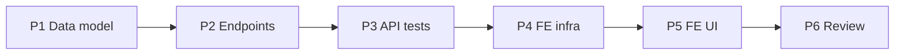

# Implementation Plan — Agent's Daily Cash Drawer with Operating Expenses (US-AG12, AG13, AG14, US-A19)

> **Spec:** `docs/cash-drawer/cash-drawer.spec.md`
> **Stack (API):** Hono · Drizzle · Cloudflare D1 · Vitest (`cloudflare:test`)
> **Stack (App):** React · MUI · TanStack Query · React Hook Form + Zod
> **Builds on:** POS / `folios` (`agent_id`, `status`, `total`, `amount_paid`, `created_at`)
> as the income source, `authMiddleware`, `requireRole`, the multitenancy Enforcement
> Contract, the `AppLayout` shell, and the money helpers in `features/catalog/types`.

This is the first feature with **both** an agent surface (view summary / add expenses /
submit closure) and an admin surface (review / validate) on **one** resource. Income is
**server-derived** from the agent's folios (never client-sent); a submitted closure is an
**immutable snapshot** (the folio philosophy). **No new `ErrorCode`** — conflicts reuse
`409 CONFLICT`, unknown/cross-org ids reuse `404 NOT_FOUND`. Backend first (a shippable
slice), then the two UIs.

---

## Phases

```
Phase 1 → Data model (2 migrations + Drizzle schema)
Phase 2 → API: schemas + handlers + the mixed-role /api/cash-drawers router
Phase 3 → API tests (Scenarios 1–16 + multitenancy 17–18)
Phase 4 → Frontend infra (service, types, hooks)
Phase 5 → Frontend UI (agent Cash Drawer page + admin Review list/detail)
Phase 6 → Review against spec + SPEC checklist
```

Phases 1→3 (backend) are independently shippable. Phases 4→5 depend on the backend.

---

## Phase 1 — Data Model

FK order: `cash_drawers` → `cash_drawer_expenses`. No new `ErrorCode`.

### Task 1.1 — Migration `migrations/0015_create_cash_drawers.sql`

```sql
CREATE TABLE `cash_drawers` (
	`id` text PRIMARY KEY NOT NULL,
	`organization_id` text NOT NULL,
	`agent_id` text NOT NULL,
	`business_date` text NOT NULL,
	`status` text DEFAULT 'open' NOT NULL,
	`total_collected` integer,
	`pending_balance` integer,
	`expense_total` integer,
	`net_balance` integer,
	`folio_count` integer,
	`submitted_at` integer,
	`reviewed_by` text,
	`reviewed_at` integer,
	`review_note` text,
	`created_at` integer DEFAULT (unixepoch()) NOT NULL,
	`updated_at` integer DEFAULT (unixepoch()) NOT NULL,
	FOREIGN KEY (`organization_id`) REFERENCES `organizations`(`id`) ON UPDATE no action ON DELETE no action,
	FOREIGN KEY (`agent_id`) REFERENCES `users`(`id`) ON UPDATE no action ON DELETE no action,
	FOREIGN KEY (`reviewed_by`) REFERENCES `users`(`id`) ON UPDATE no action ON DELETE no action
);
--> statement-breakpoint
CREATE UNIQUE INDEX `cash_drawers_org_agent_date_unique_idx` ON `cash_drawers` (`organization_id`, `agent_id`, `business_date`);
--> statement-breakpoint
CREATE INDEX `cash_drawers_org_status_idx` ON `cash_drawers` (`organization_id`, `status`);
```

### Task 1.2 — Migration `migrations/0016_create_cash_drawer_expenses.sql`

```sql
CREATE TABLE `cash_drawer_expenses` (
	`id` text PRIMARY KEY NOT NULL,
	`organization_id` text NOT NULL,
	`cash_drawer_id` text NOT NULL,
	`description` text NOT NULL,
	`amount` integer NOT NULL,
	`created_at` integer DEFAULT (unixepoch()) NOT NULL,
	FOREIGN KEY (`organization_id`) REFERENCES `organizations`(`id`) ON UPDATE no action ON DELETE no action,
	FOREIGN KEY (`cash_drawer_id`) REFERENCES `cash_drawers`(`id`) ON UPDATE no action ON DELETE no action
);
--> statement-breakpoint
CREATE INDEX `cash_drawer_expenses_org_drawer_idx` ON `cash_drawer_expenses` (`organization_id`, `cash_drawer_id`);
```

- Snapshot columns on `cash_drawers` are **nullable** (filled at close). The unique
  `(organization_id, agent_id, business_date)` index enforces one drawer per agent per day
  and backs the get-or-create. Money is integer minor units.

### Task 1.3 — Drizzle schema (`src/db/schema.ts`)

Append after `folioLineExtras`:

```ts
export const cashDrawers = sqliteTable('cash_drawers', {
  id: text('id').primaryKey(),
  organizationId: text('organization_id').notNull().references(() => organizations.id),
  agentId: text('agent_id').notNull().references(() => users.id),
  businessDate: text('business_date').notNull(), // 'YYYY-MM-DD' org-local day
  status: text('status', { enum: ['open', 'submitted', 'approved', 'rejected'] })
    .notNull().default('open'),
  totalCollected: integer('total_collected'), // snapshot at close
  pendingBalance: integer('pending_balance'),
  expenseTotal: integer('expense_total'),
  netBalance: integer('net_balance'),
  folioCount: integer('folio_count'),
  submittedAt: integer('submitted_at', { mode: 'timestamp' }),
  reviewedBy: text('reviewed_by').references(() => users.id),
  reviewedAt: integer('reviewed_at', { mode: 'timestamp' }),
  reviewNote: text('review_note'),
  createdAt: integer('created_at', { mode: 'timestamp' }).notNull().default(sql`(unixepoch())`),
  updatedAt: integer('updated_at', { mode: 'timestamp' }).notNull().default(sql`(unixepoch())`),
})

export const cashDrawerExpenses = sqliteTable('cash_drawer_expenses', {
  id: text('id').primaryKey(),
  organizationId: text('organization_id').notNull().references(() => organizations.id),
  cashDrawerId: text('cash_drawer_id').notNull().references(() => cashDrawers.id),
  description: text('description').notNull(),
  amount: integer('amount').notNull(), // minor units, > 0
  createdAt: integer('created_at', { mode: 'timestamp' }).notNull().default(sql`(unixepoch())`),
})

export type CashDrawer = typeof cashDrawers.$inferSelect
export type NewCashDrawer = typeof cashDrawers.$inferInsert
export type CashDrawerExpense = typeof cashDrawerExpenses.$inferSelect
export type NewCashDrawerExpense = typeof cashDrawerExpenses.$inferInsert
```

**Deliverable:** migrations apply cleanly; `CashDrawer` / `CashDrawerExpense` types available.

---

## Phase 2 — API Endpoints

New router `src/routes/cash-drawers/` (mirrors `pos/` layout). **Mixed roles:**
`authMiddleware` on `*`, then per-route `requireRole`.

### Task 2.1 — Schemas (`src/routes/cash-drawers/schema.ts`)

```ts
import { z } from 'zod'

const dateField = z.string().regex(/^\d{4}-\d{2}-\d{2}$/, 'Expected YYYY-MM-DD')

export const addExpenseSchema = z.object({
  description: z.string().trim().min(1, 'Description is required'),
  amount: z.number().int().positive(), // minor units, > 0
  date: dateField.optional(),
})

export const closeDrawerSchema = z.object({ date: dateField.optional() })

export const reviewDrawerSchema = z.object({
  decision: z.enum(['approved', 'rejected']),
  note: z.string().trim().min(1).nullable().optional(),
})

export type AddExpenseInput = z.infer<typeof addExpenseSchema>
export type ReviewDrawerInput = z.infer<typeof reviewDrawerSchema>
```

> No `organizationId` / `agent_id` / `status` / totals fields (Rules 1 & 3; Zod strips
> unknowns). `business_date` is the only client-chosen scoping value and defaults to today.

### Task 2.2 — Handlers (`src/routes/cash-drawers/handler.ts`)

`CashDrawerContext = Context<{ Bindings; Variables: AppVariables }>`. Reuse `utcToday()`
(UTC `YYYY-MM-DD`) as in POS. **Income derivation** is the shared core:

```ts
// Σ over the agent's NON-cancelled folios whose created_at UTC date == businessDate.
const deriveIncome = async (db, org, agentId, businessDate) => {
  const [row] = await db.select({
    folioCount: sql<number>`count(*)`,
    totalCollected: sql<number>`coalesce(sum(${folios.amountPaid}), 0)`,
    pendingBalance: sql<number>`coalesce(sum(${folios.total} - ${folios.amountPaid}), 0)`,
  })
  .from(folios)
  .where(and(
    eq(folios.organizationId, org),
    eq(folios.agentId, agentId),
    ne(folios.status, 'cancelled'),
    sql`strftime('%Y-%m-%d', ${folios.createdAt}, 'unixepoch') = ${businessDate}`,
  ))
  return { folioCount: Number(row.folioCount), totalCollected: Number(row.totalCollected),
           pendingBalance: Number(row.pendingBalance) }
}

const expenseTotal = async (db, org, drawerId) => { /* coalesce(sum(amount),0) */ }
```

- **`getMyDrawer`** (US-AG12, agent) — `date = query.date ?? utcToday()`. Load the drawer by
  `(org, agentId, businessDate)`. If **no row** → return a virtual `{ id: null, status:
  'open', income: deriveIncome(...), expense_total: 0, net_balance: total_collected,
  expenses: [] }`. If **open** → derived income + live expenses + `expense_total` +
  `net_balance = total_collected − expense_total`. If **submitted/approved/rejected** →
  the **snapshot** columns + the stored expenses. Serialize money as-is.

- **`addExpense`** (US-AG13, agent) — `date = body.date ?? utcToday()`.
  `getOrCreateOpenDrawer(org, agentId, date)`: `INSERT … onConflictDoNothing` on the unique
  index, then `SELECT`. If the resolved drawer `status !== 'open'` → `409 CONFLICT`. Insert
  the expense (`organizationId` from context, `cashDrawerId` resolved). → `201 { expense }`.

- **`deleteExpense`** (US-AG13, agent) — load the expense joined to its drawer where
  `expense.id`, `expense.organization_id = org`, `drawer.agent_id = self`. Not found →
  `404`. `drawer.status !== 'open'` → `409`. Delete → `200 { ok: true }`.

- **`closeDrawer`** (US-AG14, agent) — `date = body.date ?? utcToday()`.
  `getOrCreateOpenDrawer(...)`; if `status !== 'open'` → `409 CONFLICT`. Compute
  `income = deriveIncome(...)`, `expTotal = expenseTotal(...)`,
  `net = income.totalCollected − expTotal`. `UPDATE cash_drawers SET status='submitted',
  total_collected, pending_balance, expense_total=expTotal, net_balance=net,
  folio_count, submitted_at=now, updated_at=now WHERE id=? AND organization_id=? AND
  status='open'` (guarded). → `200 { drawer: snapshot }`. A zero-activity day is allowed
  (all zeros).

- **`listDrawers`** (US-A19, admin) — org-scoped. Optional `status` / `date` / `agent_id`
  filters. **Omit `open`** by default (no snapshot to review) — i.e.,
  `status IN ('submitted','approved','rejected')` unless `status` is given. Join `users`
  for the agent name. Order `submitted_at DESC NULLS LAST, created_at DESC`. →
  `{ drawers: [...] }`.

- **`getDrawerDetail`** (US-A19, admin) — load the drawer by `(id, org)` → `404` if
  unknown/cross-org. Snapshot income if `status !== 'open'`, else derived. Attach `agent`
  and the expense breakdown. → `{ drawer }`.

- **`reviewDrawer`** (US-A19, admin) — load by `(id, org)` → `404`. `status !==
  'submitted'` → `409 CONFLICT`. `UPDATE … SET status=decision,
  reviewed_by=admin.userId, reviewed_at=now, review_note=note ?? null WHERE id=? AND
  organization_id=? AND status='submitted'` (guarded). → `{ drawer }`.

> Every query org-filters (Rules 2 & 4); `/me/*` additionally filter `agent_id = self`;
> inserts/updates set `organization_id` / `agent_id` / `reviewed_by` from context (Rule 3).
> Totals are computed server-side from `folios` + expenses (never from the body).

### Task 2.3 — Routes (`src/routes/cash-drawers/index.ts`)

```ts
const drawers = new Hono<{ Bindings: CloudflareBindings; Variables: AppVariables }>()
const validationHook = (r: { success: boolean }) => {
  if (!r.success) throw new ApiError('VALIDATION_ERROR', 400, 'Invalid request payload')
}
drawers.use('*', authMiddleware)
const agent = requireRole('agent')
const admin = requireRole('admin')

// Static /me/* BEFORE the /:id routes so "me" is never captured as an :id.
drawers.get('/me', agent, getMyDrawer)
drawers.post('/me/expenses', agent, zValidator('json', addExpenseSchema, validationHook), addExpense)
drawers.delete('/me/expenses/:id', agent, deleteExpense)
drawers.post('/me/close', agent, zValidator('json', closeDrawerSchema, validationHook), closeDrawer)

drawers.get('/', admin, listDrawers)
drawers.get('/:id', admin, getDrawerDetail)
drawers.post('/:id/review', admin, zValidator('json', reviewDrawerSchema, validationHook), reviewDrawer)

export default drawers
```

### Task 2.4 — Mount (`src/index.tsx`)

```ts
import cashDrawersRouter from './routes/cash-drawers'
// …
app.route('/api/cash-drawers', cashDrawersRouter)
```

**Deliverable:** seven endpoints respond per spec; `curl` smoke (add expense → summary →
close → admin list → review) passes; closed-drawer expense → 409; review of open → 409.

---

## Phase 3 — API Tests (`test/cash-drawer/cash-drawer.test.ts`)

Reuse `seedUser` / `seedTwoOrgs` / `clearTenancyDb` (`test/helpers/tenancy.ts`) and
`buildFakeJwt`. Add local seeders `seedFolio` (configurable `agent_id`, `status`, `total`,
`amount_paid`, `created_at` — to place a folio on a chosen business date) and a raw
`seedDrawer` / `seedExpense` for the admin-side and conflict cases. `beforeEach` clears
`cash_drawer_expenses → cash_drawers → folio_line_extras → folio_lines → folios → slots →
schedules → service_extras → services`, then the tenancy clear. Pin `date` explicitly so
the calendar is deterministic regardless of the real clock.

| Test | Spec scenario |
|---|---|
| Live summary sums non-cancelled folios + expenses; net correct | 1 |
| No activity → virtual open drawer, `id: null`, zeros, no row created | 2 |
| Cancelled folios excluded from collected | 3 |
| Add expense lazily creates open drawer; expense stored; summary reflects it | 4 |
| Invalid expense (amount 0 / negative / non-int, empty description) → 400 | 5 |
| Expense on a closed (submitted) drawer → 409 | 6 |
| Delete expense while open (200); other-agent/unknown → 404; after close → 409 | 7 |
| Close snapshots totals, sets submitted; later summary returns snapshot | 8 |
| Close twice → 409 | 9 |
| Zero-activity close → 200 with zeros | 10 |
| Admin lists submitted closures in org; org-scoped; open omitted | 11 |
| Admin detail: snapshot + expenses + agent | 12 |
| Admin approve → approved, reviewed_by/at set | 13 |
| Admin reject with note → rejected, note stored | 14 |
| Review of open / already-reviewed → 409 | 15 |
| Wrong role both ways (agent→admin route, admin→/me/*) → 403 | 16 |
| **B3/B4** cross-org invisible/unreachable (`seedTwoOrgs`) | 17 |
| **B1** injected org/agent/totals ignored; server values win | 18 |

> Scenario 8 is the key immutability check: close, then `seedFolio` a new folio on the same
> date, and assert the summary still returns the **snapshot** (not a re-derivation).

**Deliverable:** `pnpm --filter api-guideme test` green.

---

## Phase 4 — Frontend Infrastructure

New feature dir `app-guideme/src/features/cash-drawer/`. Reuse `request()` + `ServiceError`
from `authService.ts` and the money helpers from `features/catalog/types`.

### Task 4.1 — Types (`src/features/cash-drawer/types.ts`)

```ts
export type DrawerStatus = 'open' | 'submitted' | 'approved' | 'rejected'
export interface DrawerExpense { id: string; description: string; amount: number; created_at: number }
export interface DrawerIncome { folio_count: number; total_collected: number; pending_balance: number }
export interface CashDrawer {
  id: string | null
  business_date: string
  status: DrawerStatus
  income: DrawerIncome
  expense_total: number
  net_balance: number
  expenses: DrawerExpense[]
  submitted_at: number | null
  reviewed_at: number | null
  review_note: string | null
}
export interface DrawerListItem {
  id: string; agent: { id: string; name: string }
  business_date: string; status: DrawerStatus
  total_collected: number; expense_total: number; net_balance: number
  folio_count: number; submitted_at: number | null; reviewed_at: number | null
}
```

### Task 4.2 — Service (`src/services/cashDrawerService.ts`)

| Function | Endpoint |
|---|---|
| `getMyDrawer(date?)` | `GET /api/cash-drawers/me` |
| `addExpense({description, amount, date?})` | `POST /api/cash-drawers/me/expenses` |
| `deleteExpense(id)` | `DELETE /api/cash-drawers/me/expenses/:id` |
| `closeDrawer(date?)` | `POST /api/cash-drawers/me/close` |
| `listDrawers({status?, date?, agentId?})` | `GET /api/cash-drawers` |
| `getDrawer(id)` | `GET /api/cash-drawers/:id` |
| `reviewDrawer(id, {decision, note?})` | `POST /api/cash-drawers/:id/review` |

### Task 4.3 — Hooks (`src/features/cash-drawer/hooks/`)

| Hook | Type | Notes |
|---|---|---|
| `useMyDrawer(date?)` | `useQuery(['cash-drawer','me',date])` | the agent summary |
| `useAddExpense()` / `useDeleteExpense()` | `useMutation` | invalidate `['cash-drawer','me']` |
| `useCloseDrawer()` | `useMutation` | invalidate `['cash-drawer']` |
| `useDrawers(filters)` | `useQuery(['cash-drawers',filters])` | admin list |
| `useDrawer(id)` | `useQuery(['cash-drawers',id])` | admin detail |
| `useReviewDrawer()` | `useMutation` | invalidate `['cash-drawers']` |

**Deliverable:** service + hooks + types importable; types compile.

---

## Phase 5 — Frontend UI

Routes in `config/routes.ts`:

```ts
CASH_DRAWER: '/cash-drawer',        // agent
CLOSURES: '/closures',              // admin list
CLOSURE_DETAIL: '/closures/:id',    // admin detail
```

Nav (`AppLayout`): agent-only **Caja** (`AccountBalanceWalletRounded`) and admin-only
**Closures** (`ReceiptLongRounded`). `App.tsx`: lazy `RoleGuard` routes.

### Task 5.1 — `CashDrawerPage` (agent) — US-AG12/AG13/AG14

- `useMyDrawer()` summary card: **folios**, **collected**, **pending bookings**,
  **expenses total**, and a prominent **net balance** (negative shown in error color).
- **Expenses** section: a small add form (description + amount via `amountToCents`) →
  `useAddExpense`; the list with a delete affordance (`useDeleteExpense`) — **only while
  `status === 'open'`**.
- **Close day** button → `useCloseDrawer` with a confirm dialog ("This submits today's
  closure to your admin and can't be edited"). After close, the card switches to a
  read-only **submitted** state (snapshot + status chip; `approved`/`rejected` + note shown
  once reviewed).
- Elegant-minimalist: `Card elevation={0}`, generous spacing, the single accent for net.

### Task 5.2 — Admin review — US-A19

- `ClosuresListPage` (`/closures`): `useDrawers({ status: 'submitted' })` table/cards
  (agent, date, collected, expenses, net, submitted_at) with a status filter; row →
  `CLOSURE_DETAIL`.
- `ClosureDetailPage` (`/closures/:id`): `useDrawer(id)` — the income breakdown, the
  expense list, the net balance, and **Approve** / **Reject** actions (`useReviewDrawer`;
  reject opens a note field). Terminal once reviewed (actions hidden, decision + note shown).

**Deliverable:** an agent can track the day, add/remove expenses, and submit the closure;
an admin can review the queue and approve/reject — end-to-end.

---

## Phase 6 — Review

- Walk spec Scenarios 1–18; mark ✅/❌.
- Confirm the Enforcement Contract: every query org-filtered; `/me/*` filtered
  `agent_id = self`; no `organizationId`/`agent_id`/`status`/totals in any Zod schema;
  inserts/updates set them from context; income derived from `folios`, never the body.
- Confirm **immutability**: a submitted drawer's summary returns the snapshot even after a
  later folio lands on the same date.
- Confirm the status machine: `open → submitted → approved|rejected`; expense add/delete and
  close guarded to `open`; review guarded to `submitted`; conflicts → `409`, unknown/cross-org
  → `404`; **no new `ErrorCode`**.
- Update `docs/SPEC.md`: tick **Agent's daily cash drawer with operating expenses**
  *(US-AG12, US-AG13, US-AG14, US-A19)* with a link to the spec.
- (Optional) `docs/TECH_DEBT.md`: note the deferred items the spec flags — re-opening a
  rejected closure, opening float, multi-currency — if any are likely near-term.

---

## Phase Dependencies



---

## Checklist

### Backend
- [ ] `0015_create_cash_drawers.sql` (+ unique `(org, agent, business_date)` + `(org, status)` index) and `0016_create_cash_drawer_expenses.sql`
- [ ] Drizzle `cashDrawers` + `cashDrawerExpenses` tables and types
- [ ] `cash-drawers/schema.ts` (`addExpense` / `close` / `review`; no org/agent/status/total fields)
- [ ] `cash-drawers/handler.ts`: `getMyDrawer` / `addExpense` / `deleteExpense` / `closeDrawer` (agent) + `listDrawers` / `getDrawerDetail` / `reviewDrawer` (admin); income derived from folios; get-or-create open drawer; close snapshots; review guarded
- [ ] Mixed-role router mounted at `/api/cash-drawers` (`authMiddleware` on `*`, per-route `requireRole`; `/me/*` before `/:id`)
- [ ] No new `ErrorCode` (reuse `CONFLICT` / `NOT_FOUND` / `VALIDATION_ERROR`)
- [ ] `test/cash-drawer/cash-drawer.test.ts` Scenarios 1–16
- [ ] Multitenancy B1/B3/B4 (Scenarios 17–18) via `seedTwoOrgs`

### Frontend
- [ ] `cashDrawerService` (7 calls)
- [ ] `features/cash-drawer` types + hooks
- [ ] Agent `CashDrawerPage` (summary, expense add/delete, close-day) + agent-only **Caja** nav + route
- [ ] Admin `ClosuresListPage` + `ClosureDetailPage` (approve/reject) + admin-only **Closures** nav + routes

### Docs
- [ ] `docs/SPEC.md` MUST-HAVE item ticked (US-AG12, AG13, AG14, A19)
- [ ] (Optional) `docs/TECH_DEBT.md` note for deferred reopen/float/multi-currency
```
