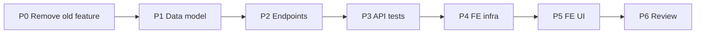

# Implementation Plan — Agent Continuous Cash Balance with Cash Drops (US-AG12, AG13, AG14, US-A19)

> **Spec:** `docs/cash-drops/agent-balance-cash-drops.spec.md`
> **Stack (API):** Hono · Drizzle · Cloudflare D1 · Vitest (`cloudflare:test`)
> **Stack (App):** React · MUI · TanStack Query · React Hook Form + Zod
> **Builds on:** POS / `folios` (`agent_id`, `status`, `amount_paid`) as the *collected*
> source, the cancellation exclusion, `authMiddleware`, `requireRole`, the multitenancy
> Enforcement Contract, the `AppLayout` shell, the money helpers in `features/catalog/types`,
> and the **review-machine pattern** (`pending → confirmed | rejected`) lifted from the
> closure feature being retired.

This pivot **replaces** the daily cash-closure (*corte de caja*) with a **perpetual running
balance + cash drops**. It is partly **demolition** (remove the shipped `cash-drawers`
feature end-to-end) and partly **construction** (derive a live balance from events; add a
drop settlement event with admin confirm/reject). The balance is **derived, never stored**
(no drift), mirroring `deriveIncome`. **No new `ErrorCode`.** Backend first (a shippable
slice), then the two UIs.

> ⚠️ **Destructive migration.** `0018` drops `cash_drawer_expenses` + `cash_drawers`. This
> assumes **no production cash-drawer data to preserve** (the daily-closure feature shipped
> immediately before this pivot). Confirm before applying to remote D1.

---

## Phases

```
Phase 0 → Remove the deprecated daily cash-closure feature (code + tests + UI)
Phase 1 → Data model (drop old tables; 2 new tables + Drizzle schema)
Phase 2 → API: schemas + handlers + the mixed-role /api/cash router
Phase 3 → API tests (Scenarios 1–14 + multitenancy 15–16)
Phase 4 → Frontend infra (cashService, types, hooks)
Phase 5 → Frontend UI (agent Balance page + admin Balances + Drops review)
Phase 6 → Review against spec + SPEC checklist + TECH_DEBT
```

Phases 0→3 (backend) are independently shippable. Phases 4→5 depend on the backend.

---

## Phase 0 — Remove the Deprecated Daily Cash-Closure Feature

Delete (the feature replaced by this one):

- **API:** `src/routes/cash-drawers/` (whole dir); remove its mount in `src/index.tsx`
  (`import cashDrawersRouter` + `app.route('/api/cash-drawers', …)`).
- **Tests:** `test/cash-drawer/`.
- **Frontend:** `src/pages/CashDrawerPage.tsx`, `src/pages/ClosuresListPage.tsx`,
  `src/pages/ClosureDetailPage.tsx`; `src/services/cashDrawerService.ts`;
  `src/features/cash-drawer/` (whole dir); their lazy imports + `RoleGuard` routes in
  `src/App.tsx`; `CASH_DRAWER` / `CLOSURES` / `CLOSURE_DETAIL` in `config/routes.ts`; the
  **Caja** (agent) and **Closures** (admin) entries + now-unused icons in `AppLayout.tsx`.

> Drizzle `cashDrawers` / `cashDrawerExpenses` table defs + types are removed in Phase 1
> (kept until the drop migration so nothing references missing tables mid-edit).

**Deliverable:** the app builds with the old cash UI/routes gone; `/api/cash-drawers`
returns 404 (unmounted). Old tables still exist in D1 until Phase 1.

---

## Phase 1 — Data Model

### Task 1.1 — Migration `migrations/0018_drop_cash_drawers.sql`

```sql
DROP TABLE IF EXISTS `cash_drawer_expenses`;
--> statement-breakpoint
DROP TABLE IF EXISTS `cash_drawers`;
```
(Expenses first — it FKs `cash_drawers`.)

### Task 1.2 — Migration `migrations/0019_create_agent_expenses.sql`

```sql
CREATE TABLE `agent_expenses` (
	`id` text PRIMARY KEY NOT NULL,
	`organization_id` text NOT NULL,
	`agent_id` text NOT NULL,
	`description` text NOT NULL,
	`amount` integer NOT NULL,
	`created_at` integer DEFAULT (unixepoch()) NOT NULL,
	FOREIGN KEY (`organization_id`) REFERENCES `organizations`(`id`) ON UPDATE no action ON DELETE no action,
	FOREIGN KEY (`agent_id`) REFERENCES `users`(`id`) ON UPDATE no action ON DELETE no action
);
--> statement-breakpoint
CREATE INDEX `agent_expenses_org_agent_idx` ON `agent_expenses` (`organization_id`, `agent_id`);
```

### Task 1.3 — Migration `migrations/0020_create_cash_drops.sql`

```sql
CREATE TABLE `cash_drops` (
	`id` text PRIMARY KEY NOT NULL,
	`organization_id` text NOT NULL,
	`agent_id` text NOT NULL,
	`amount` integer NOT NULL,
	`balance_before` integer NOT NULL,
	`status` text DEFAULT 'pending' NOT NULL,
	`note` text,
	`reviewed_by` text,
	`reviewed_at` integer,
	`review_note` text,
	`created_at` integer DEFAULT (unixepoch()) NOT NULL,
	`updated_at` integer DEFAULT (unixepoch()) NOT NULL,
	FOREIGN KEY (`organization_id`) REFERENCES `organizations`(`id`) ON UPDATE no action ON DELETE no action,
	FOREIGN KEY (`agent_id`) REFERENCES `users`(`id`) ON UPDATE no action ON DELETE no action,
	FOREIGN KEY (`reviewed_by`) REFERENCES `users`(`id`) ON UPDATE no action ON DELETE no action
);
--> statement-breakpoint
CREATE INDEX `cash_drops_org_status_idx` ON `cash_drops` (`organization_id`, `status`);
--> statement-breakpoint
CREATE INDEX `cash_drops_org_agent_idx` ON `cash_drops` (`organization_id`, `agent_id`);
```

### Task 1.4 — Drizzle schema (`src/db/schema.ts`)

Remove `cashDrawers` + `cashDrawerExpenses` (and their `$inferSelect/Insert` types). Append:

```ts
export const agentExpenses = sqliteTable('agent_expenses', {
  id: text('id').primaryKey(),
  organizationId: text('organization_id').notNull().references(() => organizations.id),
  agentId: text('agent_id').notNull().references(() => users.id),
  description: text('description').notNull(),
  amount: integer('amount').notNull(), // minor units, > 0
  createdAt: integer('created_at', { mode: 'timestamp' }).notNull().default(sql`(unixepoch())`),
})

export const cashDrops = sqliteTable('cash_drops', {
  id: text('id').primaryKey(),
  organizationId: text('organization_id').notNull().references(() => organizations.id),
  agentId: text('agent_id').notNull().references(() => users.id),
  amount: integer('amount').notNull(),            // reduces balance once confirmed
  balanceBefore: integer('balance_before').notNull(), // audit snapshot at creation
  status: text('status', { enum: ['pending', 'confirmed', 'rejected'] })
    .notNull().default('pending'),
  note: text('note'),
  reviewedBy: text('reviewed_by').references(() => users.id),
  reviewedAt: integer('reviewed_at', { mode: 'timestamp' }),
  reviewNote: text('review_note'),
  createdAt: integer('created_at', { mode: 'timestamp' }).notNull().default(sql`(unixepoch())`),
  updatedAt: integer('updated_at', { mode: 'timestamp' }).notNull().default(sql`(unixepoch())`),
})

export type AgentExpense = typeof agentExpenses.$inferSelect
export type NewAgentExpense = typeof agentExpenses.$inferInsert
export type CashDrop = typeof cashDrops.$inferSelect
export type NewCashDrop = typeof cashDrops.$inferInsert
```

**Deliverable:** migrations apply cleanly (local); old tables gone; new types available.

---

## Phase 2 — API Endpoints

New router `src/routes/cash/` (mirrors the retired `cash-drawers/` layout). **Mixed roles:**
`authMiddleware` on `*`, then per-route `requireRole`.

### Task 2.1 — Schemas (`src/routes/cash/schema.ts`)

```ts
import { z } from 'zod'

export const addExpenseSchema = z.object({
  description: z.string().trim().min(1, 'Description is required'),
  amount: z.number().int().positive(),
})

export const createDropSchema = z.object({
  amount: z.number().int().positive(),
  note: z.string().trim().min(1).nullable().optional(),
})

export const reviewDropSchema = z.object({
  decision: z.enum(['confirmed', 'rejected']),
  note: z.string().trim().min(1).nullable().optional(),
})

export type AddExpenseInput = z.infer<typeof addExpenseSchema>
export type CreateDropInput = z.infer<typeof createDropSchema>
export type ReviewDropInput = z.infer<typeof reviewDropSchema>
```
> No `organizationId`/`agent_id`/`status`/`balance_before` fields (Rules 1 & 3).

### Task 2.2 — Handlers (`src/routes/cash/handler.ts`)

`CashContext = Context<{ Bindings; Variables: AppVariables }>`. **Balance derivation** is the
shared core (reuse the `deriveIncome` shape from the retired feature, minus the date filter):

```ts
```ts
// cash_collected = Σ amount_paid over non-cancelled folios WHERE payment_method = 'cash'
const sumCashCollected = (db, org, agentId) => /* coalesce(sum(amount_paid),0), ne(status,'cancelled'), eq(payment_method,'cash') */
// commissions = Σ commission_amount over folios (cash and card)
const sumCommissions = (db, org, agentId) => /* coalesce(sum(commission_amount),0) */
const sumExpenses  = (db, org, agentId) => /* coalesce(sum(amount),0) from agent_expenses */
const sumDrops     = (db, org, agentId, status) => /* coalesce(sum(amount),0) where status */
const sumPayouts   = (db, org, agentId) => /* coalesce(sum(amount),0) from payouts */

const deriveBalance = async (db, org, agentId) => {
  const cashCollected = await sumCashCollected(db, org, agentId)
  const commissionTotal = await sumCommissions(db, org, agentId)
  const expenseTotal = await sumExpenses(db, org, agentId)
  const confirmedDrops = await sumDrops(db, org, agentId, 'confirmed')
  const pendingDrops = await sumDrops(db, org, agentId, 'pending')
  const payouts = await sumPayouts(db, org, agentId)
  
  return { 
    cashCollected, commissionTotal, expenseTotal, 
    confirmedDropsTotal: confirmedDrops,
    pendingDropsTotal: pendingDrops, 
    payoutsTotal: payouts,
    balance: cashCollected - commissionTotal - expenseTotal - confirmedDrops + payouts
  }
}
```

- **`getMyBalance`** (US-AG12, agent) — `deriveBalance(org, self)` + the agent's expenses +
  recent drops (all statuses, newest first). Serialize money as-is.
- **`addExpense`** (US-AG13, agent) — insert (`organizationId`/`agentId` from context). → `201`.
- **`deleteExpense`** (US-AG13, agent) — delete where `id`, `organization_id = org`,
  `agent_id = self`. Not found → `404`. → `200 { ok: true }`.
- **`createDrop`** (US-AG14, agent) — `balanceBefore = deriveBalance(...).balance`; insert
  `status='pending'`, `amount`, `note`, context ids. → `201 { drop }`.
- **`cancelDrop`** (US-AG14, agent) — load by `(id, org, agent=self)` → `404`. If
  `status !== 'pending'` → `409`. Delete. → `200 { ok: true }`.
- **`listBalances`** (US-A19, admin) — for each **agent** user in the org, derive the
  balance + pending rollup. MVP: select agent users in org, then derive per agent (N+1 is
  fine at MVP scale; a single grouped query is a later optimization). Order `balance` desc.
- **`listDrops`** (US-A19, admin) — org-scoped; default `status='pending'`; optional
  `agent_id`. Join `users` for the agent name. Order `created_at desc`. → `{ drops }`.
- **`getDropDetail`** (US-A19, admin) — load by `(id, org)` + agent → `404` if unknown/cross-org.
- **`reviewDrop`** (US-A19, admin) — load by `(id, org)` → `404`. `status !== 'pending'` →
  `409`. Guarded `UPDATE … SET status=decision, reviewed_by=admin, reviewed_at=now,
  review_note=note ?? null WHERE id=? AND organization_id=? AND status='pending'`. → `{ drop }`.

> Every query org-filters (Rules 2 & 4); `/me/*` additionally `agent_id = self`;
> inserts/updates set `organization_id`/`agent_id`/`reviewed_by`/`balance_before` from
> context/derivation, never the body. Balance is recomputed live on every read.

### Task 2.3 — Routes (`src/routes/cash/index.ts`)

```ts
const cash = new Hono<{ Bindings: CloudflareBindings; Variables: AppVariables }>()
const validationHook = (r: { success: boolean }) => {
  if (!r.success) throw new ApiError('VALIDATION_ERROR', 400, 'Invalid request payload')
}
cash.use('*', authMiddleware)
const agent = requireRole('agent')
const admin = requireRole('admin')

// Static /me/* BEFORE the /drops/:id routes.
cash.get('/me', agent, getMyBalance)
cash.post('/me/expenses', agent, zValidator('json', addExpenseSchema, validationHook), addExpense)
cash.delete('/me/expenses/:id', agent, deleteExpense)
cash.post('/me/drops', agent, zValidator('json', createDropSchema, validationHook), createDrop)
cash.delete('/me/drops/:id', agent, cancelDrop)

cash.get('/balances', admin, listBalances)
cash.get('/drops', admin, listDrops)
cash.get('/drops/:id', admin, getDropDetail)
cash.post('/drops/:id/review', admin, zValidator('json', reviewDropSchema, validationHook), reviewDrop)
// Payouts (US-A25)
cash.post('/payouts', admin, registerPayout)

export default cash
```

### Task 2.4 — Mount (`src/index.tsx`)

```ts
import cashRouter from './routes/cash'
// …
app.route('/api/cash', cashRouter)
```

**Deliverable:** nine endpoints respond per spec; `curl` smoke (add expense → balance →
create drop → admin balances → review confirm → balance drops) passes; cancel/review of a
non-pending drop → 409.

---

## Phase 3 — API Tests (`test/cash/agent-balance-cash-drops.test.ts`)

Reuse `seedUser` / `seedTwoOrgs` / `clearTenancyDb` + `buildFakeJwt`. Local seeders:
`seedFolio` (configurable `agent_id`/`status`/`amount_paid`), raw `seedExpense` / `seedDrop`
(with `status`). `beforeEach` clears `cash_drops → agent_expenses → folio_line_extras →
folio_lines → folios → slots → schedules → service_extras → services`, then the tenancy clear.

| Test | Spec scenario |
|---|---|
| Balance = collected − expenses − confirmed drops | 1 |
| Pending drop reported, not netted out | 2 |
| Cancelled folios excluded; balance can go negative | 3 |
| Add + delete expense moves the balance | 4 |
| Invalid expense → 400 | 5 |
| Create drop snapshots `balance_before`, stays pending, balance unchanged | 6 |
| Cancel pending drop (200); confirmed/rejected → 409; other-agent/unknown → 404 | 7 |
| Invalid drop → 400 | 8 |
| Admin balances list: org-scoped, ordered, pending rollup | 9 |
| Admin drops queue + detail (default pending) | 10 |
| Confirm a drop → balance drops; reviewed_by/at set | 11 |
| Reject with note → balance unchanged, note stored | 12 |
| Review of non-pending → 409 | 13 |
| Wrong role both ways → 403 | 14 |
| **B3/B4** cross-org invisible/unreachable (`seedTwoOrgs`) | 15 |
| **B1** injected org/agent/status/balance_before ignored | 16 |

> Scenario 11 is the key end-to-end: derive balance, create+confirm a drop, re-read balance
> and assert it dropped by exactly the confirmed amount.

**Deliverable:** `pnpm --filter api-guideme test` green (old `test/cash-drawer/` removed).

---

## Phase 4 — Frontend Infrastructure

New feature dir `app-guideme/src/features/cash/`. Reuse `request()` + `ServiceError` from
`authService.ts` and the money helpers from `features/catalog/types`.

### Task 4.1 — Types (`src/features/cash/types.ts`)

```ts
export type DropStatus = 'pending' | 'confirmed' | 'rejected'
export interface CashExpense { id: string; description: string; amount: number; created_at: number }
export interface CashDrop {
  id: string; amount: number; balance_before: number; status: DropStatus
  note: string | null; reviewed_at: number | null; review_note: string | null; created_at: number
  agent?: { id: string; name: string } // attached on the admin surface
}
export interface AgentBalance {
  collected: number; expense_total: number
  confirmed_drops_total: number; pending_drops_total: number; balance: number
  expenses: CashExpense[]; drops: CashDrop[]
}
export interface BalanceListItem {
  agent: { id: string; name: string }
  collected: number; expense_total: number; confirmed_drops_total: number
  balance: number; pending_drops_total: number; pending_drops_count: number
}
```

### Task 4.2 — Service (`src/services/cashService.ts`)

| Function | Endpoint |
|---|---|
| `getMyBalance()` | `GET /api/cash/me` |
| `addExpense({description, amount})` | `POST /api/cash/me/expenses` |
| `deleteExpense(id)` | `DELETE /api/cash/me/expenses/:id` |
| `createDrop({amount, note?})` | `POST /api/cash/me/drops` |
| `cancelDrop(id)` | `DELETE /api/cash/me/drops/:id` |
| `listBalances()` | `GET /api/cash/balances` |
| `listDrops({status?, agentId?})` | `GET /api/cash/drops` |
| `getDrop(id)` | `GET /api/cash/drops/:id` |
| `reviewDrop(id, {decision, note?})` | `POST /api/cash/drops/:id/review` |

### Task 4.3 — Hooks (`src/features/cash/hooks/`)

| Hook | Type | Notes |
|---|---|---|
| `useMyBalance()` | `useQuery(['cash','me'])` | agent balance |
| `useAddExpense()` / `useDeleteExpense()` | `useMutation` | invalidate `['cash','me']` |
| `useCreateDrop()` / `useCancelDrop()` | `useMutation` | invalidate `['cash','me']` |
| `useBalances()` | `useQuery(['cash','balances'])` | admin |
| `useDrops(filters)` / `useDrop(id)` | `useQuery` | admin queue + detail |
| `useReviewDrop()` | `useMutation` | invalidate `['cash']` |

**Deliverable:** service + hooks + types importable; types compile.

---

## Phase 5 — Frontend UI

Routes in `config/routes.ts` (replacing the removed `CASH_DRAWER`/`CLOSURES`/`CLOSURE_DETAIL`):

```ts
BALANCE: '/balance',          // agent
CASH_DROPS: '/cash',          // admin balances + drops queue
CASH_DROP_DETAIL: '/cash/drops/:id', // admin drop detail
```

Nav (`AppLayout`): agent-only **Balance** (`AccountBalanceWalletRounded`) and admin-only
**Cash** (`PaymentsRounded`). `App.tsx`: lazy `RoleGuard` routes.

### Task 5.1 — `BalancePage` (agent) — US-AG12/AG13/AG14

- `useMyBalance()` summary card: **collected**, **expenses**, **handed in** (confirmed),
  and a prominent **balance you're holding** (negative shown in error color), plus a
  **pending hand-ins** line when `pending_drops_total > 0`.
- **Expenses** section: add form (description + amount via `amountToCents`) +
  delete list (`useDeleteExpense`).
- **Hand in cash** button → dialog (amount + optional note) → `useCreateDrop`; shows the
  agent's recent drops with status chips (`pending`/`confirmed`/`rejected`), each pending one
  cancellable (`useCancelDrop`).
- Elegant-minimalist: `Card elevation={0}`, generous spacing, single accent for the balance.

### Task 5.2 — Admin surface — US-A19

- **Balances** (`/cash`): `useBalances()` cards/rows (agent, balance — largest first,
  pending count badge). This is the company's cash-exposure view.
- **Drops queue** (same page, a tab/section or below): `useDrops({ status: 'pending' })`
  rows (agent, amount, `balance_before`, note, date) → `CASH_DROP_DETAIL`, plus a status
  filter (pending/confirmed/rejected/all).
- **Drop detail** (`/cash/drops/:id`): `useDrop(id)` — amount, the agent's snapshot balance,
  note, and **Confirm receipt** / **Reject** actions (`useReviewDrop`; reject opens a note
  field). Terminal once reviewed (actions hidden, decision + note shown). Mirrors the retired
  `ClosureDetailPage`.

**Deliverable:** an agent tracks their perpetual balance, logs expenses, and hands in cash;
an admin sees every agent's exposure and confirms/rejects hand-ins — end-to-end. The old
Caja/Closures UI is gone.

---

## Phase 6 — Review

- Walk spec Scenarios 1–16; mark ✅/❌.
- Confirm the Enforcement Contract: every query org-filtered; `/me/*` filtered
  `agent_id = self`; no `organizationId`/`agent_id`/`status`/`balance_before` in any Zod
  schema; inserts/updates set them from context; balance derived from events, never the body.
- Confirm the balance math: `collected − expenses − confirmed_drops`; pending reported not
  netted; negative allowed; confirming a drop reduces the balance by exactly its amount.
- Confirm the drop machine: `pending → confirmed | rejected`; cancel guarded to `pending`;
  review guarded to `pending`; conflicts → `409`, unknown/cross-org → `404`; **no new `ErrorCode`**.
- Confirm the demolition: `/api/cash-drawers` gone, `cash_drawers`/`cash_drawer_expenses`
  dropped, no dangling imports/routes/nav/tests.
- Update `docs/SPEC.md`: tick **Agent continuous cash balance with cash drops**
  *(US-AG12, AG13, AG14, A19)*.
- Update `docs/TECH_DEBT.md`: mark the daily cash-drawer feature **superseded**; record the
  deferred refinements — (a) **settled-history immutability** (freeze expenses/folios behind
  a confirmed drop), (b) **unbounded balance sum** → snapshot-carry from the last confirmed
  drop, (c) **adjust-amount-on-confirm** instead of reject-and-resubmit, (d) the
  `listBalances` N+1 → single grouped query.

---

## Phase Dependencies



---

## Checklist

### Demolition (Phase 0–1)
- [ ] Remove `src/routes/cash-drawers/` + mount; `test/cash-drawer/`
- [ ] Remove cash-drawer/closures pages, `cashDrawerService`, `features/cash-drawer/`, routes & nav
- [ ] `0018_drop_cash_drawers.sql` drops both old tables (expenses → drawers)
- [ ] Drizzle: remove `cashDrawers`/`cashDrawerExpenses`

### Backend (Phase 1–3)
- [ ] `0019_create_agent_expenses.sql` + `0020_create_cash_drops.sql` (org-leading indexes)
- [ ] Drizzle `agentExpenses` + `cashDrops` tables and types
- [ ] `cash/schema.ts` (`addExpense` / `createDrop` / `reviewDrop`; no org/agent/status/snapshot fields)
- [ ] `cash/handler.ts`: balance derivation; `getMyBalance` / `addExpense` / `deleteExpense` / `createDrop` / `cancelDrop` (agent) + `listBalances` / `listDrops` / `getDropDetail` / `reviewDrop` (admin)
- [ ] Mixed-role router at `/api/cash` (`authMiddleware` on `*`, per-route `requireRole`; `/me/*` first)
- [ ] No new `ErrorCode` (reuse `CONFLICT` / `NOT_FOUND` / `VALIDATION_ERROR`)
- [ ] `test/cash/agent-balance-cash-drops.test.ts` Scenarios 1–14
- [ ] Multitenancy B1/B3/B4 (Scenarios 15–16) via `seedTwoOrgs`

### Frontend (Phase 4–5)
- [ ] `cashService` (9 calls)
- [ ] `features/cash` types + hooks
- [ ] Agent `BalancePage` (balance, expenses, hand-in drop) + agent-only **Balance** nav + route
- [ ] Admin **Balances** + **Drops** review (queue + detail, confirm/reject) + admin-only **Cash** nav + routes

### Docs (Phase 6)
- [ ] `docs/SPEC.md` MUST-HAVE item ticked (US-AG12, AG13, AG14, A19)
- [ ] `docs/TECH_DEBT.md`: daily cash-drawer **superseded** + deferred refinements
