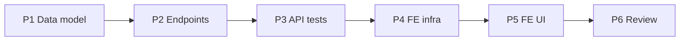

# Implementation Plan — Service Catalog (US-A09, US-A11, US-A13)

> **Spec:** `docs/catalog/service-catalog.spec.md`
> **Stack (API):** Hono · Drizzle · Cloudflare D1 · Vitest (`cloudflare:test`)
> **Stack (App):** React 18 · MUI · TanStack Query · React Hook Form + Zod
> **Builds on:** the `agents` router pattern, `authMiddleware`, `requireRole`,
> the multitenancy Enforcement Contract, and the `AppLayout` nav shell from Staff Mgmt.

A new `services` resource: services CRUD with a `minimum_price` floor and soft
deactivation, plus nested **extras** CRUD. Backend first (a self-contained shippable
slice), then the admin catalog UI.

---

## Phases

```
Phase 1 → Data model (2 migrations + Drizzle schema)
Phase 2 → API: schemas + handlers + router (services & nested extras)
Phase 3 → API tests (scenarios 1–15 + multitenancy B1/B3/B4)
Phase 4 → Frontend infra (service, types/schemas, hooks)
Phase 5 → Frontend UI (Catalog nav item, list, service form, extras manager)
Phase 6 → Review against spec + close TECH_DEBT §1
```

Phases 1→3 (backend) are independently shippable. Phases 4→5 depend on the backend.

---

## Phase 1 — Data Model

### Task 1.1 — Migration `migrations/0006_create_services.sql`

```sql
CREATE TABLE `services` (
	`id` text PRIMARY KEY NOT NULL,
	`organization_id` text NOT NULL,
	`name` text NOT NULL,
	`description` text,
	`base_price` integer NOT NULL,
	`minimum_price` integer NOT NULL,
	`default_capacity` integer NOT NULL,
	`status` text DEFAULT 'active' NOT NULL,
	`created_at` integer DEFAULT (unixepoch()) NOT NULL,
	`updated_at` integer DEFAULT (unixepoch()) NOT NULL,
	FOREIGN KEY (`organization_id`) REFERENCES `organizations`(`id`) ON UPDATE no action ON DELETE no action
);
--> statement-breakpoint
CREATE INDEX `services_org_status_idx` ON `services` (`organization_id`, `status`);
```

### Task 1.2 — Migration `migrations/0007_create_service_extras.sql`

```sql
CREATE TABLE `service_extras` (
	`id` text PRIMARY KEY NOT NULL,
	`organization_id` text NOT NULL,
	`service_id` text NOT NULL,
	`name` text NOT NULL,
	`price` integer NOT NULL,
	`status` text DEFAULT 'active' NOT NULL,
	`created_at` integer DEFAULT (unixepoch()) NOT NULL,
	`updated_at` integer DEFAULT (unixepoch()) NOT NULL,
	FOREIGN KEY (`organization_id`) REFERENCES `organizations`(`id`) ON UPDATE no action ON DELETE no action,
	FOREIGN KEY (`service_id`) REFERENCES `services`(`id`) ON UPDATE no action ON DELETE no action
);
--> statement-breakpoint
CREATE INDEX `service_extras_org_service_idx` ON `service_extras` (`organization_id`, `service_id`);
```

- Both tables carry `organization_id` directly (Rule 5); `service_extras` keeps it even
  though it could scope via `service_id` — for per-query org filtering + the index (Rule 6).
- Money columns are integer **minor units** (centavos), never floats.

### Task 1.3 — Drizzle schema (`src/db/schema.ts`)

```ts
export const services = sqliteTable('services', {
  id: text('id').primaryKey(),
  organizationId: text('organization_id').notNull().references(() => organizations.id),
  name: text('name').notNull(),
  description: text('description'),
  basePrice: integer('base_price').notNull(),
  minimumPrice: integer('minimum_price').notNull(),
  defaultCapacity: integer('default_capacity').notNull(),
  status: text('status', { enum: ['active', 'inactive'] }).notNull().default('active'),
  createdAt: integer('created_at', { mode: 'timestamp' }).notNull().default(sql`(unixepoch())`),
  updatedAt: integer('updated_at', { mode: 'timestamp' }).notNull().default(sql`(unixepoch())`),
})

export const serviceExtras = sqliteTable('service_extras', {
  id: text('id').primaryKey(),
  organizationId: text('organization_id').notNull().references(() => organizations.id),
  serviceId: text('service_id').notNull().references(() => services.id),
  name: text('name').notNull(),
  price: integer('price').notNull(),
  status: text('status', { enum: ['active', 'inactive'] }).notNull().default('active'),
  createdAt: integer('created_at', { mode: 'timestamp' }).notNull().default(sql`(unixepoch())`),
  updatedAt: integer('updated_at', { mode: 'timestamp' }).notNull().default(sql`(unixepoch())`),
})

export type Service = typeof services.$inferSelect
export type NewService = typeof services.$inferInsert
export type ServiceExtra = typeof serviceExtras.$inferSelect
export type NewServiceExtra = typeof serviceExtras.$inferInsert
```

> If migrations are generated by `drizzle-kit`, generate from the schema change;
> otherwise hand-write `0006`/`0007` to match the `0001`–`0004` style.

**Deliverable:** Migrations apply cleanly; `Service` / `ServiceExtra` types available.

---

## Phase 2 — API Endpoints

New folder `src/routes/services/` (mirrors `src/routes/agents/`).

### Task 2.1 — Schemas (`src/routes/services/schema.ts`)

```ts
import { z } from 'zod'

const money = z.number().int().min(0)            // minor units (centavos)

export const createServiceSchema = z
  .object({
    name: z.string().min(1, 'Name is required'),
    description: z.string().nullable().optional(),
    base_price: money,
    minimum_price: money,
    default_capacity: z.number().int().min(1),
  })
  .refine((v) => v.minimum_price <= v.base_price, {
    message: 'minimum_price must be ≤ base_price',
    path: ['minimum_price'],
  })

export const updateServiceSchema = createServiceSchema   // same shape (full replace)

export const createExtraSchema = z.object({
  name: z.string().min(1, 'Name is required'),
  price: money,
})
export const updateExtraSchema = createExtraSchema

export type CreateServiceInput = z.infer<typeof createServiceSchema>
export type UpdateServiceInput = z.infer<typeof updateServiceSchema>
export type CreateExtraInput = z.infer<typeof createExtraSchema>
export type UpdateExtraInput = z.infer<typeof updateExtraSchema>
```

> No `organizationId` / `status` fields (Rule 1). Zod strips unknowns.

### Task 2.2 — Handlers (`src/routes/services/handler.ts`)

Shared serializers map DB columns → API shape (snake_case money/capacity fields):

```ts
const serializeService = (row) => ({
  id, name, description, base_price, minimum_price, default_capacity, status,
})
const serializeExtra = (row) => ({ id, name, price, status })
```

- **`createService`** (US-A09) — `INSERT` with `organizationId` from context (Rule 3),
  `status: 'active'`; return `201 { service: { …, extras: [] } }`.
- **`listServices`** — `SELECT … WHERE organizationId = ctx [AND status = ?]`
  `ORDER BY name ASC` (Rule 2); return `{ services }` (no extras).
- **`getService`** (US-A13) — fetch the service org-filtered; if none → `404 NOT_FOUND`.
  Then fetch its extras (`WHERE serviceId = :id AND organizationId = ctx`, ordered by
  name) and return `{ service: { …, extras } }`. **First `NOT_FOUND` consumer.**
- **`updateService`** (US-A13) — `UPDATE … SET name, description, basePrice,
  minimumPrice, defaultCapacity, updatedAt WHERE id = :id AND organizationId = ctx`
  `.returning(...)`; 0 rows → `404`. Re-read extras for the response shape.
- **`setServiceStatus`** (`deactivate`/`reactivate`) — `UPDATE status WHERE id +
  organizationId`; 0 rows → `404`; idempotent. Return `{ service: { id, name, status } }`.
- **Extras** — every extra op first scopes by the parent. Use a single filter
  `and(eq(serviceExtras.id, extraId), eq(serviceExtras.serviceId, serviceId),
  eq(serviceExtras.organizationId, ctx))` so a wrong parent or foreign org → `404`.
  - `addExtra` (US-A11): verify the parent service exists in org (org-filtered SELECT;
    else `404`), then `INSERT` extra with `organizationId` from ctx + `serviceId`,
    `status: 'active'`; `201 { extra }`.
  - `updateExtra` (US-A11): `UPDATE name, price` with the triple filter; 0 rows → `404`.
  - `deleteExtra` (US-A11): **soft** — `UPDATE status = 'inactive'` with the triple
    filter; 0 rows → `404`; idempotent. Return `200 { extra }`.

> The org filter on every query is what makes unknown / cross-org ids resolve to `404`
> without leaking existence (Scenarios 6, 11, 14, 17).

### Task 2.3 — Router (`src/routes/services/index.ts`)

```ts
const services = new Hono<{ Bindings: CloudflareBindings; Variables: AppVariables }>()
const validationHook = (r) => { if (!r.success) throw new ApiError('VALIDATION_ERROR', 400, 'Invalid request payload') }

services.use('*', authMiddleware, requireRole('admin'))

services.post('/',  zValidator('json', createServiceSchema, validationHook), createService)
services.get('/',   listServices)
services.get('/:id', getService)
services.put('/:id', zValidator('json', updateServiceSchema, validationHook), updateService)
services.post('/:id/deactivate', deactivateService)
services.post('/:id/reactivate', reactivateService)

services.post('/:id/extras',          zValidator('json', createExtraSchema, validationHook), addExtra)
services.put('/:id/extras/:extraId',  zValidator('json', updateExtraSchema, validationHook), updateExtra)
services.delete('/:id/extras/:extraId', deleteExtra)

export default services
```

### Task 2.4 — Mount in `src/index.tsx`

Mount the router at `/api/services` next to `agents` (`app.route('/api/services', services)`).

**Deliverable:** Nine endpoints respond per spec; manual `curl` check passes.

---

## Phase 3 — API Tests (`test/catalog/service-catalog.test.ts`)

Reuse `seedUser` / `seedTwoOrgs` (`test/helpers/tenancy.ts`) and `buildFakeJwt`
(`test/helpers/jwt.ts`). Add small local seeders `seedService` / `seedExtra` (raw
`env.DB.prepare(...)`, mirroring `seedUser`), and extend `clearTenancyDb` usage to also
clear `service_extras` + `services` in the suite's `beforeEach`.

| Test | Spec scenario |
|---|---|
| Create service → 201, row active, extras [] | 1 |
| `minimum_price > base_price` / negative / `capacity 0` → 400, no row | 2 |
| List ordered by name; `?status=active` filters; no `extras` key | 3 |
| Agent role → 403 on a `/api/services*` route | 4 |
| Detail includes extras ordered by name | 5 |
| Unknown / foreign id on get/put/deactivate/reactivate → 404 | 6, 17 |
| Edit updates fields, keeps status/org, advances `updated_at` | 7 |
| Deactivate (×2) → inactive idempotent; reactivate → active | 8 |
| Deactivate leaves extras untouched | 9 |
| Add extra → 201, org matches parent, serviceId set | 10 |
| Add extra to unknown service → 404 | 11 |
| Edit extra → 200 | 12 |
| Delete extra → 200 soft-inactive, row still present | 13 |
| Edit/delete extra wrong parent / unknown → 404 | 14 |
| Negative/invalid extra price / empty name → 400 | 15 |
| **B4** list scoped to caller org (`seedTwoOrgs`) | 16 |
| **B3** cross-org service + extra ops → 404, targets untouched | 17 |
| **B1** injected `organizationId` in create/edit body ignored | 18 |

**Deliverable:** `pnpm --filter api-turistear test` green.

---

## Phase 4 — Frontend Infrastructure

New feature dir `app-turistear/src/features/catalog/`. Reuse the `request()` wrapper +
`ServiceError` from `authService.ts` (same as `agentsService.ts`).

### Task 4.1 — Types + money helper (`src/features/catalog/types.ts`)

```ts
export type ServiceStatus = 'active' | 'inactive'
export interface ServiceExtra { id: string; name: string; price: number; status: ServiceStatus }
export interface Service {
  id: string; name: string; description: string | null
  base_price: number; minimum_price: number; default_capacity: number
  status: ServiceStatus
  extras?: ServiceExtra[]      // present on detail, absent on list
}

/** minor units (150000) → major decimal (1500.00). */
export const centsToAmount = (c: number) => c / 100
/** major decimal (1500) → minor units (150000). */
export const amountToCents = (a: number) => Math.round(a * 100)
```

### Task 4.2 — Zod form schemas (`src/features/catalog/schemas.ts`)

`serviceFormSchema`: `name` (required), `description` (optional), `base_price` /
`minimum_price` as **major-unit decimals** the admin types, `default_capacity` int ≥ 1,
with a `.refine(minimum ≤ base)` mirroring the API. Convert major→cents with
`amountToCents` before calling the service. `extraFormSchema`: `name` + `price` (decimal ≥ 0).

### Task 4.3 — Service (`src/services/catalogService.ts`)

| Function | Endpoint |
|---|---|
| `listServices(status?)` | `GET /api/services[?status=]` |
| `getService(id)` | `GET /api/services/:id` |
| `createService(data)` | `POST /api/services` |
| `updateService(id, data)` | `PUT /api/services/:id` |
| `deactivateService(id)` / `reactivateService(id)` | `POST /api/services/:id/(de|re)activate` |
| `addExtra(id, data)` | `POST /api/services/:id/extras` |
| `updateExtra(id, extraId, data)` | `PUT /api/services/:id/extras/:extraId` |
| `removeExtra(id, extraId)` | `DELETE /api/services/:id/extras/:extraId` |

### Task 4.4 — Hooks (`src/features/catalog/hooks/`)

| Hook | Type | Invalidates |
|---|---|---|
| `useServices(status?)` | `useQuery(['services', status])` | — |
| `useService(id)` | `useQuery(['services', id])` | — |
| `useCreateService` / `useUpdateService` | `useMutation` | `['services']` |
| `useDeactivateService` / `useReactivateService` | `useMutation` | `['services']` |
| `useAddExtra` / `useUpdateExtra` / `useRemoveExtra` | `useMutation` | `['services', id]` |

**Deliverable:** service + hooks importable; types compile.

---

## Phase 5 — Frontend UI

### Task 5.1 — Route + nav destination

- Add `CATALOG: '/catalog'` (and detail `/catalog/:id`) to `src/config/routes.ts`.
- Wire routes in `App.tsx` inside `<AppLayout>` with `AuthGuard` + `RoleGuard role="admin"`
  (same pattern as `AGENTS`).
- Add a **Catalog** destination to the shared `NAV_ITEMS` in `AppLayout`
  (`MapRounded` icon, admin-only) — it picks up the indigo active-pill automatically.

### Task 5.2 — `CatalogListPage` (`src/pages/CatalogListPage.tsx`)

- `useServices()`; loading → `CircularProgress`; error → `Alert`.
- Header with a **New service** button (opens the service form dialog).
- Render `ServiceList`; empty state: muted "No services yet — create your first tour."

### Task 5.3 — `ServiceList` / `ServiceRow` (`src/features/catalog/components/`)

Each row (elegant-minimalist `Card elevation={0}`, subtle divider):
- name, `base_price` / `minimum_price` (via `centsToAmount`, currency-formatted),
  `default_capacity`, extras count, a `status` chip.
- actions: **Edit**, **Manage extras**, **Deactivate**/**Reactivate** (with confirm).
- `inactive` rows rendered visually muted.

### Task 5.4 — `ServiceFormDialog` (`src/features/catalog/components/`)

- MUI `Dialog` + React Hook Form + `serviceFormSchema`; used for create and edit.
- Fields: `name`, `description` (multiline), `base_price`, `minimum_price` (currency
  adornment), `default_capacity`. Inline error when `minimum_price > base_price`.
- Prefill from the selected service (cents → major). Submit → `useCreateService` /
  `useUpdateService`; convert major → cents; on success close + toast; `400`/`404` → alert.

### Task 5.5 — `ExtrasManager` (`src/features/catalog/components/`)

- Opened from a row (or the detail page); uses `useService(id)` for the live extras list.
- Add/edit row (name + price), and a **Remove** action (calls `removeExtra` → soft
  deactivate; row shows as inactive). Mutations invalidate `['services', id]`.

**Deliverable:** Admin can create/edit/deactivate services with a minimum-price floor
and manage extras end-to-end.

---

## Phase 6 — Review

- Walk spec Scenarios 1–18; mark ✅/❌.
- Confirm the Enforcement Contract: every query org-filtered; no `organizationId` in any
  Zod schema; create sets `organizationId` from context; extras filtered by the
  `extraId + serviceId + organizationId` triple.
- Confirm soft-deactivation (no hard deletes) for both services and extras.
- **Close `docs/TECH_DEBT.md §1`** — `NOT_FOUND` is now consumed by `GET /api/services/:id`;
  mark the entry resolved with a pointer to this feature.
- Update the SPEC checklist: tick **Service catalog with extras and minimum price**
  *(US-A09, US-A11, US-A13)* in `docs/SPEC.md`.

---

## Phase Dependencies



---

## Checklist

### Backend
- [ ] `0006_create_services.sql` + `0007_create_service_extras.sql` (+ org-leading indexes)
- [ ] Drizzle `services` + `serviceExtras` tables and types
- [ ] `createServiceSchema` / `updateServiceSchema` (refine `minimum ≤ base`), extra schemas
- [ ] Handlers: create/list/get/update/deactivate/reactivate service; add/update/delete extra
- [ ] Money as integer minor units; soft-deactivate only (no hard delete)
- [ ] Router mounted at `/api/services` with `authMiddleware` + `requireRole('admin')`
- [ ] `test/catalog/service-catalog.test.ts` Scenarios 1–15
- [ ] Multitenancy B1/B3/B4 (Scenarios 16–18) via `seedTwoOrgs`

### Frontend
- [ ] `catalogService` (services + extras)
- [ ] `features/catalog` types + `serviceFormSchema`/`extraFormSchema` + cents↔amount helpers
- [ ] `useServices`/`useService` + create/update/(de/re)activate + extras mutation hooks
- [ ] `CATALOG` route(s) (AuthGuard + RoleGuard admin)
- [ ] **Catalog** nav destination (admin-only) in `AppLayout`
- [ ] `CatalogListPage` + `ServiceList` / `ServiceRow`
- [ ] `ServiceFormDialog` (create + edit, min-price guard)
- [ ] `ExtrasManager` (add/edit/remove extras)

### Docs
- [ ] `docs/TECH_DEBT.md §1` marked resolved
- [ ] `docs/SPEC.md` MUST-HAVE item ticked
</content>
