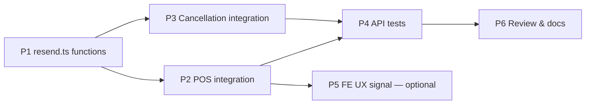

# Implementation Plan — Client Ticket Delivery via Email (US-AG09, US-C01, US-C03)

> **Spec:** `docs/email/client-ticket-delivery.spec.md`
> **Stack (API):** Hono · Drizzle · Cloudflare D1 · Resend · Vitest (`cloudflare:test`)
> **Stack (App):** React · MUI · TanStack Query
> **Builds on:** POS `confirmSale`, Total Folio Cancellation `cancelFolio`, the existing
> Resend service (`src/services/resend.ts`), stored `folio_lines.qr_token` tokens,
> and the `RESEND_API_KEY` / `RESEND_FROM` bindings already in `CloudflareBindings`.

**No new DB tables, no new migrations, no new API endpoints.** This feature is two
new functions in `resend.ts` + two integration hooks (one in `pos/handler.ts`, one in
`folios/handler.ts`) + their tests. Closes TECH_DEBT §11 (the `cancelFolio` seam).

```
Phase 0 → Make customer_email mandatory at POS (pos/schema.ts + UI)
Phase 1 → Resend email functions (resend.ts)
Phase 2 → POS integration — confirmation email (pos/handler.ts)
Phase 3 → Cancellation integration — notification email (folios/handler.ts)
Phase 4 → API tests (test/email/)
Phase 5 → Frontend: required email field + "receipt sent" UX signal
Phase 6 → Review & docs
```

Phases 1→3 are sequentially dependent (hook code calls the functions). Phase 4 can
be written alongside Phases 2–3. Phase 0 (the mandatory-email rule) is independent but
has the widest test blast radius — do it first so the rest builds on valid sales.

---

## Phase 0 — Mandatory customer_email at POS (spec Business Rule 2)

Email is the only ticket-delivery channel in Phase 1, so a sale without a deliverable
address is useless. Make it required at both layers.

### Task 0.1 — Schema (`src/routes/pos/schema.ts`)

```ts
// was: customer_email: z.string().nullable().optional()
customer_email: z.string().trim().email('A valid customer email is required'),
```
`requireRole('agent')` runs before `zValidator`, so role-403 tests are unaffected; an
emailless/malformed sale now returns `400 VALIDATION_ERROR` before any folio is written.

### Task 0.2 — Frontend (`PosCheckoutPage.tsx`)

Make the email `TextField` `required`, show an inline format error, and disable
*Confirmar venta* until `EMAIL_RE.test(email.trim())`. Relabel the card "Cliente"
(name/phone stay optional).

### Task 0.3 — Test fallout (do this with Phase 0, not later)

Every suite that creates a folio via `POST /api/pos/folios` must now send a valid email:
- Per-file sale helpers (`confirmOneLine`, `confirm`, `mintTicket`) — inject a default
  `customer_email: 'cliente@example.com'` (explicit bodies override).
- `folio-cancellation` has one inline sale POST — add the field there.
- `cash/agent-balance-cash-drops` seeds folios via **direct DB insert** — unaffected.
- `folio-qr-signing` Scenario 5: the `client_identity` `folio:<id>` fallback is now
  **unreachable via POS** (email always present, identity baked into the token at confirm).
  Reduce it to the two reachable identities (name, email) and note the third is defensive.

---

## Phase 1 — Resend Email Functions

Add two new exports to `src/services/resend.ts`. No other file changes in this phase.

### Task 1.1 — Types and helpers (top of the new block in resend.ts)

```ts
// --- Minor-unit amounts → "MXN 1,250.00" display string ---
const formatAmount = (cents: number): string =>
  `$${(cents / 100).toLocaleString('es-MX', { minimumFractionDigits: 2 })}`

// --- QR code image URL (external PNG service; no library needed) ---
const qrImageUrl = (token: string): string =>
  `https://api.qrserver.com/v1/create-qr-code/?size=250x250&ecc=M&data=${encodeURIComponent(token)}`

// A short folio reference for display: first 8 chars of the UUID.
const shortId = (id: string): string => id.slice(0, 8).toUpperCase()

// --- Escape user-controlled text before HTML interpolation (Business Rule 9) ---
// Applied to customer_name, cancellation_reason, service_name, org_name.
const escapeHtml = (s: string): string =>
  s.replace(/[&<>"']/g, (ch) =>
    ({ '&': '&amp;', '<': '&lt;', '>': '&gt;', '"': '&quot;', "'": '&#39;' })[ch]!,
  )
```

> Apply `escapeHtml(...)` to every dynamic, user-sourced value at the interpolation site:
> `escapeHtml(line.serviceName)`, `escapeHtml(ex.name)`, `escapeHtml(data.orgName)`,
> `escapeHtml(data.customerName)` (guard for null), `escapeHtml(data.cancellationReason)`.
> System-generated values (folio id, amounts, dates) are already safe and don't need it.

### Task 1.2 — `sendTicketConfirmationEmail` (US-AG09 / US-C01)

```ts
export interface TicketConfirmationEmailInput {
  to: string
  customerName: string | null
  orgName: string
  folioId: string
  createdAt: Date
  paymentMethod: 'cash' | 'card'
  total: number
  lines: Array<{
    serviceName: string
    slotDate: string        // 'YYYY-MM-DD'
    slotStartTime: string   // 'HH:MM'
    quantity: number
    unitPrice: number
    lineTotal: number
    qrToken: string
    extras: Array<{ name: string; price: number; quantity: number }>
  }>
}

export const sendTicketConfirmationEmail = async (
  env: CloudflareBindings,
  data: TicketConfirmationEmailInput,
): Promise<void> => {
  // Build one <section> per service line, each with a QR code image.
  const linesHtml = data.lines.map((line) => {
    const extrasHtml =
      line.extras.length > 0
        ? `<ul>${line.extras
            .map(
              (ex) =>
                `<li>+ ${ex.name} (×${ex.quantity}): ${formatAmount(ex.price * ex.quantity)}</li>`,
            )
            .join('')}</ul>`
        : ''

    return `
      <div style="border:1px solid #e0e0e0;border-radius:8px;padding:16px;margin:16px 0;">
        <h3 style="margin:0 0 8px">${line.serviceName}</h3>
        <p style="margin:4px 0">📅 <strong>${line.slotDate}</strong> — ${line.slotStartTime}</p>
        <p style="margin:4px 0">👥 Personas: ${line.quantity}</p>
        <p style="margin:4px 0">💰 ${formatAmount(line.unitPrice)} × ${line.quantity} = <strong>${formatAmount(line.lineTotal)}</strong></p>
        ${extrasHtml}
        <div style="margin-top:16px;text-align:center;">
          
          <p style="font-size:12px;color:#777;margin:4px 0">Presenta este código QR al llegar</p>
        </div>
      </div>`
  }).join('')

  const paymentLabel = data.paymentMethod === 'card' ? 'Tarjeta' : 'Efectivo'
  const greeting = data.customerName ? `Hola ${data.customerName},` : 'Hola,'
  const dateStr = data.createdAt.toLocaleDateString('es-MX', {
    day: '2-digit', month: 'long', year: 'numeric',
  })

  const html = `
    <div style="font-family:sans-serif;max-width:600px;margin:0 auto;color:#1a1a2e">
      <h2 style="color:#1a1a2e">¡Tu reserva está confirmada!</h2>
      <p>${greeting}</p>
      <p>Tu compra en <strong>${data.orgName}</strong> ha sido confirmada. 
         Aquí están los detalles de tu reserva.</p>

      <table style="width:100%;margin:8px 0;font-size:14px">
        <tr><td><strong>Folio</strong></td><td>#${shortId(data.folioId)}</td></tr>
        <tr><td><strong>Fecha</strong></td><td>${dateStr}</td></tr>
        <tr><td><strong>Pago</strong></td><td>${paymentLabel}</td></tr>
      </table>

      ${linesHtml}

      <p style="font-size:18px;font-weight:600;border-top:1px solid #e0e0e0;padding-top:12px;margin-top:4px;">
        Total pagado: ${formatAmount(data.total)}
      </p>

      <p style="font-size:12px;color:#777;margin-top:24px;">
        ${data.orgName} — Gestión de reservas con Turistear Ya!
      </p>
    </div>`

  const res = await fetch('https://api.resend.com/emails', {
    method: 'POST',
    headers: {
      'Content-Type': 'application/json',
      Authorization: `Bearer ${env.RESEND_API_KEY}`,
    },
    body: JSON.stringify({
      from: env.RESEND_FROM,
      to: data.to,
      subject: `Tu reserva está confirmada — ${data.orgName}`,
      html,
    }),
  })

  if (!res.ok) {
    const body = await res.text()
    throw new ApiError('INTERNAL_ERROR', 502, `Resend error: ${body}`)
  }
}
```

### Task 1.3 — `sendCancellationEmail` (US-C03)

```ts
export interface CancellationEmailInput {
  to: string
  customerName: string | null
  orgName: string
  folioId: string
  cancelledAt: Date
  cancellationReason: string | null
  lines: Array<{
    serviceName: string
    slotDate: string
    slotStartTime: string
    quantity: number
  }>
}

export const sendCancellationEmail = async (
  env: CloudflareBindings,
  data: CancellationEmailInput,
): Promise<void> => {
  const greeting = data.customerName ? `Hola ${data.customerName},` : 'Hola,'
  const servicesHtml = data.lines
    .map(
      (l) =>
        `<li>${l.serviceName} — ${l.slotDate} ${l.slotStartTime} (×${l.quantity})</li>`,
    )
    .join('')
  const reasonHtml = data.cancellationReason
    ? `<p><strong>Motivo:</strong> ${data.cancellationReason}</p>`
    : ''

  const html = `
    <div style="font-family:sans-serif;max-width:600px;margin:0 auto;color:#1a1a2e">
      <h2 style="color:#c62828">Tu reserva ha sido cancelada</h2>
      <p>${greeting}</p>
      <p>Lamentamos informarte que tu reserva en <strong>${data.orgName}</strong> 
         ha sido cancelada.</p>

      <p><strong>Folio:</strong> #${shortId(data.folioId)}</p>

      <p><strong>Servicios cancelados:</strong></p>
      <ul>${servicesHtml}</ul>

      ${reasonHtml}

      <p>Si tienes alguna pregunta, comunícate directamente con 
         <strong>${data.orgName}</strong>.</p>

      <p style="font-size:12px;color:#777;margin-top:24px;">
        ${data.orgName} — Gestión de reservas con Turistear Ya!
      </p>
    </div>`

  const res = await fetch('https://api.resend.com/emails', {
    method: 'POST',
    headers: {
      'Content-Type': 'application/json',
      Authorization: `Bearer ${env.RESEND_API_KEY}`,
    },
    body: JSON.stringify({
      from: env.RESEND_FROM,
      to: data.to,
      subject: `Tu reserva ha sido cancelada — ${data.orgName}`,
      html,
    }),
  })

  if (!res.ok) {
    const body = await res.text()
    throw new ApiError('INTERNAL_ERROR', 502, `Resend error: ${body}`)
  }
}
```

**Deliverable:** `resend.ts` exports two new functions; TypeScript compiles; the logic is
pure (no DB, no Hono) and reviewable in isolation.

---

## Phase 2 — POS Integration (US-AG09, US-C01)

Hook the confirmation email into `confirmSale` in `src/routes/pos/handler.ts`.

### Task 2.1 — Fetch org name

Add one helper call after the D1 batch (`db.batch`) succeeds. The org name is needed
for the email subject. Reuse the `organizations` import already in scope (or add it):

```ts
import { organizations, /* existing imports */ } from '../../db/schema'
import {
  sendTicketConfirmationEmail,
  type TicketConfirmationEmailInput,
} from '../../services/resend'
```

### Task 2.2 — Fire-and-forget email block

Insert the following block **after** `await db.batch(statements …)` and **before**
`return c.json({ folio: … }, 201)`:

```ts
// Fire-and-forget — a Resend failure must never roll back a committed sale.
if (input.customer_email && env.RESEND_API_KEY) {
  const orgRows = await db
    .select({ name: organizations.name })
    .from(organizations)
    .where(eq(organizations.id, org))
    .limit(1)
  const orgName = orgRows[0]?.name ?? 'Turistear Ya!'

  const emailData: TicketConfirmationEmailInput = {
    to: input.customer_email,
    customerName: input.customer_name ?? null,
    orgName,
    folioId,
    createdAt: new Date(),
    paymentMethod: input.payment_method ?? 'cash',
    total,
    lines: prepared.map((line) => ({
      serviceName: line.serviceName,
      slotDate: line.slotDate,
      slotStartTime: line.slotStartTime,
      quantity: line.quantity,
      unitPrice: line.unitPrice,
      lineTotal: line.lineTotal,
      qrToken: line.qrToken!,
      extras: line.extras.map((ex) => ({
        name: ex.name,
        price: ex.price,
        quantity: ex.quantity,
      })),
    })),
  }

  // waitUntil — keeps the request alive until the send finishes WITHOUT blocking the
  // 201 response. A bare floating promise here can be cancelled when the Worker returns,
  // silently dropping the email under load (Business Rule 1).
  c.executionCtx.waitUntil(
    sendTicketConfirmationEmail(env, emailData).catch((err) =>
      console.error('[email] confirmation send failed', folioId, err),
    ),
  )
}
```

> `line.qrToken` is always set at this point (signed in step 4 of `confirmSale`, before
> the batch). The non-null assertion is safe here.
>
> **Do not `await`** the send (blocks checkout on the external Resend call) and **do not**
> leave it as a bare floating promise (cancellable on Workers). `c.executionCtx.waitUntil`
> is the correct middle ground.

**Deliverable:** calling `POST /api/pos/folios` with a `customer_email` fires a Resend
call after the batch. No customer_email → no call. Resend error → logged, sale returns
`201`.

---

## Phase 3 — Cancellation Integration (US-C03)

Hook the cancellation email into `cancelFolio` in `src/routes/folios/handler.ts`.

### Task 3.1 — Add the import

```ts
import {
  sendCancellationEmail,
  type CancellationEmailInput,
} from '../../services/resend'
```

Also add `organizations` to the Drizzle import if not already present.

### Task 3.2 — Fire-and-forget block in `cancelFolio`

Insert **after** `await db.batch(statements …)` and the `readFolio` re-read, but
**before** `return c.json({ folio })`:

```ts
// Fire-and-forget — a Resend failure must never fail a committed cancellation.
if (folio.customer_email && env.RESEND_API_KEY) {
  const orgRows = await db
    .select({ name: organizations.name })
    .from(organizations)
    .where(eq(organizations.id, org))
    .limit(1)
  const orgName = orgRows[0]?.name ?? 'Turistear Ya!'

  const emailData: CancellationEmailInput = {
    to: folio.customer_email,
    customerName: folio.customer_name,
    orgName,
    folioId: id,
    cancelledAt: new Date(),
    cancellationReason: folio.cancellation_reason,
    lines: folio.lines.map((l) => ({
      serviceName: l.service_name,
      slotDate: l.slot_date,
      slotStartTime: l.slot_start_time,
      quantity: l.quantity,
    })),
  }

  // waitUntil — same rationale as confirmSale (Business Rule 1): guaranteed completion
  // without blocking the 200 response.
  c.executionCtx.waitUntil(
    sendCancellationEmail(env, emailData).catch((err) =>
      console.error('[email] cancellation send failed', id, err),
    ),
  )
}
```

> `folio` here is the result of `readFolio` (already in scope in `cancelFolio`) which
> includes `customer_email`, `customer_name`, `cancellation_reason`, and the `lines`
> array with `service_name`, `slot_date`, etc.

**Deliverable:** `POST /api/folios/:id/cancel` sends a cancellation notification when
`customer_email` is set. Resend error → logged, cancel returns `200` with the cancelled folio.

---

## Phase 4 — API Tests

New test file: `test/email/client-ticket-delivery.test.ts`.

### Task 4.1 — Mock strategy

Resend calls are `fetch` calls to `https://api.resend.com/emails`. In Vitest with
`cloudflare:test`, spy on `globalThis.fetch`:

```ts
import { vi, beforeEach, afterEach } from 'vitest'

let resendCalls: { to: string; subject: string; html: string }[] = []

const mockFetch = vi.fn(async (input: RequestInfo, init?: RequestInit) => {
  const url = typeof input === 'string' ? input : input.url ?? String(input)
  if (url.includes('resend.com')) {
    const body = JSON.parse((init?.body as string) ?? '{}')
    resendCalls.push({ to: body.to, subject: body.subject, html: body.html })
    return new Response(JSON.stringify({ id: 'mock-id' }), { status: 200 })
  }
  // Pass through all other fetch calls (D1, etc.)
  return originalFetch(input, init)
})

beforeEach(() => {
  resendCalls = []
  vi.spyOn(globalThis, 'fetch').mockImplementation(mockFetch)
})
afterEach(() => vi.restoreAllMocks())
```

> **Important:** `RESEND_API_KEY` must be set to a non-empty value in the test env
> (e.g., `"test-key"`) so the API-KEY guard passes. Add to the test `wrangler.test.jsonc`
> or the test helper setup.
>
> **`waitUntil` + test timing:** with the send handed to `c.executionCtx.waitUntil`, the
> `SELF.fetch(...)` response resolves before the email send necessarily completes. In the
> `cloudflare:test` pool the waitUntil task still flushes within the same isolate, so
> asserting `resendCalls` right after the response works in practice — but be aware the test
> proves the email was *initiated*, not delivery. If an assertion ever races, `await`-flush
> the microtask queue (e.g. `await new Promise((r) => setTimeout(r))`) before asserting
> `resendCalls`. Do not "fix" flakiness by reverting the handler to `await` the send.

### Task 4.2 — Test cases

| Test | Scenario |
|---|---|
| Confirmation email sent with correct `to`, subject includes org name, HTML has QR `` tags (one per line) | 1 |
| No Resend call when `customer_email` absent | 2 |
| Sale returns `201` and folio body is correct even when Resend throws | 3 |
| One Resend call for a 3-line folio; HTML contains 3 QR image URLs | 4 |
| No Resend call when `RESEND_API_KEY` is empty string | 5 |
| Cancellation email sent with correct `to`, subject, HTML lists services | 6 |
| No Resend call on cancel when `customer_email` absent (null via DB update) | 7 |
| Cancel returns `200` and folio body is correct even when Resend throws | 8 |
| Cancellation reason present in HTML when set | 9 |
| "Motivo:" section absent when reason is null | 10 |
| Sale without / with malformed `customer_email` → `400`, no Resend call | 2, 2b |
| User-controlled fields HTML-escaped (`<b>` name → entities) | 11 |

### Task 4.3 — Regression guard for existing test suites

Verify that `test/pos/pos-controlled-discount.test.ts` and
`test/folios/folio-cancellation.test.ts` still pass **without** mocking Resend. The
`RESEND_API_KEY` empty-string guard (Business Rule 8 in the spec) should handle this —
confirm the test env does not set a non-empty key, or explicitly set it to `""`.

**Deliverable:** `pnpm --filter api-turistear test` green across all test files.

---

## Phase 5 — Frontend

### Task 5.0 — Required email field (blocking — Phase 0 UI half)

`PosCheckoutPage`: `customer_email` required + format-validated; *Confirmar venta*
disabled until valid (see Phase 0, Task 0.2). This is **not optional** — without it the
agent can hit the backend's new `400`.

### Task 5.1 — POS confirm success screen (optional UX signal)

In the `SaleSummaryPage` (or wherever the agent sees the confirmed folio):

If the confirmed folio has a non-null `customer_email`, show a subtle helper text below
the folio ID:

In the `SaleSummaryPage` (or wherever the agent sees the confirmed folio):

If the confirmed folio has a non-null `customer_email`, show a subtle helper text below
the folio ID:

```
📧 Recibo enviado a {customer_email}
```

No API change needed — `customer_email` is already returned on the `POST /api/pos/folios`
`201` response body. This is a frontend-only change in `features/pos/` or the receipt page.

---

## Phase 6 — Review & Docs

### Task 6.1 — Spec walk-through

- [ ] Walk Scenarios 1–10 against the implementation.
- [ ] Confirm the send uses `c.executionCtx.waitUntil(send(...).catch(log))` in BOTH hooks —
      not a bare floating promise (cancellable on Workers) and not `await` (blocks response).
- [ ] Confirm every user-sourced HTML field is wrapped in `escapeHtml()` (Business Rule 9).
- [ ] Confirm the API-KEY guard is in place in both hooks.
- [ ] Confirm the org-name DB read is scoped to `org` from context (no org injection).
- [ ] Confirm `qr_token` non-null assertion is safe at the call site (tokens are signed
      before the email block; `prepared[i].qrToken` is set in Phase 4 of `confirmSale`).
- [ ] Confirm `cancelFolio` uses the `readFolio` result for email data (already in scope).

### Task 6.2 — Update `docs/SPEC.md`

Tick the SHOULD-HAVE item:
```md
- [x] **Sending receipt and QR code to client via Email (Resend)** *(US-AG09, US-C01, US-C03)* — `docs/email/client-ticket-delivery.spec.md`
```

### Task 6.3 — Update `docs/TECH_DEBT.md`

- **§11 (Client Cancellation Email Not Sent — US-C03):** mark `✅ RESOLVED`. Update the
  status to: *"Closed by the Client Ticket Delivery feature
  (`docs/email/client-ticket-delivery.spec.md`). `cancelFolio` now sends a Resend
  notification after the batch commits when `folio.customer_email` is set."*

- **New entry:** External QR-image service dependency (api.qrserver.com). Document it as
  an accepted MVP trade-off with the action: self-host a `/api/qr/:token.png` endpoint
  (WebAssembly QR library, e.g., `qr-wasm`) if the external service becomes unreliable or
  the privacy of embedding token in URL params is a concern.

---

## Phase Dependencies



---

## Checklist

### Backend
- [ ] `src/services/resend.ts`: `sendTicketConfirmationEmail` + `sendCancellationEmail`
      with typed input interfaces; `formatAmount`, `qrImageUrl`, `shortId`, `escapeHtml`
      helpers; `escapeHtml` applied to all user-sourced HTML fields (Business Rule 9)
- [ ] `pos/handler.ts`: confirmation email via `c.executionCtx.waitUntil(...)` after
      `db.batch` commits, guarded by `input.customer_email && env.RESEND_API_KEY`
- [ ] `folios/handler.ts`: cancellation email via `c.executionCtx.waitUntil(...)` after
      `db.batch` commits, guarded by `folio.customer_email && env.RESEND_API_KEY`
- [ ] Both hooks: org name fetched from `organizations` table (scoped to `org` from context)
- [ ] `test/email/client-ticket-delivery.test.ts` — Scenarios 1–10 (fetch spy, RESEND_API_KEY set to "test-key")
- [ ] Existing POS + cancellation tests still green (API-KEY guard with empty string)
- [ ] `pnpm --filter api-turistear test` green

### Frontend
- [ ] *(Optional)* POS confirm success: "Recibo enviado a {email}" helper text when
      `customer_email` is set in the folio response

### Docs
- [ ] `docs/SPEC.md` SHOULD-HAVE item for email delivery ticked
- [ ] `docs/TECH_DEBT.md` §11 marked ✅ RESOLVED
- [ ] `docs/TECH_DEBT.md` new entry: external QR-image service (api.qrserver.com)
