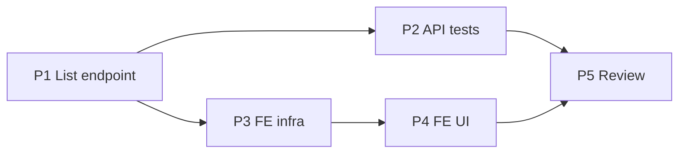

# Implementation Plan — Agent Folio History (US-AG20, US-AG21)

> **Spec:** `docs/folio-history/agent-folio-history.spec.md`
> **Stack (API):** Hono · Drizzle · Cloudflare D1 · Vitest (`cloudflare:test`)
> **Stack (App):** React · MUI · TanStack Query
> **Builds on:** the agent-only POS router (`/api/pos`, already `authMiddleware` +
> `requireRole('agent')`), the **already-shipped** agent folio detail read
> (`GET /api/pos/folios/:id` → `getFolio`, with its `readFolio` shape + signed-QR echo), the
> `folios`/`folio_lines`/`folio_line_extras` tables, `status = 'cancelled'` +
> `cancelled_at` from the cancellation feature, the `AppLayout` shell, `features/pos`
> (`useFolio`, `TicketQr`), and the money helpers in `features/catalog/types`.

This is one of the **smallest** features in the MVP. The detail story (US-AG21) is **already
served** by the existing agent receipt endpoint — there is **nothing new to build on the
backend for it**. The entire backend deliverable is **one read-only, caller-scoped list
handler** (`GET /api/pos/folios`) for US-AG20. The frontend adds an agent **history list**
page and a **status-aware detail** page that reuses the existing `useFolio` hook.

- **No** new table, column, or migration.
- **No** new `ErrorCode`.
- **No** writes anywhere — strictly read-only.

> **Forward seam:** *Resend receipt + QR from history* (US-AG22) is **Phase 2**. The history
> detail page is the single seam where that action will attach; this feature sends no email.

---

## Phases

```
Phase 1 → API: listAgentFolios handler + GET /api/pos/folios route
Phase 2 → API tests (Scenarios 1–11, incl. multitenancy B3/B4)
Phase 3 → Frontend infra (service call, type, hook)
Phase 4 → Frontend UI (agent History list + status-aware detail page) + nav + routes
Phase 5 → Review against spec + SPEC checklist
```

Phases 1→2 (backend) are independently shippable. Phases 3→4 depend on Phase 1.

---

## Phase 1 — API (the only backend work)

Add to the **existing** POS router — no new resource directory. The router is already
agent-only, so role/auth are inherited.

### Task 1.1 — `listAgentFolios` (`src/routes/pos/handler.ts`)

Mirror the admin `listFolios` (`folios/handler.ts`) but **caller-scoped** and with a leaner
row (no `agent` block — every row is the caller's own). Read filters from the query string
directly (no Zod), matching the admin handler.

```ts
// US-AG20 — the caller agent's own folios (their read-only sales history). Caller-scoped:
// organization_id AND agent_id come from context — there is NO agent_id query param, so an
// agent can never see another agent's folios (that is the admin org-wide list). Optional
// status / date (created_at UTC day) filters; newest first. Lean row — a history list, not
// a metrics dashboard.
export const listAgentFolios = async (c: PosContext) => {
  const agent = c.get('user')
  const org = agent.organizationId
  const db = getDb(c.env)

  const statusQ = c.req.query('status')
  const dateQ = c.req.query('date')

  const filters = [
    eq(folios.organizationId, org),
    eq(folios.agentId, agent.userId), // caller-scoped — never from the request
  ]
  if (statusQ === 'paid' || statusQ === 'booking' || statusQ === 'cancelled') {
    filters.push(eq(folios.status, statusQ))
  }
  if (dateQ) {
    filters.push(
      sql`strftime('%Y-%m-%d', ${folios.createdAt}, 'unixepoch') = ${dateQ}`,
    )
  }

  const rows = await db
    .select({
      id: folios.id,
      customerName: folios.customerName,
      status: folios.status,
      total: folios.total,
      amountPaid: folios.amountPaid,
      createdAt: folios.createdAt,
      cancelledAt: folios.cancelledAt,
    })
    .from(folios)
    .where(and(...filters))
    .orderBy(desc(folios.createdAt))

  return c.json({
    folios: rows.map((r) => ({
      id: r.id,
      customer_name: r.customerName,
      status: r.status,
      total: r.total,
      amount_paid: r.amountPaid,
      created_at: Math.floor(r.createdAt.getTime() / 1000),
      cancelled_at: r.cancelledAt ? Math.floor(r.cancelledAt.getTime() / 1000) : null,
    })),
  })
}
```

> Imports to confirm in `pos/handler.ts`: `desc`, `sql` from `drizzle-orm` (already imports
> `and`, `eq`, `asc`). No `users` join needed (no agent name in the row).

### Task 1.2 — Route (`src/routes/pos/index.ts`)

```ts
import { confirmSale, getFolio, getPosService, listAgentFolios, listPosServices } from './handler'
// …
pos.get('/folios', listAgentFolios)      // US-AG20 — list (new)
pos.get('/folios/:id', getFolio)         // US-AG21 — detail (already shipped)
```

> `GET /folios` (list) and `GET /folios/:id` (detail) are distinct paths — no ordering
> conflict. `POST /folios` (confirm sale) is untouched.

**Deliverable:** `GET /api/pos/folios` returns the caller's folios newest-first; `?status=` /
`?date=` filter; an admin → `403`; another agent's folios never appear. `curl` smoke passes.

---

## Phase 2 — API Tests (`test/pos/agent-folio-history.test.ts`)

Reuse `seedUser` / `seedTwoOrgs` / `clearTenancyDb` (`test/helpers/tenancy.ts`) and
`buildFakeJwt`. Reuse the POS seed helpers already used by `test/pos/pos-controlled-discount.test.ts`
for services/slots/folios (or add a local `seedFolio` with configurable `agent_id` /
`status` / `total` / `amount_paid` / `created_at`). `beforeEach` clears
`folio_line_extras → folio_lines → folios → slots → schedules → service_extras → services`,
then the tenancy clear.

| Test | Spec scenario |
|---|---|
| List returns only the caller's folios, `created_at DESC`; same-org other agent's folio absent | 1 |
| Each row carries its `status`; cancelled row has non-null `cancelled_at` | 2 |
| `?status=cancelled` filters to the caller's cancelled folios; bad status ignored | 3 |
| `?date=YYYY-MM-DD` filters to that UTC day | 4 |
| Agent with no folios → `200 { folios: [] }` | 5 |
| Detail of the caller's own folio → `200` with lines/extras/totals/qr (reuses `getFolio`) | 6 |
| Detail of another agent's folio (same org) → `404` | 7 |
| Cancelled folio visible read-only (`status: 'cancelled'`) | 8 |
| Non-agent (admin) → `403` on the list | 9 |
| **B3** cross-org folio by id → `404` (`seedTwoOrgs`) | 10 |
| **B4** list is org- and caller-scoped; no param widens it | 11 |

> Scenario 6/7 largely re-assert existing `getFolio` guarantees, anchored here as the
> US-AG21 contract that the history relies on. Scenario 11 seeds ≥2 agents in `org_a` and a
> folio in `org_b`, then asserts the caller sees only their own `org_a` folios.

**Deliverable:** `pnpm --filter api-turistear test` green.

---

## Phase 3 — Frontend Infrastructure

Keep agent history in the **`features/pos`** feature (the detail read already lives there as
`useFolio`). Reuse `request()` from `authService.ts` and the money helpers from
`features/catalog/types`.

### Task 3.1 — Type (`src/features/pos/types.ts`)

```ts
export type FolioStatus = 'paid' | 'booking' | 'cancelled'

// US-AG20 — lean row for the agent's history list (no agent block — all rows are the caller's).
export interface FolioHistoryItem {
  id: string
  customer_name: string | null
  status: FolioStatus
  total: number
  amount_paid: number
  created_at: number
  cancelled_at: number | null
}
```

### Task 3.2 — Service (`src/services/posService.ts`)

```ts
export interface MyFolioFilters {
  status?: FolioStatus
  date?: string
}

// US-AG20 — the caller agent's own folio history. Server scopes to the caller; no agent_id.
export const listMyFolios = async (filters: MyFolioFilters = {}): Promise<FolioHistoryItem[]> => {
  const params = new URLSearchParams()
  if (filters.status) params.set('status', filters.status)
  if (filters.date) params.set('date', filters.date)
  const qs = params.toString()
  const res = await request<{ folios: FolioHistoryItem[] }>(`/api/pos/folios${qs ? `?${qs}` : ''}`)
  return res.folios
}
```

### Task 3.3 — Hook (`src/features/pos/hooks/useMyFolios.ts` + export in `hooks/index.ts`)

```ts
import { useQuery } from '@tanstack/react-query'
import { listMyFolios, type MyFolioFilters } from '../../../services/posService'

export const MY_FOLIOS_QUERY_KEY = ['pos', 'my-folios'] as const

// US-AG20 — agent's own folio history. The existing useFolio(id) covers the detail (US-AG21).
export function useMyFolios(filters: MyFolioFilters = {}) {
  return useQuery({
    queryKey: [...MY_FOLIOS_QUERY_KEY, filters],
    queryFn: () => listMyFolios(filters),
  })
}
```

**Deliverable:** service + hook + type importable; types compile.

---

## Phase 4 — Frontend UI

### Routes (`config/routes.ts`)

```ts
HISTORY: '/history',          // agent — own folio history list (US-AG20)
HISTORY_DETAIL: '/history/:id', // agent — one folio, read-only (US-AG21)
```

> Distinct from the admin **Folios** (`/folios`, `/folios/:id`) and the post-sale receipt
> (`/pos/folio/:id`). The detail page reuses the same `useFolio` hook + endpoint as the
> receipt, but with neutral, status-aware framing instead of the "Venta confirmada" hero.

### Nav (`AppLayout`)

Add an **agent-only** entry: `{ label: 'Historial', to: ROUTES.HISTORY, icon:
ReceiptLongRounded, role: 'agent' }` (a history-flavored icon distinct from the admin
**Folios** `ReceiptRounded`). `App.tsx`: lazy `RoleGuard role="agent"` routes for both paths.

### Task 4.1 — `FolioHistoryPage` (`pages/FolioHistoryPage.tsx`) — US-AG20

- `useMyFolios(filters)` → a list of cards/rows: customer name (or "Sin nombre"), date
  (`created_at`), `total` (`formatMoney`), and a **status chip** (`paid` / `booking` neutral,
  `cancelled` in error color). Row → `HISTORY_DETAIL`.
- A status filter (`ToggleButtonGroup`: Todos / Pagado / Apartado / Cancelado), mirroring the
  admin `FoliosListPage` filter pattern.
- Loading (`CircularProgress`), error (`Alert`), and **empty** states ("Aún no tienes ventas
  registradas").
- Elegant-minimalist: `Card elevation={0}` + `1px` divider borders, generous spacing,
  `maxWidth` mobile-first column.

### Task 4.2 — `FolioHistoryDetailPage` (`pages/FolioHistoryDetailPage.tsx`) — US-AG21

- `useFolio(id)` (existing hook) → customer block, line items (service, slot date/time, qty,
  unit price, line total) + extras, totals (subtotal, discount, total, amount paid), and a
  `TicketQr` per line so the agent can re-show the customer's QR.
- **Status-aware framing:** no success hero. When `status === 'cancelled'`, show an `Alert`
  ("Este folio fue cancelado") with the cancelled date; otherwise a neutral status chip.
- **Read-only** — no cancel/edit/resend affordance. (US-AG22 resend is the Phase-2 seam.)
- Back link to `HISTORY`.

> Reuse opportunity: the line-items + totals block is nearly identical to `FolioReceiptPage`.
> Optionally extract a shared `FolioSummary` presentational component used by both the receipt
> and the history detail — keep it in `features/pos/components`. Not required to ship.

**Deliverable:** an agent can open **Historial**, see their past sales with status, tap one,
and review its services, amounts, and QR — end-to-end, read-only.

---

## Phase 5 — Review

- Walk spec Scenarios 1–11; mark ✅/❌.
- Confirm the **caller-scope** rule: the list query filters `organization_id` **and**
  `agent_id` from context; there is **no** `agent_id` query param; another agent's folio is
  absent from the list and `404` on detail.
- Confirm **read-only**: no write path is added; no cancel/edit/resend affordance on either
  page; a `cancelled` folio renders informationally only.
- Confirm **reuse**: the detail uses the existing `GET /api/pos/folios/:id` (`getFolio`) +
  `useFolio` — no duplicate detail endpoint or hook.
- Confirm role/tenancy: admin → `403` on `GET /api/pos/folios`; cross-org id → `404`; the POS
  router's `requireRole('agent')` covers the new route; **no new `ErrorCode`**.
- Update `docs/SPEC.md`: tick **Agent folio history (read-only list and details)**
  *(US-AG20, US-AG21)* under SHOULD HAVE, linking this spec.
- Note the deferred **US-AG22** (resend receipt/QR from history) as a Phase-2 seam on the
  detail page (optionally in `docs/TECH_DEBT.md`).

---

## Phase Dependencies



---

## Checklist

### Backend
- [x] `listAgentFolios` in `pos/handler.ts` — caller-scoped (`organization_id` + `agent_id`
      from context), `created_at DESC`, optional `status` / `date`, lean row shape
- [x] `GET /api/pos/folios` wired in `pos/index.ts` (agent-only via the router)
- [x] No `agent_id` query param; no new table/column/migration; no new `ErrorCode`
- [x] Detail (`GET /api/pos/folios/:id`, US-AG21) reused unchanged (additive `cancelled_at`
      added to its response for the cancelled banner)
- [x] `test/pos/agent-folio-history.test.ts` Scenarios 1–11 (caller-scope, ordering, filters,
      empty, own-detail, other-agent `404`, cancelled read-only, admin `403`, B3/B4)

### Frontend
- [x] `posService.listMyFolios` (1 call)
- [x] `FolioHistoryItem` type + `useMyFolios` hook in `features/pos`
- [x] `FolioHistoryPage` (status chips + filter + empty state) + `FolioHistoryDetailPage`
      (status-aware, read-only, reuses `useFolio` + `TicketQr`)
- [x] Agent-only **Historial** nav + `HISTORY` / `HISTORY_DETAIL` routes

### Docs
- [x] `docs/SPEC.md` SHOULD-HAVE item ticked (US-AG20, US-AG21)
- [x] US-AG22 resend noted as a Phase-2 seam
