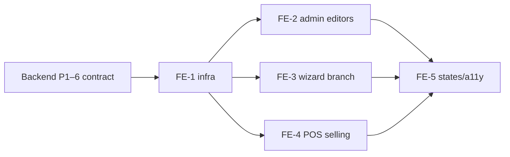

# Frontend Plan — Accommodation Stays (Lodging)

> **Spec:** `docs/lodging/accommodation-stays.spec.md`
> **Backend plan:** `docs/lodging/implementation-plan.md` (Phases 1–6 are the API contract this consumes)
> **Design sources (binding):** `.design/design-system/DESIGN_BRIEF.md` ·
> `.design/design-system/DESIGN_TOKENS.md` · `.design/design-system/INFORMATION_ARCHITECTURE.md`
> **Stack:** React 18 · TS · Vite (CRXJS) · **MUI v6** (`createTheme cssVariables`) · TanStack Query ·
> React Hook Form + Zod
> **Stories:** US-A59–A63 (admin config + wizard) · US-AG36–AG38 (selling)

This plan covers **only the frontend**. It adds three surfaces — the **lodging admin editors**, a
**lodging branch of the Service Creation Wizard** (US-A38–A44 chrome, now category-aware), and the
**POS stay-selling** flow — each built strictly from the shared primitive layer and the
Elegant-Field-Minimalism tokens. **No new visual language is introduced**; every screen maps onto an
existing IA archetype.

---

## 0. Design-system conformance contract (applies to every surface below)

Non-negotiables pulled from the three design docs. Each task references this section instead of
restating it.

| Concern | Rule (token / source) |
|---|---|
| **Accent** | Teal `#0F766E` (`palette.primary`) is the **only** fill — used for the single bottom-anchored CTA, active nav, and **selected** states (a picked date, a chosen unit, an active chip). Never for state/meaning. (Brief §Principle 2; Tokens §1.) |
| **Money & counts** | Every price, nightly rate, stay total, and "N noches" count renders through **`MoneyText`** / tabular Manrope (`--numeric-feature-settings`), color **semantic** (neutral ink / success / error), **never teal**. On every card and the checkout, the figure **reads first** (Brief §Key Interactions; IA §Content Hierarchy). |
| **Surfaces** | All resting containers use **`SectionCard`** (white, `--slate-200` hairline, `--radius-lg` 16, 24px pad, **no shadow**). Real shadow only on overlays: `BottomSheet` (`--shadow-sheet`), Dialog (`--shadow-overlay-md`), Menu (`--shadow-overlay-sm`). (Tokens §7/§9.) |
| **Shape** | Controls (buttons, inputs, segmented toggles, day cells) `--radius-md` 12 · cards/dialogs `--radius-lg` 16 · bottom-sheet top `--radius-xl` 20 · chips/avatars/FAB `--radius-full`. |
| **State color** | Availability/ok = green `#15803D`, caution = amber `#B45309`, unavailable/error = red `#B91C1C` — **always icon-paired**, via **`StatusChip`** / functional tints, never color-alone, never teal. (Tokens §3; IA §Badges.) |
| **Inputs** | White field, `--color-border-control` 1px, 12 radius, **≥48px** height, teal focus ring (`--shadow-focus`); money/number fields open the **mobile numeric keypad** (`inputMode="decimal"`). (Tokens §9 Input; Brief §Component Inventory.) |
| **Reach** | Mobile-first single column; the primary action is **bottom-anchored, full-width, teal, one per screen** (Cobrar / Guardar / Agregar). Touch targets ≥48px at every breakpoint. (Brief §Principle 3.) |
| **Overlays** | Configuration happens in a **`BottomSheet`** over a scrim; success **auto-closes** + returns control via Snackbar (reuses US-AG31). Sheets/dialogs **trap focus**, restore on close, and set `?action=` or local state so mobile **Back** dismisses the sheet (IA §URL Strategy). |
| **Motion** | Page fade `--duration-normal --easing-out`; sheet slide `--duration-slow --easing-sheet`; honor `prefers-reduced-motion`. |
| **A11y / i18n** | WCAG AA (daylight-biased); SR labels announce **meaning** ("Total de la estancia: $X", "3 noches", "No disponible"); Spanish (MX) copy, no truncation. (Brief §Accessibility.) |
| **Empty states** | Quiet, typographic, consistent voice — *"Aún no hay unidades"*, *"Sin temporadas"*. (IA §Catalog archetype.) |

**IA archetype mapping** (each surface inherits an existing content hierarchy):

| Surface | Archetype (IA §Content Hierarchy) |
|---|---|
| Lodging service detail (Units section) | **Detail screen** — identity+status → core figures → line items → actions |
| Unit / Season / Blockout editors | **Bottom-sheet / dialog config** over the detail |
| Service Creation Wizard (lodging branch) | **Wizard / multi-step** — fixed header (PASO n DE 4) · one cluster body · fixed footer |
| POS range-first availability | **Bottom-sheet config** + **Catalog/list** (each unit card leads with its total) |
| POS unit-first calendar | **Bottom-sheet config** (square day-cell calendar, US-AG35 pattern) |
| Stay checkout line | **Transactional screen** — total reads first → supporting math → one teal CTA |

---

## 1. Module layout & shared building blocks

```
app-guideme/src/
  features/catalog/
    lodging.ts                      # AMENITY_OPTIONS (key→label, order); shared by value with API enum
    types.ts (extend)               # AccommodationUnit, Season, Blockout, + lodging fields
    schemas.ts (extend)             # unitFormSchema, seasonFormSchema, blockoutFormSchema (Zod)
    hooks/
      useUnits.ts  useUnitMutations.ts  useSeasons.ts  useBlockouts.ts
      useCreateLodgingFull.ts       # wizard compile (service + first unit)
    components/
      UnitFields.tsx                # shared unit field group (RHF ctx + unitFormSchema) — reused by
                                    #   UnitFormDialog (FE-2) AND the wizard UnitDraftSheet (FE-3)
      SeasonsField.tsx              # CONTROLLED list+add-row core (value[] + onChange, client-side
                                    #   overlap check) — mode-agnostic; no network
      BlockoutsField.tsx            # CONTROLLED list+add-row core (value[] + onChange)
      UnitsSection.tsx  UnitRow.tsx  UnitFormDialog.tsx
      SeasonsEditor.tsx  BlockoutsEditor.tsx   # FE-2 mutation wrappers around the *Field cores
      AmenityPicker.tsx             # reusable amenity multi-select chips
      wizard/                       # EXTENDS the existing wizard (see §3)
        wizardSchema.ts (extend)    # category-aware fields + STEP_FIELDS/STEP_TITLES/totalSteps maps
        wizardTypes.ts (extend)     # per-track step ids + titles; UnitDraft (incl. seasons[]/blockouts[])
        StepCommission.tsx          # lodging Step 2 (service-level commission)
        StepUnits.tsx               # lodging Step 3 — units repeater (local units[] array)
        UnitDraftSheet.tsx          # add/edit one unit — UnitFields + SeasonsField + BlockoutsField, all local
  features/pos/
    types.ts (extend)               # LodgingAvailabilityUnit, UnitCalendarDay; PosServiceSummary.from_nightly_rate
    hooks/ useLodgingAvailability.ts  useUnitCalendar.ts
    components/
      LodgingStaySheet.tsx          # range-first: date-range + guests → available units
      UnitCalendarSheet.tsx         # unit-first: month availability calendar
      DateRangeCalendar.tsx         # shared range picker (extends US-AG35 day-cell grid)
      StayCartLine.tsx              # checkout line for a stay
  services/
    lodgingCatalogService.ts        # units/seasons/blockouts CRUD
    posLodgingService.ts            # availability + unit calendar
```

**Reused primitives (no new variants):** `WizardShell`, `BottomSheet`, `SectionCard`, `MoneyText`,
`StatusChip`, the `[− N +]` guests stepper (from US-AG32), the square day-cell grid + month nav
(from `PosDatePickerSheet`/US-AG35), `usePosCart`.

**Two new low-level pieces (composed from tokens, not new language):**
- `AmenityPicker` — wrap-flow of selectable chips (`--radius-full`, 48px tap height); selected =
  teal-50 surface + teal-700 text + check icon (selection = teal, per §0). SR: toggle buttons with
  `aria-pressed`.
- `DateRangeCalendar` — the US-AG35 day grid extended to **range** selection: first tap = check-in,
  second = check-out; the inclusive range fills with `--teal-50`, endpoints `--teal-700`. Days that
  are blocked/booked render **disabled** (muted, `--slate-100` well + strike icon); a short legend
  differentiates *No disponible* (blocked) vs *Ocupado* (booked) with functional dots. Checkout-day
  reuse (D4) means a booked stay's last night frees the checkout date — the grid reflects that.

---

## FE-1 — Infrastructure (types · schemas · services · hooks · amenity map)

> Mirrors implementation-plan Phase 7. Pure data layer; no UI. Ship first.

### Task 1.1 — Amenity map (`features/catalog/lodging.ts`)

`AMENITY_OPTIONS: { value: AmenityKey; label: string }[]` from spec §2.6 (`wifi`→"WiFi", … ,
`breakfast`→"Desayuno incluido"), plus `amenityLabel(key)`. Keys equal the API enum by value
(stored CSV server-side). Single source for the picker, the unit row chips, and the POS unit card.

### Task 1.2 — Types (`features/catalog/types.ts`, `features/pos/types.ts`)

`AccommodationUnit`, `Season`, `Blockout`, `LodgingAvailabilityUnit`
(`{ unit_id, name, unit_type, beds, base_occupancy, max_capacity, amenities[], checkin_time,
checkout_time, nights, total, per_night: { date, rate }[] }`), `UnitCalendarDay`
(`{ date, status: 'available'|'blocked'|'booked', rate }`). Extend `PosServiceSummary` with
`from_nightly_rate: number` and a `category`-driven lodging flag. Reuse `centsToAmount`/`amountToCents`.

### Task 1.3 — Zod form schemas (`features/catalog/schemas.ts`)

- `unitFormSchema` — `name` (min 1), `unit_type` (optional), `beds`/`base_occupancy`/`max_capacity`
  ints ≥ 1, money fields as **major-unit decimals** (the admin types $; convert with `amountToCents`
  on submit), `min_nights` ≥ 1, `checkin_time`/`checkout_time` `HH:MM`, `amenities: AmenityKey[]`,
  with `.refine(max_capacity ≥ base_occupancy, …)`.
- `seasonFormSchema` — `name`, `start_date`/`end_date` (`end ≥ start`), `nightly_rate` decimal ≥ 0.
- `blockoutFormSchema` — `start_date`/`end_date` (`end > start`), `reason?`.
- `rangesOverlap(a, b)` helper + `seasonOverlaps(draft, existing[])` — a **client-side** overlap
  guard so the wizard's draft seasons (no server round-trip) reject overlaps inline; the API's
  `409 SEASON_OVERLAP` stays the backstop. Shared by `SeasonsField` in both modes.
- Spanish messages mirroring the API (e.g. *"La capacidad máxima no puede ser menor a la base"*).

### Task 1.4 — Services + hooks

`lodgingCatalogService` (unit/season/blockout CRUD → spec §4.1) and `posLodgingService`
(`getAvailability(serviceId, {check_in, check_out, guests})`, `getUnitCalendar(unitId, {from,to})`).
Hooks: `useUnits(serviceId)`, `useCreate/Update/Deactivate/ReactivateUnit`, `useSeasons`,
`useBlockouts` (mutations invalidate `['units', serviceId]`); `useLodgingAvailability` (query keyed
on the range+guests, `enabled` once the range is valid), `useUnitCalendar`. Extend
`organizationsService` with the three lodging settings fields.

**Deliverable:** importable, type-checks (`pnpm --filter app-guideme exec tsc --noEmit`).

---

## FE-2 — Admin: lodging service detail editors

> **Detail-screen archetype.** Lives on `CatalogDetailPage` (`/catalog/:id`). The Units section
> renders **only** when `service.category === 'lodging'`; the existing slots/extras sections stay
> for tour categories — no regression.

### Task 2.1 — `UnitsSection` + `UnitRow`

- A `SectionCard` titled **Unidades** with a teal **"Agregar unidad"** action (the section's single
  accent affordance) and the unit list; empty state *"Aún no hay unidades — agrega la primera para
  poder vender."*
- `UnitRow` (a bordered list item, not a nested card): **name** (title, 18/600) · `unit_type` +
  beds/occupancy as `--text-body-sm` secondary · **`MoneyText`** "Desde $X / noche" (min of base
  vs weekend, neutral ink) · amenity chips (`--radius-full`, max 3 + "+N") · a `StatusChip`
  (`active`→green "Activa" / `inactive`→neutral "Inactiva", icon-paired). Row actions: **Editar**,
  **Temporadas**, **Bloqueos**, **Desactivar/Reactivar** (ghost buttons; deactivate confirms).
  Inactive rows render muted.

### Task 2.2 — `UnitFormDialog` (create + edit)

- MUI `Dialog`, **full-screen on `xs`** (`fullScreen={isMobile}`), `--radius-lg` on ≥sm; RHF +
  `unitFormSchema`, body = the shared **`UnitFields`** group (same component the wizard's
  `UnitDraftSheet` uses — one definition, no drift). Field groups render as visually separated
  clusters (label-overline headers): **Identidad** (name, type) · **Capacidad** (beds, base
  occupancy, max — steppers) · **Tarifas** (base rate, weekend rate, extra-person fee — money
  inputs, `$` adornment, numeric keypad, `MoneyText`-styled values where shown) · **Reglas** (min
  nights stepper, check-in/out time pickers) · **Amenidades** (`AmenityPicker`).
- Inline error when `max_capacity < base_occupancy` (mirrors the API refine). Bottom-anchored teal
  **Guardar**; convert decimals→cents + amenities→array on submit; success → close + Snackbar,
  invalidate `['units', serviceId]`; `400`/`409` → inline `Alert`.

### Task 2.3 — `SeasonsEditor` + `BlockoutsEditor` (mutation wrappers over the shared `*Field` cores)

- The reusable cores live in `SeasonsField` / `BlockoutsField` — **controlled** (`value[]` +
  `onChange`), mode-agnostic, no network: an inline **add row** (date-range + rate / + reason via
  the shared `DateRangeCalendar`, rates as `MoneyText`), a list of rows with a **trash** action, and
  the client-side `seasonOverlaps` guard (inline *"Esta temporada se traslapa con otra."*).
- `SeasonsEditor` / `BlockoutsEditor` (FE-2, detail page) open from a `UnitRow` action into a
  `BottomSheet` and wrap the core for an **existing** unit: they seed `value` from
  `useSeasons`/`useBlockouts` and translate each add/remove into the create/delete mutation
  (`409 SEASON_OVERLAP` from the server is the backstop). The wizard (FE-3) reuses the **same cores**
  bound to a draft's local arrays — no mutations until compile.

### Task 2.4 — Settings (`/settings`)

A `SectionCard` **Hospedaje**: weekend-days selector (L–D initials toggle, default V·S highlighted
teal), **Cancelación gratuita (días)** numeric, **Penalización (%)** numeric (0–100). Saves via the
extended `organizationsService`. Help text explains the free-window/penalty (Brief: inline help).

**Deliverable:** admin builds a full property (units + seasons + blockouts) and sets org policy.

---

## FE-3 — Service Creation Wizard: lodging branch with **multiple units up front** (US-A38–A44, category-aware)

> **Promoted to first-class** (was a follow-up). The wizard stays **one entry point** —
> *"Nuevo servicio"* — and **branches after Step 1 on the chosen category**. It reuses the
> `WizardShell` chrome verbatim (fixed header *PASO n DE N* + progress bar, fixed footer Anterior /
> Siguiente→**Guardar**, Anterior disabled on Step 1) — IA §Wizard archetype. The lodging service
> is created here **with all its units (≥ 1 required), and each unit's seasonal rates and
> block-outs** — a complete, fully-configured property in one pass. Post-create editing of any of
> these lives in FE-2.

### Why a repeater (not extra steps)

A unit carries ~12 fields and a property has *several* units — too much to flatten into wizard
steps. Instead the lodging track ends on a **units repeater** that reuses the **exact local-array
pattern the wizard already ships** for departure times (US-AG42) and extras (US-AG43): a step holds
a list, an "Agregar" affordance opens a sub-form, validated entries accumulate in local state, and
the step gates on `length ≥ 1` (mirroring the existing `times.length === 0` gate). Each unit's full
field set is captured in a sub-form bound to **`unitFormSchema`** (FE-1) via the shared
**`UnitFields`** group (FE-2) — one definition of a unit, three call sites (wizard sub-form,
detail-page `UnitFormDialog`, and validation).

### Step map (tracks have **different lengths**; `WizardShell` already takes `totalSteps` as a prop)

| Step | Tour track (existing, 4 steps) | **Lodging track (new, 3 steps)** |
|---|---|---|
| 1 | **Información básica** — name · category · description (shared component) | same; selecting **Hospedaje** switches the track |
| 2 | Precios y comisiones | **Comisión** (`StepCommission`): service-level commission %/$ segmented toggle (one rate for the whole property — US-A12) |
| 3 | Disponibilidad y horarios | **Unidades** (`StepUnits`): the repeater — add/edit/remove N units; **≥ 1 required to finish** |
| 4 | Extras | *(none — lodging is 3 steps)* |

### Task 3.1 — Category-aware step config (`wizard/wizardSchema.ts`, `wizardTypes.ts`)

- `totalSteps(category)` → `4` for tour, `3` for lodging. `stepTitle(category, step)` and
  `stepFields(category, step)` replace the static `TOTAL_STEPS`/`STEP_TITLES`/`STEP_FIELDS`.
- `WizardFormData` gains only the **service-level** lodging fields needed before the repeater —
  i.e. it reuses the existing `commission_type`/`commission_value` (no per-unit fields on the main
  form). Per-unit data lives entirely in the **`units: UnitDraft[]`** local array, each entry already
  validated by `unitFormSchema` at draft-save time → no `superRefine` unit branch needed.
- `STEP_FIELDS` for lodging: `1 → [name, category, description]`, `2 → [commission_type,
  commission_value]`, `3 → []` (gated by `units.length`, not RHF fields).
- `UnitDraft` (in `wizardTypes.ts`) = the `unitFormSchema` output + a client `tempId` +
  **`seasons: SeasonDraft[]`** and **`blockouts: BlockoutDraft[]`** (each a `*FormSchema` output +
  `tempId`). The whole property — units *and* their seasons/blockouts — lives in local state until
  the final compile.

### Task 3.2 — `StepUnits` repeater + `UnitDraftSheet`

- **`StepUnits`** — header *"Unidades"* + teal **"Agregar unidad"**; an empty state *"Aún no hay
  unidades — agrega al menos una para poder vender."*; otherwise the `units` list rendered with
  **`UnitRow`** (reused from FE-2: name, *"Desde $X/noche"* `MoneyText`, capacity, amenity chips,
  **Editar**/**Eliminar**). Receives `units` + `onChange` from the orchestrator (same shape as
  `StepExtras`' `extras`/`onChange`). Shows the ≥1 gate error when the user tries to advance empty
  (mirrors `showTimesError`).
- **`UnitDraftSheet`** — a `BottomSheet` (full-bleed on mobile, 20px top radius, real shadow) with
  its **own RHF form** (`zodResolver(unitFormSchema)`) wrapping **`UnitFields`**, plus two
  **collapsed-by-default** disclosure sub-sections beneath the fields — **Temporadas (opcional)** =
  `SeasonsField` and **Bloqueos (opcional)** = `BlockoutsField` — so the common case (a unit with
  just a name and a rate) stays a short form and advanced pricing/availability is opt-in. Each
  disclosure is a 48px tappable header (chevron + label) showing a **count badge when populated**
  (e.g. *Temporadas · 2*) so configured drafts stay discoverable even while collapsed; expanding one
  reveals its `*Field` core bound to the draft's local `seasons`/`blockouts` array (controlled, no
  network; `SeasonsField` runs the client-side overlap guard). A draft that already carries seasons
  or block-outs **opens with that section expanded** on edit. Bottom-anchored teal **Agregar/Guardar**.
  On submit, push/replace the full draft (unit + its seasons + blockouts) in the parent `units` array
  and auto-close. Money decimals stay as typed; conversion to cents happens at compile.

### Task 3.3 — Branch render + save (`wizard/ServiceWizard.tsx`)

- `const isLodging = category === 'lodging'`. Replace local `times`/`extras` usage with `units` on
  the lodging path; pick step bodies by track:
  `{step===2 && (isLodging ? <StepCommission/> : <StepPricing/>)}`,
  `{step===3 && (isLodging ? <StepUnits units={units} onChange={setUnits}/> : <StepAvailability …/>)}`.
- `goNext`/`save` call `stepFields(category, step)` and, on the lodging final step, gate on
  `units.length >= 1` (the analogue of the existing `times.length === 0` check) before compiling.
- Save → `useCreateLodgingFull` (Task 3.4) for lodging, existing `useCreateServiceFull` otherwise.
  `onCreated(serviceId, failures)` and the catalog success Snackbar are unchanged.

### Task 3.4 — `useCreateLodgingFull` compile hook (service + N units + their seasons/blockouts)

1. `POST /api/services` — category `lodging`, commission from the form,
   `base_price`/`minimum_price`/`default_capacity` = `0`/`0`/`1` (spec §4.3).
2. For each draft in `units`, **sequentially**:
   a. `POST /api/services/:id/units` (decimals→cents, amenities→array) → capture the new `unitId`.
      If the unit POST fails, count it and **skip its children** (no parent to attach to).
   b. For each `seasons[]` entry, `POST …/units/:unitId/seasons`; for each `blockouts[]` entry,
      `POST …/units/:unitId/blockouts`.
   Count every failed child write into a single `failures` total (units + seasons + blockouts).
3. Return `{ serviceId, failures }` — identical partial-success contract to `useCreateServiceFull`
   (the catalog surfaces *"Servicio creado; N elementos no se guardaron"* and the admin finishes the
   gaps in FE-2). If the **service** POST itself fails, nothing is created and the wizard stays on
   Step 3 with an error (clean rollback, matching the tour wizard).

### Design conformance (FE-3)

`WizardShell` already encodes the tokens (90vh mobile, 20px top radius, fixed header/footer, teal
progress + CTA); a shorter `totalSteps` just yields a 3-segment progress bar. The repeater reuses
the shipped times/extras interaction and `UnitRow`/`UnitFields`/`SeasonsField`/`BlockoutsField`/
`AmenityPicker` — **zero new chrome or visual language**. Discard-confirm dialog reused; `isDirty`
extended to include `units.length > 0`. `UnitDraftSheet` traps focus and restores to the "Agregar
unidad" button.

**Deliverable:** *Nuevo servicio* → Hospedaje produces a fully-configured lodging service **in one
pass — all its units, plus each unit's seasonal rates and block-outs** — on identical wizard chrome.

---

## FE-4 — POS: selling a stay (US-AG36/37/38)

### Task 4.1 — `DateRangeCalendar` (shared range picker)

Per §1: US-AG35 square day-cell grid + month nav, extended to range selection; blocked/booked days
disabled with a legend; selected range fills teal. Used by both POS sheets and (optionally) the
admin seasons/blockouts editors.

### Task 4.2 — Range-first: `LodgingStaySheet` (US-AG36)

- Tapping a **lodging** catalog card opens a `BottomSheet` (reuses the US-AG31 open/auto-close
  pattern). Top: **`DateRangeCalendar`** (check-in→check-out) + the **`[− N +]` guests stepper**.
- On a valid range, `useLodgingAvailability` loads; render available units as a **catalog/list**
  (each a `SectionCard`): the unit's **stay total reads first** (`MoneyText`, neutral) with
  *"N noches · $rate/noche"* secondary + capacity + amenity chips; sold-out units are simply absent.
- Picking a unit adds a **stay line** to `usePosCart` → sheet **auto-closes** + Snackbar
  *"Agregado al carrito · Ver carrito"*. Loading = skeleton rows; empty = *"No hay unidades
  disponibles para esas fechas."*; range invalid (`check_out ≤ check_in`) blocks the query with an
  inline hint.

### Task 4.3 — Unit-first: `UnitCalendarSheet` (US-AG37)

From a unit (e.g. a deep-link or a "Ver calendario" affordance), a `BottomSheet` shows the month
availability via `useUnitCalendar`: each day a square cell with its rate; free = selectable, blocked
= *No disponible*, booked = *Ocupado* (functional, icon-paired, never teal). Selecting a range here
feeds the same add-to-cart path as Task 4.2. Guests stepper shared.

### Task 4.4 — `StayCartLine` + deposit-aware checkout (US-AG38)

- The cart/checkout renders a stay line via `StayCartLine`: unit name (title) ·
  `Sáb 10 → Mar 13 · 3 noches` · guests · **`MoneyText` total** (reads first); an expandable
  per-night / extra-person breakdown beneath (supporting math, secondary text — IA transactional
  hierarchy).
- Checkout reuses the existing **adaptive amount-driven** control (US-AG07.2): amount pre-loads the
  total; `= total` → **Cobrar**/Finalizar Pago, `min ≤ amount < total` → **Registrar Reserva**
  (deposit), phone required for a booking. The single bottom-anchored teal CTA is unchanged.
- Confirm-time errors surface inline: `409 UNIT_UNAVAILABLE` → *"La unidad ya no está disponible
  para esas fechas."*; `400 MIN_STAY_NOT_MET` → *"Estancia mínima: N noches."*.

### Task 4.5 — Catalog card (US-AG30 branch)

A lodging service card shows **"Desde $X / noche"** (`from_nightly_rate` via `MoneyText`) and the
`has_availability` boolean treatment (the existing `AvailabilityChip`, green/neutral) — no spot
count. Tapping opens `LodgingStaySheet` instead of the tour service sheet (branch on category).

**Deliverable:** agent/affiliate sells a multi-night stay range-first or unit-first, full or deposit.

---

## FE-5 — States, edge cases, a11y & motion pass

- **Loading:** skeleton rows in availability lists; spinner only inside content area (never tear
  down nav). **Errors:** inline `Alert`, retriable. **Empty:** the quiet voice strings above.
- **Reduced motion:** sheet slide → instant/opacity; collapse the range-fill animation.
- **Focus:** trap in every sheet/dialog, restore to the opener; `DateRangeCalendar` arrow-key
  navigable; `AmenityPicker` chips are `aria-pressed` toggle buttons.
- **SR announcements (meaning, not bare numbers):** availability item =
  *"Cabaña 1, total de la estancia $4,500, 3 noches, disponible"*; unavailable day =
  *"12 de julio, no disponible"*; stay line total announced with label.
- **i18n:** all copy in Spanish (MX); verify no truncation at long strings; numbers via the locale
  money formatter already used by `MoneyText`.
- **Back-dismiss:** sheets set `?action=stay` / local state so mobile Back closes the sheet, not the
  page (IA §URL Strategy).

---

## Phase order & dependencies



FE-1 gates everything. FE-2/FE-3/FE-4 are parallelizable once infra + the relevant endpoints exist
(FE-4 needs Phase 4–5 of the backend; FE-2/FE-3 need Phase 3). FE-5 is a cross-cutting finish pass.

---

## Checklist

### Infrastructure (FE-1)
- [ ] `features/catalog/lodging.ts` amenity map (keys = API enum by value)
- [ ] Types: `AccommodationUnit`/`Season`/`Blockout`/`LodgingAvailabilityUnit`/`UnitCalendarDay`; `PosServiceSummary.from_nightly_rate`
- [ ] Zod `unitFormSchema`/`seasonFormSchema`/`blockoutFormSchema` (decimals→cents on submit; `max ≥ base` refine)
- [ ] `lodgingCatalogService` + `posLodgingService` + org-settings extension
- [ ] Hooks: units/seasons/blockouts mutations + `useLodgingAvailability`/`useUnitCalendar` + `useCreateLodgingFull`

### Admin editors (FE-2)
- [ ] `UnitsSection` + `UnitRow` on `CatalogDetailPage` (lodging-only; `MoneyText`, `StatusChip`, `SectionCard`)
- [ ] `UnitFormDialog` (full-screen xs, field clusters, `AmenityPicker`, numeric keypad, `max ≥ base` inline)
- [ ] `SeasonsEditor` (`409 SEASON_OVERLAP` inline) + `BlockoutsEditor` in a `BottomSheet`
- [ ] Settings: weekend-days + free-cancel-days + penalty-% with inline help

### Wizard branch (FE-3 — multiple units + their seasons/blockouts up front)
- [ ] Shared `SeasonsField`/`BlockoutsField` controlled cores (+ `seasonOverlaps` client guard); FE-2 editors rewrapped over them
- [ ] Category-aware `totalSteps`/`stepFields`/`stepTitle` (tour 4 steps · lodging 3 steps)
- [ ] `StepCommission` (service-level %/$ toggle) + `StepUnits` repeater (local `units[]`, ≥1 gate)
- [ ] `UnitDraftSheet` (own RHF + `unitFormSchema` + shared `UnitFields` + **collapsed-by-default** Temporadas/Bloqueos disclosures w/ count badges; add/edit/remove)
- [ ] `UnitDraft` carries `seasons[]`/`blockouts[]`; `ServiceWizard` `units` replaces times/extras; `isDirty` includes units
- [ ] `useCreateLodgingFull` (service + **N** units + each unit's seasons/blockouts, sequential, partial-failure parity)
- [ ] `WizardShell` chrome reused unchanged (PASO n DE N, teal progress + Guardar)

### POS selling (FE-4)
- [ ] `DateRangeCalendar` (US-AG35 grid → range; disabled blocked/booked + legend)
- [ ] `LodgingStaySheet` (range-first; total reads first; auto-close + Snackbar)
- [ ] `UnitCalendarSheet` (unit-first; functional day states)
- [ ] `StayCartLine` + deposit-aware checkout (US-AG07.2 reuse; inline `409`/`400`)
- [ ] Catalog card lodging branch (`from_nightly_rate`, `AvailabilityChip`, opens stay sheet)

### Finish (FE-5)
- [ ] Loading/error/empty states; reduced-motion; focus trap/restore; SR meaning labels; i18n no-truncation; Back-dismiss
- [ ] `pnpm --filter app-guideme exec tsc --noEmit` clean · `pnpm lint:app` clean
```

