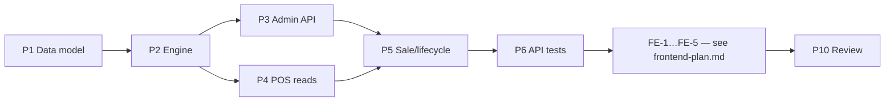

# Implementation Plan — Accommodation Stays (US-A59–A63, US-AG36–AG38)

> **Spec:** `docs/lodging/accommodation-stays.spec.md`
> **Stack (API):** Hono · Drizzle · Cloudflare D1 · Vitest (`cloudflare:test`)
> **Stack (App):** React 18 · MUI · TanStack Query · React Hook Form + Zod
> **Builds on:** the `services` nested-resource pattern (extras/slots), `authMiddleware`,
> `requireRole`, the multitenancy Enforcement Contract, the `confirmSale` atomic guard
> (`src/routes/pos/handler.ts:641`) + sweep (`src/routes/pos/sweep.ts`), the apartado lifecycle
> (`docs/bookings/bookings-down-payments.spec.md`), and the `effectiveCapacity()` shared-helper
> discipline.

A `lodging` service gains **named units** with their own nightly pricing, availability controls,
and amenities, sold for a **date range** through the existing cart → folio flow. The core is a new
inventory primitive — `accommodation_reservations` — guarded by an atomic overlap-insert, the
lodging analogue of the slot capacity guard (US-AG11). Backend first (independently shippable),
then the POS/admin UI.

---

## Phases

```
Phase 1 → Data model (5 migrations + Drizzle schema + org settings)
Phase 2 → Shared engine (src/utils/lodging.ts: nightlyRate · quoteStay · isUnitAvailable)
Phase 3 → Admin API: units / seasons / blockouts (nested under services) + org settings
Phase 4 → POS API: availability reads + listPosServices lodging branch
Phase 5 → POS API: confirmSale stay lines + reservation guard; cancel/expiry/reactivate; refund
Phase 6 → API tests (scenarios 1–16 + multitenancy B1/B3/B4)
Phase 7–9 → Frontend → see docs/lodging/frontend-plan.md (FE-1 infra · FE-2 admin editors ·
            FE-3 Creation Wizard lodging branch · FE-4 POS selling · FE-5 finish)
Phase 10 → Review against spec + close TECH_DEBT (3 new error codes)
```

Phases 1→6 (backend) are independently shippable. Phases 7→9 depend on the backend.
**Order matters within backend:** Phase 2 (engine) is imported by both Phase 4 (display) and
Phase 5 (enforcement) — build it once, share it.

---

## Phase 1 — Data Model

Five migrations, continuing the `0035+` sequence (latest in tree is `0034`). One table per file,
matching the `0006`–`0009` style. All money is integer **minor units**; dates/times are TEXT.

### Task 1.1 — `migrations/0035_create_accommodation_units.sql`

```sql
CREATE TABLE `accommodation_units` (
	`id` text PRIMARY KEY NOT NULL,
	`organization_id` text NOT NULL,
	`service_id` text NOT NULL,
	`name` text NOT NULL,
	`unit_type` text,
	`beds` integer NOT NULL,
	`base_occupancy` integer NOT NULL,
	`max_capacity` integer NOT NULL,
	`base_rate` integer NOT NULL,
	`weekend_rate` integer,
	`extra_person_fee` integer DEFAULT 0 NOT NULL,
	`min_nights` integer DEFAULT 1 NOT NULL,
	`checkin_time` text DEFAULT '15:00' NOT NULL,
	`checkout_time` text DEFAULT '11:00' NOT NULL,
	`amenities` text DEFAULT '' NOT NULL,
	`status` text DEFAULT 'active' NOT NULL,
	`created_at` integer DEFAULT (unixepoch()) NOT NULL,
	`updated_at` integer DEFAULT (unixepoch()) NOT NULL,
	FOREIGN KEY (`organization_id`) REFERENCES `organizations`(`id`),
	FOREIGN KEY (`service_id`) REFERENCES `services`(`id`)
);
--> statement-breakpoint
CREATE INDEX `accommodation_units_org_service_idx` ON `accommodation_units` (`organization_id`, `service_id`, `status`);
```

### Task 1.2 — `migrations/0036_create_accommodation_seasons.sql`

Columns per spec §2.2 (`unit_id`, `name`, `start_date`, `end_date`, `nightly_rate`, `status`).
Index `accommodation_seasons_org_unit_idx (organization_id, unit_id, start_date)`.

### Task 1.3 — `migrations/0037_create_accommodation_blockouts.sql`

Columns per spec §2.3 (`unit_id`, `start_date`, `end_date`, `reason`). Index
`accommodation_blockouts_org_unit_idx (organization_id, unit_id, start_date)`. No `status`
(hard-deletable).

### Task 1.4 — `migrations/0038_create_accommodation_reservations.sql`

Columns per spec §2.4 (`unit_id`, `folio_id`, `check_in`, `check_out`, `guests`, `status`).

```sql
CREATE INDEX `accommodation_reservations_org_unit_dates_idx`
  ON `accommodation_reservations` (`organization_id`, `unit_id`, `check_in`, `check_out`);
```

> No DB-level exclusion constraint (SQLite has none); overlap is enforced by the conditional-insert
> guard in Phase 5. The index makes the `WHERE NOT EXISTS` overlap probe cheap.

### Task 1.5 — `migrations/0039_add_lodging_settings_to_organizations.sql`

```sql
ALTER TABLE `organizations` ADD COLUMN `lodging_weekend_days` text DEFAULT '5,6' NOT NULL;
ALTER TABLE `organizations` ADD COLUMN `lodging_free_cancel_days` integer DEFAULT 0 NOT NULL;
ALTER TABLE `organizations` ADD COLUMN `lodging_cancel_penalty_pct` integer DEFAULT 0 NOT NULL;
```

Additive, default-safe (existing orgs: Fri+Sat weekends, no free-cancel window, no penalty).

### Task 1.6 — Drizzle schema (`src/db/schema.ts`)

Add the four `sqliteTable`s (status as `text({ enum })`, timestamps as `integer({ mode:'timestamp'})`)
and the three `organizations` columns next to `bookingGraceOffsetMinutes`. Export
`AccommodationUnit`/`New…`, `AccommodationSeason`, `AccommodationBlockout`,
`AccommodationReservation` inferred types.

**Deliverable:** migrations apply cleanly; types available. Run `pnpm cf-typegen:api` if bindings shift.

---

## Phase 2 — Shared engine (`src/utils/lodging.ts`)

Pure, dependency-free functions imported by Phase 4 (serializer) and Phase 5 (guard) — single
source of pricing/availability so display can't drift from enforcement (the `effectiveCapacity`
pattern).

```ts
// CSV "5,6" → number[]; reused for weekendDays + amenities parsing.
export const parseCsvInts = (csv: string): number[] => …
export const eachNight = (checkIn: string, checkOut: string): string[] => …   // [checkIn .. checkOut)
export const nightsBetween = (checkIn: string, checkOut: string): number => …

export function nightlyRate(date: string, unit, seasons, weekendDays: number[]): number
// season.nightly_rate if date ∈ an active season; else unit.weekend_rate (if set) on a weekend
// weekday; else unit.base_rate.   Precedence: seasonal > weekend > base.

export function quoteStay(unit, checkIn, checkOut, guests, seasons, weekendDays) {
  // returns { nights, total, perNight: [{ date, rate }] }
  // extraPerNight = max(0, guests - base_occupancy) * extra_person_fee, added to every night.
}

export type Unavailable = 'MIN_STAY_NOT_MET' | 'OVER_CAPACITY' | 'BLOCKED' | 'OVERLAP' | 'INACTIVE'
export function checkUnitAvailable(unit, checkIn, checkOut, guests, blockouts, reservations): Unavailable | null
// null = available; otherwise the first failing rule (spec §3.3). Date overlap is half-open (D4).
```

> Date math stays string-based (`YYYY-MM-DD`) — add a tiny `addDays`/`dateDiff` (mirror
> `features/pos/dates` on the app side) or reuse an existing util. No `Date`-timezone traps.

**Deliverable:** `src/utils/lodging.ts` unit-tested in isolation (Phase 6 includes engine cases 6,7,10).

---

## Phase 3 — Admin API (units / seasons / blockouts)

Extend the existing **admin-only** `services` router (`authMiddleware` + `requireRole('admin')` on
`*`, parent guarded by `requireService`). New file `src/routes/services/lodging.handler.ts` +
`lodging.schema.ts` (or fold into the existing handler — keep separate, it's sizeable).

### Task 3.1 — Schemas (`lodging.schema.ts`)

- `createUnitSchema` — `name` (min 1), `unit_type` (optional), `beds`/`base_occupancy`/`max_capacity`
  ints, rate fields money, `min_nights >= 1`, `checkin_time`/`checkout_time` `HH:MM`,
  `amenities` `z.array(z.enum(AMENITY_KEYS))` (serialized to CSV in the handler), with
  `.refine(max_capacity >= base_occupancy)`. `updateUnitSchema` = same (full replace).
- `createSeasonSchema` / `updateSeasonSchema` — `name`, `start_date`/`end_date` (`end >= start`),
  `nightly_rate` money.
- `createBlockoutSchema` — `start_date`/`end_date` (`end > start`), `reason` optional.
- No `organizationId`/`status` fields (Rule 1).
- Export `AMENITY_KEYS` const (shared with the frontend label map by value).

### Task 3.2 — Handlers (`lodging.handler.ts`)

Serializers map DB → API (snake_case; `amenities` CSV → array; `nights`/rates as-is). Every query
org-filtered + parent-scoped:

- **Units:** `createUnit` (verify parent service is `lodging` in org → else `400`/`404`; INSERT
  with `organizationId` from ctx); `listUnits` (`?status`); `updateUnit` (triple filter
  `unitId+serviceId+org`, 0 rows → `404`); `deactivateUnit`/`reactivateUnit` (idempotent).
- **Seasons:** `addSeason` — verify unit in org, **reject overlap** with an existing `active`
  season for that unit → `409 SEASON_OVERLAP`; `listSeasons`; `updateSeason` (re-check overlap
  excluding self); `deleteSeason` (soft → `status='inactive'`).
- **Blockouts:** `addBlockout`, `listBlockouts` (`?from=&to=`), `deleteBlockout` (hard delete,
  triple filter).

### Task 3.3 — Router wiring (`src/routes/services/index.ts`)

Mount the nested routes per spec §4.1 (units, units/:unitId/seasons, units/:unitId/blockouts) with
`zValidator` + the existing `validationHook`.

### Task 3.4 — Org settings (extend `src/routes/organizations/`)

Add `lodging_weekend_days` (CSV of ints `0–6`, validated), `lodging_free_cancel_days` (`>=0`),
`lodging_cancel_penalty_pct` (`0–100`) to the org-settings GET/PUT schema + serializer.

**Deliverable:** admin can CRUD units/seasons/blockouts and set lodging org policy via `curl`.

---

## Phase 4 — POS availability reads

New file `src/routes/pos/lodging.handler.ts`; routes on the existing POS router (auth: agent /
affiliate / admin sellers; org-scoped).

- **`getLodgingAvailability`** (`GET /api/pos/lodging/:serviceId/availability?check_in=&check_out=&guests=`)
  — `400` on bad range; load the service's active units + their active seasons + blockouts +
  overlapping active reservations (org-filtered); for each unit run `checkUnitAvailable`, and for
  the survivors `quoteStay`; return only available units with their breakdown (spec §4.2).
- **`getUnitCalendar`** (`GET /api/pos/lodging/units/:unitId/calendar?from=&to=`) — per-day status
  (`available`/`blocked`/`booked`) + `nightlyRate` per day for that unit.
- **`listPosServices` lodging branch** (extend `src/routes/pos/handler.ts`): for
  `category === 'lodging'` compute `has_availability` from units/reservations over the rolling
  window (or selected date) and emit `from_nightly_rate` (min unit `base_rate`); omit slot/spot
  fields. Tour services unchanged (spec §4.3).

> Affiliate visibility: reuse the existing affiliate allow-list filter so an affiliate only sees
> lodging services with an `affiliate_commission` row.

**Deliverable:** range-first + unit-first reads return correct, org-scoped availability & prices.

---

## Phase 5 — POS sale, lifecycle & refund

### Task 5.1 — `confirmSale` stay lines (`src/routes/pos/handler.ts`, schema.ts)

- Extend `confirmSaleSchema` so a cart line is **either** a slot line `{ slot_id, quantity }`
  **or** a stay line `{ service_id, unit_id, check_in, check_out, guests }` (discriminated union).
- In `confirmSale`, for each stay line: re-load the unit/seasons (org-filtered), **re-`quoteStay`
  server-side** (ignore any client price), and **snapshot** total + per-night breakdown + unit
  name onto the folio line (folio history must not dereference live config).
- **Atomic guard** — conditional insert (the lodging analogue of the slot guard at
  `handler.ts:192`/`:293`):

  ```sql
  INSERT INTO accommodation_reservations (id, organization_id, service_id, unit_id, folio_id,
                                          check_in, check_out, guests, status)
  SELECT :id, :org, :svc, :unit, :folio, :in, :out, :guests, 'active'
  WHERE NOT EXISTS (
    SELECT 1 FROM accommodation_reservations r
    WHERE r.unit_id = :unit AND r.status = 'active'
      AND r.check_in < :out AND :in < r.check_out                  -- half-open overlap (D4)
  )
  AND NOT EXISTS (
    SELECT 1 FROM accommodation_blockouts b
    WHERE b.unit_id = :unit AND b.start_date < :out AND :in < b.end_date
  );
  ```

  0 rows affected → `409 UNIT_UNAVAILABLE`; the whole sale rolls back (same transaction/rollback
  path as the slot guard — a mixed cart fails atomically). Re-validate `nights >= min_nights`
  (`400 MIN_STAY_NOT_MET`) and `guests <= max_capacity` before the insert.

### Task 5.2 — Lifecycle (deposit / settle / cancel / reactivate / sweep)

The apartado machinery operates on the folio; the reservation follows its status:

- **Create with deposit:** reservation born `active` (holds the dates) regardless of `booking` vs
  `paid` folio status. `Liquidar saldo` → folio `paid`, reservation untouched.
- **Cancel (US-AG07.4) / auto-expiry (`sweep.ts`):** set the folio's reservations → `cancelled`
  (frees the dates). Deposit non-refundable (unchanged).
- **Reactivate (US-AG07.5):** re-run the §5.1 atomic guard; if the dates were retaken →
  `409 UNIT_UNAVAILABLE` (action disabled in UI when unavailable).

### Task 5.3 — Paid-stay refund (D9 — extend US-A21 cancellation handler)

When cancelling a **`paid`** folio that has stay lines: set reservations → `cancelled` and compute
the structured refund per spec §4.5 (`free_cancel_days` / `cancel_penalty_pct`), recorded via the
existing refund-tracking fields (US-A23); commission clawback per US-A26.

### Task 5.4 — Error codes

Add `'UNIT_UNAVAILABLE'`, `'SEASON_OVERLAP'`, `'MIN_STAY_NOT_MET'` to the `ErrorCode` union
(`src/types/errors.ts`, after `'CONFLICT'`). Record in `docs/TECH_DEBT.md` as introduced-and-consumed.

**Deliverable:** a stay sells (full or deposit), holds its dates atomically, and releases them on
cancel/expiry; concurrent double-booking yields exactly one success.

---

## Phase 6 — API tests (`test/lodging/accommodation-stays.test.ts`)

Reuse `seedTwoOrgs`/`seedUser`/`buildFakeJwt`; add local seeders `seedLodgingService`,
`seedUnit`, `seedSeason`, `seedBlockout`, `seedReservation` (raw `env.DB.prepare`). Clear the four
new tables in `beforeEach`.

| Test | Spec scenario |
|---|---|
| Create unit → 201; `max_capacity < base_occupancy` → 400 | 1, 2 |
| Unit only on a lodging service (non-lodging parent → 400) | 3 |
| Deactivate/reactivate idempotent; reservations untouched | 4 |
| Season persists; overlapping active season → 409 `SEASON_OVERLAP` | 5 |
| `quoteStay` precedence (season > weekend > base) — **engine unit test** | 6 |
| Extra-person surcharge per night — **engine unit test** | 7 |
| Block-out hides unit + 409 `UNIT_UNAVAILABLE` at confirm | 8 |
| Min-stay → 400 `MIN_STAY_NOT_MET`; hidden in range-first list | 9 |
| Turnover: checkout-day reuse is available — **engine unit test** | 10 |
| Amenities CSV round-trip; unknown key → 400 | 11 |
| Paid-stay refund (full vs penalty); booking-status deposit non-refundable | 12 |
| Range-first availability returns only free units w/ correct totals | 13 |
| Concurrent confirm same unit/range → one 201, one 409 (atomic) | 14 |
| Deposit path: booking folio + active reservation; settle/expiry transitions | 15 |
| Mixed cart (tour + stay) confirms/rolls back atomically | 16 |
| **B4** unit/season/blockout/availability lists org-scoped | 17 |
| **B3** cross-org get/edit/availability → 404 | 18 |
| **B1** injected `organizationId`/`status` stripped | 19 |

**Deliverable:** `pnpm --filter api-guideme test` green.

---

## Phase 7 — Frontend infrastructure

New feature dir `app-guideme/src/features/catalog/` additions + POS hooks. Reuse the `request()`
wrapper.

- **`features/catalog/lodging.ts`** — `AMENITY_OPTIONS` (key → Spanish label, §2.6), shared
  ordering; `centsToAmount`/`amountToCents` already exist.
- **Types** (`features/catalog/types.ts` + `features/pos/types.ts`) — `AccommodationUnit`,
  `Season`, `Blockout`, `LodgingAvailabilityUnit` (with `nights`/`total`/`per_night`),
  `UnitCalendarDay`; extend `PosServiceSummary` with `from_nightly_rate` + lodging flag.
- **Zod form schemas** (`features/catalog/schemas.ts`) — `unitFormSchema`
  (`max_capacity >= base_occupancy`, money as major-unit decimals → cents on submit, amenities
  array), `seasonFormSchema`, `blockoutFormSchema`.
- **Services** (`src/services/`) — `lodgingCatalogService` (units/seasons/blockouts CRUD) and
  `posLodgingService` (`getAvailability`, `getUnitCalendar`); extend `organizationsService` with
  the three settings fields.
- **Hooks** — `useUnits(serviceId)`, `useCreate/Update/Deactivate/ReactivateUnit`,
  `useSeasons`/`useBlockouts` mutations (invalidate `['units', serviceId]`);
  `useLodgingAvailability(serviceId, range, guests)`, `useUnitCalendar(unitId, range)`.

**Deliverable:** services + hooks compile and are importable.

---

## Phases 7–9 — Frontend (admin editors · **Creation Wizard branch** · POS selling)

> **The detailed, design-system-conformant frontend plan lives in
> `docs/lodging/frontend-plan.md`** (built against `DESIGN_BRIEF.md` / `DESIGN_TOKENS.md` /
> `INFORMATION_ARCHITECTURE.md`). The **Service Creation Wizard lodging branch is now in scope**
> (US-A38–A44, category-aware) — no longer a follow-up. Summary of the frontend phases:

- **FE-1 Infrastructure** — `features/catalog/lodging.ts` amenity map, types, Zod
  `unitFormSchema`/`seasonFormSchema`/`blockoutFormSchema`, `lodgingCatalogService` +
  `posLodgingService`, and hooks (units/seasons/blockouts + `useLodgingAvailability`,
  `useUnitCalendar`, `useCreateLodgingFull`). Gates everything.
- **FE-2 Admin editors** — a lodging-only **Units** section on `CatalogDetailPage`
  (`UnitsSection`/`UnitRow`, `MoneyText`/`StatusChip`/`SectionCard`), `UnitFormDialog`,
  `SeasonsEditor` (`409 SEASON_OVERLAP` inline), `BlockoutsEditor`, and the Settings fields.
- **FE-3 Creation Wizard branch (full property up front)** — extend
  `features/catalog/components/wizard/ServiceWizard` to **branch after Step 1 on `category`**: a
  3-step lodging track (Básica → Comisión → **Unidades repeater**) reusing the `WizardShell` chrome
  verbatim. The repeater (`StepUnits` + `UnitDraftSheet`, reusing the shipped times/extras pattern
  and the shared `UnitFields`/`unitFormSchema`) captures **N units in local state (≥ 1 required)**,
  and **each unit's seasonal rates + block-outs** via the shared controlled `SeasonsField`/
  `BlockoutsField` cores (also wrapped by the FE-2 detail editors). Compiles via
  `useCreateLodgingFull` (service → per unit: unit → its seasons/blockouts; single `failures`
  counter, partial-failure parity).
- **FE-4 POS selling** — `DateRangeCalendar` (US-AG35 grid → range), `LodgingStaySheet`
  (range-first, AG36), `UnitCalendarSheet` (unit-first, AG37), `StayCartLine` + deposit-aware
  checkout (AG38), and the lodging catalog-card branch (`from_nightly_rate`).
- **FE-5 Finish** — states, reduced-motion, focus trap, SR meaning labels, i18n, Back-dismiss.

**Deliverable:** admin builds a property (via wizard *and* detail editors); agent/affiliate sells a
multi-night stay range-first or unit-first, full or deposit — all on the Elegant-Field-Minimalism
tokens.

---

## Phase 10 — Review

- Walk spec Scenarios 1–19; mark ✅/❌. Confirm the engine is the **only** place pricing/overlap
  is computed (Phase 4 read == Phase 5 enforcement).
- Enforcement Contract: every query org-filtered; no `organizationId`/`status` in any Zod schema;
  inserts set org from context; nested resources filtered by the `…Id + serviceId/unitId + org`
  chain; cross-org → 404.
- Folio snapshot: stay total/breakdown/unit-name stored on the line, never re-read from live config.
- Record the 3 new error codes in `docs/TECH_DEBT.md` (introduced-and-consumed).
- Tick US-A59–A63 / US-AG36–AG38 references in `docs/SPEC.md`.

---

## Phase Dependencies



---

## Checklist

### Backend
- [ ] Migrations `0035`–`0039` (4 tables + 3 org columns; org-leading indexes)
- [ ] Drizzle tables + inferred types; org settings columns
- [ ] `src/utils/lodging.ts` — `nightlyRate` · `quoteStay` · `checkUnitAvailable` (shared)
- [ ] Admin units/seasons/blockouts handlers + schemas + router (`409 SEASON_OVERLAP`)
- [ ] Org-settings: weekend days + free-cancel-days + penalty-% (validated)
- [ ] POS `getLodgingAvailability` + `getUnitCalendar` + `listPosServices` lodging branch
- [ ] `confirmSale` stay lines: re-quote + snapshot + atomic overlap insert (`409 UNIT_UNAVAILABLE`)
- [ ] Lifecycle: deposit/settle/cancel/expiry/reactivate drive reservation status
- [ ] Paid-stay structured refund (D9); booking-status deposit non-refundable
- [ ] `UNIT_UNAVAILABLE` / `SEASON_OVERLAP` / `MIN_STAY_NOT_MET` in `ErrorCode`
- [ ] `test/lodging/accommodation-stays.test.ts` Scenarios 1–16 + engine cases
- [ ] Multitenancy B1/B3/B4 (17–19) via `seedTwoOrgs`

### Frontend → full checklist in `docs/lodging/frontend-plan.md`
- [ ] FE-1 infra (amenity map · types · Zod schemas · services · hooks incl. `useCreateLodgingFull`)
- [ ] FE-2 admin editors (Units section · `UnitFormDialog` · Seasons/Blockouts · Settings)
- [ ] FE-3 **Service Creation Wizard lodging branch** (category-aware steps + compile)
- [ ] FE-4 POS selling (range-first · unit-first · stay checkout line, deposit-aware)
- [ ] FE-5 finish (states · a11y · i18n · motion); `tsc`/`lint:app` clean

### Docs
- [ ] `docs/TECH_DEBT.md` — 3 new error codes recorded
- [ ] `docs/SPEC.md` references ticked
