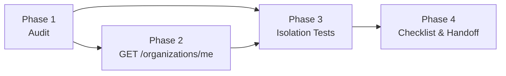

# Implementation Plan — Multitenancy Foundational

> **Stack:** Cloudflare Workers · Hono · Drizzle ORM · Cloudflare D1 · Vitest (`@cloudflare/vitest-pool-workers`)
> **Spec:** `docs/multitenancy/multitenancy.spec.md`
> **Architecture:** `docs/ARCHITECTURE.md`

---

## Phases

```
Phase 1 → Validate existing foundation (audit)
Phase 2 → GET /api/organizations/me endpoint
Phase 3 → Isolation tests + reusable cross-org helper
Phase 4 → Enforcement checklist and handoff to future features
```

---

## Phase 1 — Validate Existing Foundation

The database schema and auth middleware were built with multitenancy in mind from the start. This phase audits that the existing code already satisfies the contract before adding anything new. It is read-only — no code changes are expected.

### Task 1.1 — Audit DB schema

Verify the following migrations are applied and correct:

| Migration | Table | Tenant-scoped? | `organization_id` |
|---|---|---|---|
| `0001_create_organizations.sql` | `organizations` | Root | N/A |
| `0002_create_users.sql` | `users` | Yes | ✅ `NOT NULL REFERENCES organizations(id)` |
| `0003_create_invitations.sql` | `invitations` | Yes | ✅ `NOT NULL REFERENCES organizations(id)` |
| `0004_create_password_reset_tokens.sql` | `password_reset_tokens` | No (transitive via `user_id`) | ✅ Correctly excluded |

Also confirm:
- `users.email` carries a **global** `UNIQUE` index (`users_email_unique`) — this is the "one identity = one org" decision from the spec, not an oversight.
- Foreign keys exist on every `organization_id` column (integrity), with the understanding that they do **not** enforce isolation.

### Task 1.2 — Audit auth middleware

Verify that `src/middleware/auth.ts`:
- Resolves the user from the JWT `sub` (email) and looks them up in D1
- Attaches `organizationId` to `c.var.user` (via `buildUserPayload`)
- Returns `401 UNAUTHORIZED` for missing sessions and for expired sessions with no valid refresh

**Status:** ✅ Already implemented — `buildUserPayload` selects `organizationId` from `users` and attaches it to context.

### Task 1.3 — Audit existing handler against the Enforcement Contract

Verify that `src/routes/agents/handler.ts` (`inviteAgent`) already honors the rules:

| Operation | Rule | Status |
|---|---|---|
| `existingUser` check by email | Rule 2 exception (email is globally unique) | ✅ Correctly global |
| Expire prior pending invitations by `identity`+`status` | Rule 2 exception (identity unique per pending) | ✅ |
| Insert invitation | Rule 3 — sets `organizationId: admin.organizationId` | ✅ |
| Organization name lookup | Rule 1 — keyed by `admin.organizationId` from context | ✅ |

**Deliverable:** Audit findings recorded in the PR description. No code changes in Phase 1.

---

## Phase 2 — `GET /api/organizations/me`

### Task 2.1 — Add handler (`src/routes/organizations/handler.ts`)

Mirror the structure of `src/routes/agents/handler.ts` (typed context alias, `getDb`, `ApiError`). The missing-org branch maps to `INTERNAL_ERROR` (500), since `users.organization_id` is a `NOT NULL` FK and the org is therefore always present — its absence is an invariant violation, not a client error. This avoids introducing a `NOT_FOUND` code that the current `ErrorCode` union does not define.

```ts
import type { Context } from 'hono'
import { eq } from 'drizzle-orm'
import { getDb } from '../../db/client'
import { organizations } from '../../db/schema'
import { ApiError } from '../../types/errors'
import type { AppVariables } from '../../types/context'

type OrganizationsContext = Context<{
  Bindings: CloudflareBindings
  Variables: AppVariables
}>

export const getMyOrganization = async (c: OrganizationsContext) => {
  const user = c.get('user')
  const db = getDb(c.env)

  const result = await db
    .select({ id: organizations.id, name: organizations.name })
    .from(organizations)
    .where(eq(organizations.id, user.organizationId))
    .limit(1)

  const org = result[0]
  if (!org) {
    // Unreachable in normal operation (NOT NULL FK guarantees the org exists).
    throw new ApiError('INTERNAL_ERROR', 500, 'Organization not found')
  }

  return c.json({ organization: org })
}
```

> Response is limited to `{ id, name }` per the spec. Do **not** select `createdAt`/`updatedAt`: those columns use `{ mode: 'timestamp' }` and would serialize as ISO strings, which no current consumer needs.

### Task 2.2 — Add router (`src/routes/organizations/index.ts`)

```ts
import { Hono } from 'hono'
import { authMiddleware } from '../../middleware/auth'
import type { AppVariables } from '../../types/context'
import { getMyOrganization } from './handler'

const organizations = new Hono<{
  Bindings: CloudflareBindings
  Variables: AppVariables
}>()

organizations.use('*', authMiddleware)
organizations.get('/me', getMyOrganization)

export default organizations
```

> No `requireRole` — both `admin` and `agent` may read their own organization (spec A1/A2).

### Task 2.3 — Mount router in `src/index.tsx`

```ts
import organizationsRouter from './routes/organizations'

app.route('/api/organizations', organizationsRouter)
```

### Task 2.4 — Confirm Drizzle types

`Organization` / `NewOrganization` are already exported from `src/db/schema.ts`. No schema change needed.

**Deliverable:** `GET /api/organizations/me` returns `200 { organization: { id, name } }` for any authenticated user, `401` without a session.

---

## Phase 3 — Isolation Tests + Reusable Cross-Org Helper

Tests follow the existing harness in `test/auth/` (`cloudflare:test` with `SELF.fetch`, `env.DB.prepare`, `buildFakeJwt`, and a `clearDb` + seed pattern). Auth in tests works by seeding a user and setting `Cookie: gm_access=${buildFakeJwt(email)}` — the middleware resolves the user by the JWT `sub` (email); the signature is not verified.

### Task 3.1 — Create test file (`test/multitenancy/multitenancy.test.ts`)

Reuse the seed pattern from `test/auth/agent-invitation.test.ts` (a local `seedUser({ role, organizationId })` that creates the org + user and returns `{ userId, organizationId }`). Cover:

| Scenario | Test |
|---|---|
| A1 | Seed admin in `org_a` → `GET /api/organizations/me` → `200`, body `organization.id === org_a`, `organization.name === ORG_NAME` |
| A2 | Seed agent in `org_a` → `GET /api/organizations/me` → `200` with `org_a` data |
| A3 | No cookie → `GET /api/organizations/me` → `401`, `error.code === 'UNAUTHORIZED'` |
| B1 | Seed admin in `org_a`; `POST /api/agents/invite` with body `{ identity, organizationId: 'org_b' }`; assert `201` and the new `invitations.organization_id === org_a` (the injected `org_b` was stripped by Zod) |
| B2 | Seed admin in `org_a`; invite an agent; assert the new `invitations.organization_id === org_a` (write scoped from context) |

Mock Resend for the B1/B2 invite cases exactly as `agent-invitation.test.ts` does (`mockResend()`), so no real email is sent.

### Task 3.2 — Reusable cross-org assertion helper (`test/helpers/tenancy.ts`)

Provide a helper that future resource suites import to assert B3/B4 without re-implementing the setup each time:

```ts
// Seeds two orgs, returns their admins' cookies + ids, so a resource suite can
// create a row in org A and assert org B's admin gets 404 / an empty list.
export const seedTwoOrgs = async () => { /* ... */ }
```

Document in the file header that every new tenant-scoped resource route MUST add:
- a B3-style test (cross-org fetch-by-id → `404`), and
- a B4-style test (collection list excludes other orgs' rows).

> B3/B4 cannot be exercised end-to-end yet — no resource-detail/collection route exists beyond `/agents/invite`. The helper + documented requirement is the deliverable; the assertions land with the first resource feature (Service Catalog).

**Deliverable:** `pnpm --filter api-turistear test` passes with A1–A3, B1, B2 green; `seedTwoOrgs` helper available for future suites.

---

## Phase 4 — Enforcement Checklist and Handoff

### Task 4.1 — Codify the Enforcement Contract in `CLAUDE.md`

Add a "Multitenancy — Data Isolation Rules" section to `CLAUDE.md` (after the Backend Folder Structure Rules) so the contract is loaded into context on every session and applied automatically when implementing tenant-scoped features. The section restates Rules 1–6, the identity model (globally-unique `users.email` → one org per identity), and the cross-org testing requirement (`seedTwoOrgs`), and links to this spec for detail.

### Task 4.2 — Mark foundational feature complete in `docs/SPEC.md`

Once Phases 1–3 are complete, check off the Multitenancy item in the Phase 1 MUST HAVE list:

```markdown
- [x] **Multitenancy (isolated organizations)** *(Global)* — `docs/multitenancy/multitenancy.spec.md`
```

### Task 4.3 — Note the deferred `NOT_FOUND` error code

The cross-org resource-detail scenario (spec B3) returns `404`, but the current `ErrorCode` union (`src/types/errors.ts`) has no `NOT_FOUND`. Record this as a one-line task to be picked up by the **first** feature that introduces a resource-detail endpoint (Service Catalog): add `'NOT_FOUND'` to `ErrorCode`. It is intentionally **not** added here, because this feature has no endpoint that needs it (`/organizations/me`'s missing-org case is `INTERNAL_ERROR`).

**Deliverable:** PR template updated. `SPEC.md` checkbox checked. The deferred `NOT_FOUND` task is logged. The team is unblocked to start Staff Management with the enforcement contract in place.

---

## Phase Dependencies



Phase 1 is a read-only audit and can run in parallel with Phase 2. Phase 3 requires Phase 2 (the A1–A3 tests hit the new endpoint). Phase 4 is the final sign-off.

---

## Checklist

### Phase 1 — Audit
- [ ] `organizations` migration verified
- [ ] `users` migration verified (`organization_id NOT NULL REFERENCES organizations`; global unique email confirmed intentional)
- [ ] `invitations` migration verified
- [ ] `password_reset_tokens` confirmed correctly excluded (transitive org via `user_id`)
- [ ] `authMiddleware` verified (attaches `organizationId` to `c.var.user`)
- [ ] `inviteAgent` handler verified against Rules 1–4

### Phase 2 — Endpoint
- [ ] `src/routes/organizations/handler.ts` created with `getMyOrganization` (missing-org → `INTERNAL_ERROR`)
- [ ] `src/routes/organizations/index.ts` created with router (auth only, no role gate)
- [ ] Mounted at `/api/organizations` in `src/index.tsx`
- [ ] Response limited to `{ id, name }` (no timestamp fields)
- [ ] Manual check: `GET /api/organizations/me` → 200 with correct org data; no session → 401

### Phase 3 — Tests
- [ ] `test/multitenancy/multitenancy.test.ts` created (reuses `buildFakeJwt`, `SELF.fetch`, seed pattern)
- [ ] A1 — admin reads own org → 200 → passes
- [ ] A2 — agent reads own org → 200 → passes
- [ ] A3 — no session → 401 → passes
- [ ] B1 — `organizationId` injected in invite body is stripped; row scoped to context org → passes
- [ ] B2 — invite write scoped to context org → passes
- [ ] `test/helpers/tenancy.ts` with `seedTwoOrgs` helper created and documented

### Phase 4 — Handoff
- [ ] "Multitenancy — Data Isolation Rules" section added to `CLAUDE.md`
- [ ] `docs/SPEC.md` Multitenancy checkbox marked `[x]`
- [ ] Deferred `NOT_FOUND` error-code task logged for Service Catalog
- [ ] Enforcement contract reviewed before starting Staff Management feature
