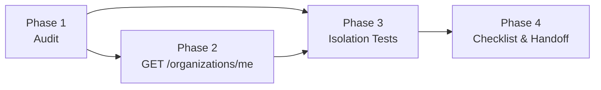

# Implementation Plan — Multitenancy Foundational

> **Stack:** Cloudflare Workers · Hono · Drizzle ORM · Cloudflare D1  
> **Spec:** `docs/multitenancy/multitenancy.spec.md`  
> **Architecture:** `docs/ARCHITECTURE.md`

---

## Phases

```
Phase 1 → Validate existing foundation
Phase 2 → GET /api/organizations/me endpoint
Phase 3 → Isolation tests
Phase 4 → Enforcement checklist and handoff to future features
```

---

## Phase 1 — Validate Existing Foundation

The database schema and auth middleware were built with multitenancy in mind from the start. This phase audits that the existing code already satisfies the contract before adding anything new.

### Task 1.1 — Audit DB schema

Verify the following migrations are applied and correct:

| Migration | Table | `organization_id` present |
|---|---|---|
| `0001_create_organizations.sql` | `organizations` | N/A (root table) |
| `0002_create_users.sql` | `users` | ✅ `NOT NULL REFERENCES organizations(id)` |
| `0003_create_invitations.sql` | `invitations` | ✅ `NOT NULL REFERENCES organizations(id)` |
| `0004_create_password_reset_tokens.sql` | `password_reset_tokens` | ✅ Not tenant-scoped (references `users.id` which carries the org) |

### Task 1.2 — Audit auth middleware

Verify that `src/middleware/auth.ts`:
- Looks up the user in D1 by identity (email) after JWT validation
- Attaches `organizationId` to `c.var.user`
- Returns `401` for missing or expired sessions with no valid refresh token

**Status:** ✅ Already implemented — `buildUserPayload` selects `organizationId` from `users` and attaches it to context.

### Task 1.3 — Audit existing handler

Verify that `src/routes/agents/handler.ts` (`inviteAgent`) already scopes queries to `admin.organizationId`:
- `existingUser` check: currently searches by email only (no org scope needed — emails are globally unique)
- Invitation expiration update: filters by `identity` and `status` (no org scope needed — identity is unique per pending status)
- Invitation insert: sets `organizationId: admin.organizationId` ✅
- Organization name lookup: queries `organizations` by `admin.organizationId` ✅

**Status:** ✅ Handler is correctly scoped.

**Deliverable:** Audit findings documented. No code changes expected in Phase 1.

---

## Phase 2 — `GET /api/organizations/me`

### Task 2.1 — Add handler (`src/routes/organizations/handler.ts`)

```ts
export const getMyOrganization = async (c: OrganizationsContext) => {
  const user = c.get('user')
  const db = getDb(c.env)

  const result = await db
    .select({
      id: organizations.id,
      name: organizations.name,
      createdAt: organizations.createdAt,
    })
    .from(organizations)
    .where(eq(organizations.id, user.organizationId))
    .limit(1)

  const org = result[0]
  if (!org) {
    throw new ApiError('NOT_FOUND', 404, 'Organization not found')
  }

  return c.json({ organization: org })
}
```

### Task 2.2 — Add router (`src/routes/organizations/index.ts`)

```ts
const organizations = new Hono<{ Bindings: CloudflareBindings; Variables: AppVariables }>()

organizations.use('*', authMiddleware)
organizations.get('/me', getMyOrganization)

export default organizations
```

### Task 2.3 — Mount router in `src/index.tsx`

```ts
import organizationsRouter from './routes/organizations'

app.route('/api/organizations', organizationsRouter)
```

### Task 2.4 — Add Drizzle types to `src/db/schema.ts` (if not already exported)

Verify `Organization` and `NewOrganization` types are exported. No schema change needed.

**Deliverable:** `GET /api/organizations/me` returns `200` with `{ organization: { id, name, createdAt } }` for any authenticated user.

---

## Phase 3 — Isolation Tests

### Task 3.1 — Create test file (`test/multitenancy/multitenancy.test.ts`)

Tests must cover all 7 scenarios from `docs/multitenancy/multitenancy.spec.md`. Key cases:

| Scenario | Test description |
|---|---|
| 1 | Admin gets their own org → 200 with correct data |
| 2 | Agent gets their own org → 200 with correct data |
| 3 | No session → 401 UNAUTHORIZED |
| 4 | Cross-org isolation — admin from org_b cannot retrieve org_a resource |
| 5 | `organizationId` in request body is ignored — record is scoped to context org |
| 6 | New resource creation → `organization_id` set from context, not from body |
| 7 | Query results are filtered to authenticated user's org |

### Task 3.2 — Cross-org isolation test pattern

Every tenant-scoped resource route added in future features should include a variation of this test:

```ts
it('does not return resources from another organization', async () => {
  // Seed: org_a has a service, org_b does not
  // Auth: authenticate as org_b admin
  // Act: GET /api/services/:id (using org_a's service ID)
  // Assert: 404 — no data from org_a is returned
})
```

This pattern must be applied to every resource type as it is introduced.

**Deliverable:** Scenario 4 and Scenario 5 tests pass. The pattern is established for future resource routes.

---

## Phase 4 — Enforcement Checklist and Handoff

### Task 4.1 — PR template entry

Add the following checklist item to the repository's PR template (`.github/PULL_REQUEST_TEMPLATE.md` or equivalent):

```markdown
## Multitenancy checklist (for any PR adding a new resource route or migration)
- [ ] New migration includes `organization_id TEXT NOT NULL REFERENCES organizations(id)` (or documents why the table is not tenant-scoped)
- [ ] Every SELECT on the new table filters by `eq(table.organizationId, user.organizationId)`
- [ ] Every INSERT sets `organizationId: user.organizationId` from context
- [ ] Every UPDATE/DELETE includes `and(eq(table.id, input.id), eq(table.organizationId, user.organizationId))`
- [ ] No route accepts `organizationId` as a client-supplied parameter
```

### Task 4.2 — Mark foundational feature complete in `docs/SPEC.md`

Once Phases 1–3 are complete, check off the Multitenancy item in the Phase 1 MUST HAVE list:

```markdown
- [x] **Multitenancy (isolated organizations)** *(Global)*
```

**Deliverable:** PR template updated. `SPEC.md` checkbox checked. Team is unblocked to start the Staff Management feature with the enforcement contract in place.

---

## Phase Dependencies



Phase 1 is a read-only audit and can be done in parallel with Phase 2. Phase 3 requires Phase 2 to be complete (the `GET /organizations/me` test is one of the scenarios). Phase 4 is the final sign-off step.

---

## Checklist

### Phase 1 — Audit
- [ ] `organizations` migration verified
- [ ] `users` migration verified (`organization_id NOT NULL REFERENCES organizations`)
- [ ] `invitations` migration verified
- [ ] `authMiddleware` verified (attaches `organizationId` to `c.var.user`)
- [ ] `inviteAgent` handler verified (scoped to `admin.organizationId`)

### Phase 2 — Endpoint
- [ ] `src/routes/organizations/handler.ts` created with `getMyOrganization`
- [ ] `src/routes/organizations/index.ts` created with router
- [ ] Mounted at `/api/organizations` in `src/index.tsx`
- [ ] Manual test: `GET /api/organizations/me` → 200 with correct org data
- [ ] Manual test: no session → 401

### Phase 3 — Tests
- [ ] `test/multitenancy/multitenancy.test.ts` created
- [ ] Scenario 1 — admin reads own org → passes
- [ ] Scenario 2 — agent reads own org → passes
- [ ] Scenario 3 — no session → 401 → passes
- [ ] Scenario 4 — cross-org isolation → passes
- [ ] Scenario 5 — org ID injection ignored → passes
- [ ] Scenario 6 — INSERT sets org from context → passes
- [ ] Scenario 7 — SELECT filtered by org → passes

### Phase 4 — Handoff
- [ ] PR template multitenancy checklist added
- [ ] `docs/SPEC.md` Multitenancy checkbox marked `[x]`
- [ ] Enforcement contract reviewed before starting Staff Management feature
