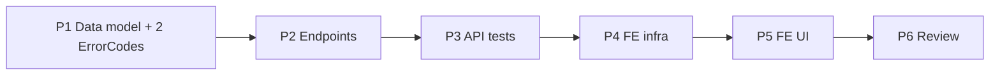

# Implementation Plan — Mobile Point of Sale with Controlled Discount (US-AG03, AG04, AG05, AG06, AG08)

> **Spec:** `docs/pos/pos-controlled-discount.spec.md`
> **Stack (API):** Hono · Drizzle · Cloudflare D1 · Vitest (`cloudflare:test`)
> **Stack (App):** React 18 · MUI · TanStack Query · Zustand · React Hook Form + Zod
> **Builds on:** Service Catalog (`services`, `service_extras`, minor-unit money,
> `base_price` / `minimum_price`), Schedules & Slots (`slots` inventory unit,
> `booked` + derived `remaining`), `authMiddleware`, `requireRole`, the multitenancy
> Enforcement Contract, and the `AppLayout` shell.

This is the **first agent-facing** feature. A folio is an **immutable sale record** with
snapshotted lines/extras; the slot decrement at confirm time is the integrity-critical
operation (US-AG11). Backend first (a self-contained, shippable slice), then the agent POS
UI. **Out of scope** (own features): signed QR (HMAC), WhatsApp delivery, bookings
(US-AG07), cancellation (US-A21), cash drawer — see the spec's "Scope boundary".

---

## Phases

```
Phase 1 → Data model (3 migrations + Drizzle schema + 2 new ErrorCodes)
Phase 2 → API: schemas + handlers + routes (new agent-only /api/pos router)
Phase 3 → API tests (scenarios 1–16 + multitenancy B1/B3/B4)
Phase 4 → Frontend infra (service, types/schemas, cart store, hooks)
Phase 5 → Frontend UI (POS catalog → cart → checkout → receipt)
Phase 6 → Review against spec + SPEC checklist + TECH_DEBT note
```

Phases 1→3 (backend) are independently shippable. Phases 4→5 depend on the backend.

---

## Phase 1 — Data Model

FK order: `folios` → `folio_lines` → `folio_line_extras`.

### Task 1.1 — Migration `migrations/0010_create_folios.sql`

```sql
CREATE TABLE `folios` (
	`id` text PRIMARY KEY NOT NULL,
	`organization_id` text NOT NULL,
	`agent_id` text NOT NULL,
	`customer_name` text,
	`customer_email` text,
	`customer_phone` text,
	`status` text DEFAULT 'paid' NOT NULL,
	`subtotal` integer NOT NULL,
	`discount_total` integer DEFAULT 0 NOT NULL,
	`total` integer NOT NULL,
	`amount_paid` integer NOT NULL,
	`created_at` integer DEFAULT (unixepoch()) NOT NULL,
	`updated_at` integer DEFAULT (unixepoch()) NOT NULL,
	FOREIGN KEY (`organization_id`) REFERENCES `organizations`(`id`) ON UPDATE no action ON DELETE no action,
	FOREIGN KEY (`agent_id`) REFERENCES `users`(`id`) ON UPDATE no action ON DELETE no action
);
--> statement-breakpoint
CREATE INDEX `folios_org_agent_idx`   ON `folios` (`organization_id`, `agent_id`);
--> statement-breakpoint
CREATE INDEX `folios_org_created_idx` ON `folios` (`organization_id`, `created_at`);
```

### Task 1.2 — Migration `migrations/0011_create_folio_lines.sql`

```sql
CREATE TABLE `folio_lines` (
	`id` text PRIMARY KEY NOT NULL,
	`organization_id` text NOT NULL,
	`folio_id` text NOT NULL,
	`service_id` text NOT NULL,
	`slot_id` text NOT NULL,
	`service_name` text NOT NULL,
	`slot_date` text NOT NULL,
	`slot_start_time` text NOT NULL,
	`quantity` integer NOT NULL,
	`base_price` integer NOT NULL,
	`minimum_price` integer NOT NULL,
	`unit_price` integer NOT NULL,
	`line_total` integer NOT NULL,
	`created_at` integer DEFAULT (unixepoch()) NOT NULL,
	FOREIGN KEY (`organization_id`) REFERENCES `organizations`(`id`) ON UPDATE no action ON DELETE no action,
	FOREIGN KEY (`folio_id`)   REFERENCES `folios`(`id`)   ON UPDATE no action ON DELETE no action,
	FOREIGN KEY (`service_id`) REFERENCES `services`(`id`) ON UPDATE no action ON DELETE no action,
	FOREIGN KEY (`slot_id`)    REFERENCES `slots`(`id`)    ON UPDATE no action ON DELETE no action
);
--> statement-breakpoint
CREATE INDEX `folio_lines_org_folio_idx` ON `folio_lines` (`organization_id`, `folio_id`);
--> statement-breakpoint
CREATE INDEX `folio_lines_org_slot_idx`  ON `folio_lines` (`organization_id`, `slot_id`);
```

### Task 1.3 — Migration `migrations/0012_create_folio_line_extras.sql`

```sql
CREATE TABLE `folio_line_extras` (
	`id` text PRIMARY KEY NOT NULL,
	`organization_id` text NOT NULL,
	`folio_id` text NOT NULL,
	`folio_line_id` text NOT NULL,
	`extra_id` text NOT NULL,
	`name` text NOT NULL,
	`price` integer NOT NULL,
	`quantity` integer DEFAULT 1 NOT NULL,
	`created_at` integer DEFAULT (unixepoch()) NOT NULL,
	FOREIGN KEY (`organization_id`) REFERENCES `organizations`(`id`) ON UPDATE no action ON DELETE no action,
	FOREIGN KEY (`folio_id`)      REFERENCES `folios`(`id`)         ON UPDATE no action ON DELETE no action,
	FOREIGN KEY (`folio_line_id`) REFERENCES `folio_lines`(`id`)    ON UPDATE no action ON DELETE no action,
	FOREIGN KEY (`extra_id`)      REFERENCES `service_extras`(`id`) ON UPDATE no action ON DELETE no action
);
--> statement-breakpoint
CREATE INDEX `folio_line_extras_org_folio_idx` ON `folio_line_extras` (`organization_id`, `folio_id`);
```

- All three carry `organization_id` directly (Rule 5). Money is integer minor units.
  `slot_date` / `slot_start_time` are TEXT snapshots (`YYYY-MM-DD` / `HH:MM`).

### Task 1.4 — Drizzle schema (`src/db/schema.ts`)

Append after `slots`:

```ts
export const folios = sqliteTable('folios', {
  id: text('id').primaryKey(),
  organizationId: text('organization_id').notNull().references(() => organizations.id),
  agentId: text('agent_id').notNull().references(() => users.id),
  customerName: text('customer_name'),
  customerEmail: text('customer_email'),
  customerPhone: text('customer_phone'),
  status: text('status', { enum: ['paid', 'booking', 'cancelled'] }).notNull().default('paid'),
  subtotal: integer('subtotal').notNull(),
  discountTotal: integer('discount_total').notNull().default(0),
  total: integer('total').notNull(),
  amountPaid: integer('amount_paid').notNull(),
  createdAt: integer('created_at', { mode: 'timestamp' }).notNull().default(sql`(unixepoch())`),
  updatedAt: integer('updated_at', { mode: 'timestamp' }).notNull().default(sql`(unixepoch())`),
})

export const folioLines = sqliteTable('folio_lines', {
  id: text('id').primaryKey(),
  organizationId: text('organization_id').notNull().references(() => organizations.id),
  folioId: text('folio_id').notNull().references(() => folios.id),
  serviceId: text('service_id').notNull().references(() => services.id),
  slotId: text('slot_id').notNull().references(() => slots.id),
  serviceName: text('service_name').notNull(),
  slotDate: text('slot_date').notNull(),
  slotStartTime: text('slot_start_time').notNull(),
  quantity: integer('quantity').notNull(),
  basePrice: integer('base_price').notNull(),
  minimumPrice: integer('minimum_price').notNull(),
  unitPrice: integer('unit_price').notNull(),
  lineTotal: integer('line_total').notNull(),
  createdAt: integer('created_at', { mode: 'timestamp' }).notNull().default(sql`(unixepoch())`),
})

export const folioLineExtras = sqliteTable('folio_line_extras', {
  id: text('id').primaryKey(),
  organizationId: text('organization_id').notNull().references(() => organizations.id),
  folioId: text('folio_id').notNull().references(() => folios.id),
  folioLineId: text('folio_line_id').notNull().references(() => folioLines.id),
  extraId: text('extra_id').notNull().references(() => serviceExtras.id),
  name: text('name').notNull(),
  price: integer('price').notNull(),
  quantity: integer('quantity').notNull().default(1),
  createdAt: integer('created_at', { mode: 'timestamp' }).notNull().default(sql`(unixepoch())`),
})

export type Folio = typeof folios.$inferSelect
export type NewFolio = typeof folios.$inferInsert
export type FolioLine = typeof folioLines.$inferSelect
export type NewFolioLine = typeof folioLines.$inferInsert
export type FolioLineExtra = typeof folioLineExtras.$inferSelect
export type NewFolioLineExtra = typeof folioLineExtras.$inferInsert
```

### Task 1.5 — Add two `ErrorCode`s (`src/types/errors.ts`)

```ts
export type ErrorCode =
  | 'VALIDATION_ERROR'
  // …existing…
  | 'CONFLICT'
  | 'PRICE_BELOW_MINIMUM'  // ← new (400): line unit_price below snapshot minimum_price
  | 'SLOT_UNAVAILABLE'     // ← new (409): slot can't satisfy quantity at confirm (race)
  | 'INTERNAL_ERROR'
```

The global error handler already maps `ApiError.status` → response — no other change.

**Deliverable:** Migrations apply cleanly; `Folio` / `FolioLine` / `FolioLineExtra` types
available; both new codes in the union.

---

## Phase 2 — API Endpoints

New router `src/routes/pos/` (mirrors `services/` layout). Agent-only via `*` middleware.

### Task 2.1 — Schemas (`src/routes/pos/schema.ts`)

```ts
import { z } from 'zod'

const extraSchema = z.object({
  extra_id: z.string().min(1),
  quantity: z.number().int().min(1),
})

const lineSchema = z.object({
  slot_id: z.string().min(1),
  quantity: z.number().int().min(1),
  unit_price: z.number().int().min(0), // floor vs minimum_price checked server-side (snapshot)
  extras: z.array(extraSchema).optional().default([]),
})

export const confirmSaleSchema = z
  .object({
    customer_name: z.string().nullable().optional(),
    customer_email: z.string().email().nullable().optional(),
    customer_phone: z.string().nullable().optional(),
    lines: z.array(lineSchema).nonempty('Cart must have at least one line'),
  })
  // Rule 6 — distinct slot_id across lines (UI merges quantities).
  .refine(
    (v) => new Set(v.lines.map((l) => l.slot_id)).size === v.lines.length,
    { message: 'Each slot may appear once', path: ['lines'] },
  )

export type ConfirmSaleInput = z.infer<typeof confirmSaleSchema>
```

> No `organizationId` / `agent_id` / `status` / totals fields (Rules 1 & 3; Zod strips
> unknowns). `service_id` is **not** accepted — derived from the slot. `unit_price`'s
> floor depends on the DB snapshot, so it's a handler check, not a Zod refine.

### Task 2.2 — Handlers (`src/routes/pos/handler.ts`)

Define `PosContext = Context<{ Bindings; Variables: AppVariables }>`. Serializers map DB
columns → snake_case API shape with derived `remaining` (reuse the slot serializer idea
from `slots.handler.ts`).

- **`listPosServices`** (US-AG03/AG10) — `today = c.req.query('today') ?? <UTC today>`.
  Select active services in org ordered by `name`. For availability, one grouped query
  over active slots with `date >= today`: `SELECT service_id, SUM(capacity - booked) AS
  available_spots, MIN(date) AS next_slot_date … WHERE org AND status='active' AND date
  >= today GROUP BY service_id`. Left-join in memory onto the service list (default `0` /
  `null`). Return `{ services }`.
- **`getPosService`** (US-AG03/AG04/AG05) — load the active service (`id + org + status
  ='active'`) → `404` otherwise. Load active extras (`org + service_id + status='active'`
  ordered by `name`). Load active future slots (`org + service_id + status='active' AND
  date >= from [AND date <= to]` ordered by `date, start_time`) with derived `remaining`.
  Return `{ service: { …, extras, slots } }`.
- **`confirmSale`** (US-AG04/05/06/08/AG11) — the heart of the feature, below.
- **`getFolio`** (US-AG08) — load the folio by (`id + org + agent_id = self`) → `404`.
  Load its lines (`org + folio_id` ordered by `created_at`) and their extras
  (`org + folio_id`). Assemble and return `{ folio }`.

#### `confirmSale` algorithm

```
admin = c.get('user')                       // role already 'agent' via requireRole
input = confirmSaleSchema-validated body
db = getDb(c.env)

// 1. VALIDATE (reads only) — load each slot joined to its service, org-scoped.
for each line:
  slotRow = SELECT slot.{id,capacity,booked,date,startTime,status,serviceId},
                   service.{name,basePrice,minimumPrice,status}
            FROM slots JOIN services ON slots.service_id = services.id
            WHERE slots.id = line.slot_id
              AND slots.organization_id = org
              AND slots.status = 'active'
              AND services.status = 'active'
  if !slotRow            → throw NOT_FOUND
  if line.unit_price <  slotRow.minimumPrice → throw PRICE_BELOW_MINIMUM (400)
  if line.unit_price >  slotRow.basePrice    → throw VALIDATION_ERROR (400)
  for each extra in line.extras:
    extraRow = SELECT id,name,price FROM service_extras
               WHERE id = extra.extra_id AND organization_id = org
                 AND service_id = slotRow.serviceId AND status = 'active'
    if !extraRow → throw NOT_FOUND
    snapshot extra {name, price, quantity}
  lineTotal = line.unit_price * line.quantity
            + Σ(extraRow.price * extra.quantity)
  collect a prepared line { snapshots…, lineTotal }

subtotal      = Σ lineTotal
discountTotal = Σ (basePrice - unit_price) * quantity
total         = subtotal

// 2. DECREMENT each distinct slot conditionally, tracking successes.
applied: { slotId, qty }[] = []
for each line (in order):
  res = UPDATE slots SET booked = booked + line.quantity, updated_at = now
        WHERE id = line.slot_id AND organization_id = org
          AND status = 'active' AND capacity - booked >= line.quantity
        RETURNING id
  if res.length === 0:
    // 3. COMPENSATE everything already applied, then fail.
    for a in applied:
      UPDATE slots SET booked = booked - a.qty, updated_at = now
        WHERE id = a.slotId AND organization_id = org
    throw ApiError('SLOT_UNAVAILABLE', 409, 'A selected time just sold out')
  applied.push({ slotId: line.slot_id, qty: line.quantity })

// 4. PERSIST (db.batch — atomic on error). No folio existed before this point.
folioId = randomUUID()
batch = [
  insert folios { id: folioId, organizationId: org, agentId: admin.userId,
                  customerName, customerPhone, status: 'paid',
                  subtotal, discountTotal, total, amountPaid: total },
  …insert folio_lines (one per line, with folioId + snapshots),
  …insert folio_line_extras (one per extra, with folioId + folioLineId),
]
await db.batch(batch)

return c.json({ folio: serializeFolio(...) }, 201)
```

> Every query org-filters (Rules 2 & 4); inserts set `organizationId`/`agentId` from
> context (Rule 3). The `capacity - booked >= qty` guard + the slots partial unique index
> are the DB-level backstops behind the validate-decrement-compensate flow (D1 has no
> interactive transactions — documented in `docs/TECH_DEBT.md`).

### Task 2.3 — Routes (`src/routes/pos/index.ts`)

```ts
const pos = new Hono<{ Bindings: CloudflareBindings; Variables: AppVariables }>()
const validationHook = (r: { success: boolean }) => {
  if (!r.success) throw new ApiError('VALIDATION_ERROR', 400, 'Invalid request payload')
}
pos.use('*', authMiddleware, requireRole('agent'))

pos.get('/services', listPosServices)
pos.get('/services/:id', getPosService)
pos.post('/folios', zValidator('json', confirmSaleSchema, validationHook), confirmSale)
pos.get('/folios/:id', getFolio)

export default pos
```

### Task 2.4 — Mount in `src/index.tsx`

```ts
import posRouter from './routes/pos'
// …
app.route('/api/pos', posRouter)
```

**Deliverable:** Four endpoints respond per spec; manual `curl` check passes (browse →
confirm → read folio; confirm a sold-out slot → 409; confirm below-min → 400).

---

## Phase 3 — API Tests (`test/pos/pos-controlled-discount.test.ts`)

Reuse `seedUser` / `seedTwoOrgs` (`test/helpers/tenancy.ts`) and `buildFakeJwt`
(`test/helpers/jwt.ts`). Add local seeders `seedService` / `seedSlot` / `seedExtra` (raw
`env.DB.prepare(...)`, same pattern as the catalog/schedules suites). `beforeEach` clears
`folio_line_extras` → `folio_lines` → `folios` → `slots` → `schedules` →
`service_extras` → `services` (children before parents, FK order), plus the tenancy clear.
Seed the caller as an **`agent`** (POS is agent-role).

| Test | Spec scenario |
|---|---|
| List POS services: active only, `available_spots` summed, `next_slot_date` earliest | 1 |
| Service detail: active extras + active future slots (incl. remaining 0), past/inactive excluded | 2 |
| Inactive / unknown / foreign service detail → 404 | 3 |
| Confirm single line → 201; folio paid, agent_id set, slot.booked +qty, snapshots stored | 4 |
| Extras snapshotted & summed; price from DB not client | 5 |
| In-range discount accepted; totals + discount_total server-computed | 6 |
| `unit_price < minimum_price` → 400 PRICE_BELOW_MINIMUM, nothing written, no decrement | 7 |
| `unit_price > base_price` → 400 VALIDATION_ERROR | 8 |
| Multi-line cart decrements every slot | 9 |
| Race: slot can't satisfy qty → 409 SLOT_UNAVAILABLE; **compensation** leaves all booked unchanged; no folio | 10 |
| Inactive / foreign / unknown slot, or inactive parent service → 404, no decrement | 11 |
| Extra not of the line's service → 404 | 12 |
| Empty cart / duplicate slot_id / bad quantity → 400 | 13 |
| Folio read-back returns lines + extras | 14 |
| Other agent's / foreign / unknown folio → 404 | 15 |
| Admin role → 403 on any /api/pos route | 16 |
| **B4** POS catalog/detail scoped to caller org (`seedTwoOrgs`) | 17 |
| **B3** cross-org confirm & folio read → 404, slot.booked untouched | 18 |
| **B1** injected organizationId/agent_id/status/total ignored | 19 |

> Scenario 10 is the critical one: seed `slot_1` near capacity and a roomy `slot_2`, order
> the cart so `slot_2` decrements first, assert the 409 **and** that `slot_2.booked`
> returned to its pre-call value (compensation), and that **no** `folios` row exists.

**Deliverable:** `pnpm --filter api-turistear test` green.

---

## Phase 4 — Frontend Infrastructure

New feature dir `app-turistear/src/features/pos/`. Reuse the `request()` wrapper +
`ServiceError` from `authService.ts` (same as `catalogService.ts` / `schedulesService.ts`)
and the `amountToCents` / cents helpers from `features/catalog/types`.

### Task 4.1 — Types (`src/features/pos/types.ts`)

```ts
export interface PosServiceSummary {
  id: string; name: string; description: string | null
  base_price: number; minimum_price: number
  available_spots: number; next_slot_date: string | null
}
export interface PosSlot {
  id: string; date: string; start_time: string
  capacity: number; booked: number; remaining: number
}
export interface PosExtra { id: string; name: string; price: number }
export interface PosServiceDetail extends Omit<PosServiceSummary,'available_spots'|'next_slot_date'> {
  extras: PosExtra[]; slots: PosSlot[]
}
export interface FolioLineExtra { id: string; extra_id: string; name: string; price: number; quantity: number }
export interface FolioLine {
  id: string; service_id: string; slot_id: string; service_name: string
  slot_date: string; slot_start_time: string; quantity: number
  base_price: number; minimum_price: number; unit_price: number
  line_total: number; extras: FolioLineExtra[]
}
export interface Folio {
  id: string; status: 'paid'|'booking'|'cancelled'
  customer_name: string | null; customer_email: string | null; customer_phone: string | null
  subtotal: number; discount_total: number; total: number; amount_paid: number
  created_at: number; lines: FolioLine[]
}
```

### Task 4.2 — Cart Zustand store (`src/store/posCart.ts`)

Cart is **client state** (the server only sees the final cart on confirm). Shape: an array
of `CartLine { slot, service: {id,name,base_price,minimum_price}, quantity, unit_price,
extras: {extra, quantity}[] }`. Actions: `addLine`, `updateQuantity`, `setUnitPrice`
(clamped client-side to `[minimum_price, base_price]` — the server re-checks), `addExtra`,
`removeExtra`, `removeLine`, `clear`. Derived selectors: `lineTotal`, `subtotal`,
`discountTotal`, `total` (mirror the server math for live display; the server remains the
source of truth). Enforce **distinct slot** on `addLine` (merge quantity instead).

### Task 4.3 — Service (`src/services/posService.ts`)

| Function | Endpoint |
|---|---|
| `listPosServices(today?)` | `GET /api/pos/services` |
| `getPosService(id, {from?,to?})` | `GET /api/pos/services/:id` |
| `confirmSale(payload)` | `POST /api/pos/folios` |
| `getFolio(id)` | `GET /api/pos/folios/:id` |

`confirmSale` maps the cart store to the request body
(`lines: [{slot_id, quantity, unit_price, extras:[{extra_id, quantity}]}]`).

### Task 4.4 — Hooks (`src/features/pos/hooks/`)

| Hook | Type | Notes |
|---|---|---|
| `usePosServices(today?)` | `useQuery(['pos','services',today])` | availability grid; short `staleTime` (live) |
| `usePosService(id, range)` | `useQuery(['pos','service',id,range])` | slot picker |
| `useConfirmSale()` | `useMutation` | on success: clear cart, invalidate `['pos']`, route to receipt |

**Deliverable:** service + store + hooks importable; types compile.

---

## Phase 5 — Frontend UI

POS is the agent's home. Add an **agent-only** primary nav destination **Sell** in
`AppLayout`, plus routes in `config/routes.ts`:

```ts
POS: '/pos',
POS_SERVICE: '/pos/service/:id',
POS_CHECKOUT: '/pos/checkout',
FOLIO: '/pos/folio/:id',
```

### Task 5.1 — `PosCatalogPage` (`src/pages/PosCatalogPage.tsx`) — US-AG03/AG10

- `usePosServices()` grid of `Card elevation={0}` (elegant-minimalist). Each card: name,
  `from $base_price`, and an availability chip from `available_spots` /
  `next_slot_date` — **available** (green-ish accent) / **close to capacity** (amber) /
  **full** (muted, `available_spots === 0`). Tap → `POS_SERVICE`.
- A floating **Cart** badge (count from `posCart`) → `POS_CHECKOUT`.
- Loading → `CircularProgress`; error → `Alert`; empty → muted "No services available."

### Task 5.2 — `PosServicePage` (`src/pages/PosServicePage.tsx`) — US-AG04/AG05/AG06

- `usePosService(id)`; header with name/description.
- **Slot picker**: slots grouped by `date`, each showing `start_time` + `remaining /
  capacity`; `remaining === 0` rows disabled ("Full"). Select one.
- **Quantity** stepper (`>= 1`, soft-capped at the slot's `remaining`).
- **Discount field** (`DiscountInput`): major-unit number input for `unit_price`,
  **clamped to `[minimum_price, base_price]`** with inline helper "Min $1,200.00"; mirror
  the server floor so the agent can't submit below min. Show live line discount.
- **Extras**: list active `extras` with a quantity stepper each.
- **Add to cart** → `posCart.addLine` (merges if the slot is already in the cart) → back
  to catalog or stay to add another service.

### Task 5.3 — `PosCheckoutPage` (`src/pages/PosCheckoutPage.tsx`) — US-AG08

- Render cart lines (service, date/time, qty, unit price, extras, line total) with
  edit/remove. Live `subtotal` / `discount_total` / `total` from the store selectors.
- Optional `customer_name` / `customer_email` / `customer_phone` fields (captured for later QR/Resend and marketing).
- **Confirm sale** → `useConfirmSale()`. On `409 SLOT_UNAVAILABLE` → inline banner "A
  selected time just sold out — please review your cart" + refetch availability; on `400
  PRICE_BELOW_MINIMUM` → focus the offending line's discount field; on success → clear
  cart, route to `FOLIO/:id`.

### Task 5.4 — `FolioReceiptPage` (`src/pages/FolioReceiptPage.tsx`) — US-AG08

- `getFolio(id)`; render the immutable receipt: folio id, customer, each line (service,
  date/time, qty, unit price, extras), totals, `amount_paid`. A muted note: "QR codes &
  Email delivery arrive in a later step" (those are separate features). **New sale**
  CTA → back to `POS`.

**Deliverable:** An agent can browse live availability, build a multi-service cart with
extras and a controlled discount, confirm, and see the folio receipt — end-to-end, with
sold-out and below-minimum handled gracefully.

---

## Phase 6 — Review

- Walk spec Scenarios 1–19; mark ✅/❌.
- Confirm the Enforcement Contract: every query org-filtered; no
  `organizationId`/`agent_id`/`status`/totals in any Zod schema; inserts set
  `organizationId` + `agentId` from context; folio read-back filtered by `agent_id = self`;
  `service_id` derived from the slot, never the client.
- Confirm the controlled discount uses **snapshot** `minimum_price`/`base_price`; below-min
  → `PRICE_BELOW_MINIMUM`, above-base → `VALIDATION_ERROR`.
- Confirm the **atomic conditional decrement** + **compensation**: a sold-out slot yields
  `409 SLOT_UNAVAILABLE`, no folio is written, and every prior decrement is rolled back.
- Confirm folios are immutable (no update/delete here) and totals are server-computed.
- Add `docs/TECH_DEBT.md` notes: (a) `PRICE_BELOW_MINIMUM` + `SLOT_UNAVAILABLE` introduced
  **and consumed** here (no open debt); (b) "D1 has no interactive transactions — sale
  confirm uses validate-decrement-compensate; revisit if D1 transactions land."
- Update the SPEC checklist: tick **Mobile point of sale with controlled discount**
  *(US-AG03, US-AG04, US-AG05, US-AG06, US-AG08)* in `docs/SPEC.md`.

---

## Phase Dependencies



---

## Checklist

### Backend
- [ ] `0010_create_folios.sql` + `0011_create_folio_lines.sql` + `0012_create_folio_line_extras.sql` (+ org-leading indexes, incl. `folio_lines_org_slot_idx`)
- [ ] Drizzle `folios` + `folioLines` + `folioLineExtras` tables and types
- [ ] `'PRICE_BELOW_MINIMUM'` (400) + `'SLOT_UNAVAILABLE'` (409) in the `ErrorCode` union
- [ ] `pos/schema.ts` (`confirmSaleSchema` — non-empty lines, distinct slot refine, no org/agent/status/total fields)
- [ ] `pos/handler.ts`: `listPosServices` / `getPosService` (active-only, derived remaining, availability rollup) / `confirmSale` / `getFolio` (agent-self-scoped)
- [ ] Discount floor from snapshot (`minimum_price <= unit_price <= base_price`); below-min → `PRICE_BELOW_MINIMUM`, above-base → `VALIDATION_ERROR`
- [ ] `service_id` derived from slot; extras validated against the line's service; all snapshots stored; totals server-computed
- [ ] Atomic conditional decrement per distinct slot + compensation; sold-out → `409 SLOT_UNAVAILABLE`, no folio written
- [ ] Folio created `status='paid'`, `amount_paid=total`; immutable (no update/delete)
- [ ] New `/api/pos` router mounted with `authMiddleware` + `requireRole('agent')` on `*`
- [ ] `test/pos/pos-controlled-discount.test.ts` Scenarios 1–16
- [ ] Multitenancy B1/B3/B4 (Scenarios 17–19) via `seedTwoOrgs`

### Frontend
- [ ] `posService` (services list/detail, confirm, folio read)
- [ ] `features/pos` types + `posCart` Zustand store (distinct-slot merge, client-clamped discount, live totals)
- [ ] `usePosServices` / `usePosService` / `useConfirmSale` hooks
- [ ] `PosCatalogPage` (availability chips) + agent-only **Sell** nav destination + routes
- [ ] `PosServicePage` (slot picker, quantity, `DiscountInput` clamped to min, extras)
- [ ] `PosCheckoutPage` (cart review, customer fields, confirm, 409/400 handling)
- [ ] `FolioReceiptPage` (immutable receipt)

### Docs
- [ ] `docs/TECH_DEBT.md`: new codes introduced-and-consumed; D1 no-interactive-transactions note
- [ ] `docs/SPEC.md` MUST-HAVE item ticked (US-AG03, AG04, AG05, AG06, AG08)
</content>
