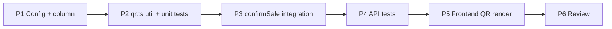

# Implementation Plan — Folio generation with signed QR code (HMAC) (US-AG08, US-C02)

> **Spec:** `docs/qr/folio-qr-signing.spec.md`
> **Stack (API):** Hono · Drizzle · Cloudflare D1 · WebCrypto (`crypto.subtle`) · Vitest
> **Stack (App):** React · MUI · TanStack Query · `qrcode.react`
> **Builds on:** Mobile POS (`folios` / `folio_lines` / `confirmSale` / `/api/pos`),
> `c.var.user.organizationId`, the multitenancy Enforcement Contract, `FolioReceiptPage`.

This is a **thin, surgical** feature: one nullable column, one crypto util, one
integration point inside the already-shipped `confirmSale`, and a QR render on the
receipt. No new endpoints, no new `ErrorCode`. The crypto util is the only genuinely new
surface; everything else augments POS.

---

## Phases

```
Phase 1 → Config + data model (QR_SECRET binding, migration 0013, schema column)
Phase 2 → Crypto util (src/utils/qr.ts: deriveOrgKey / signTicket / verifyTicket) + unit tests
Phase 3 → Integrate into confirmSale + folio read (sign per line, store, expose)
Phase 4 → API tests (Scenarios 1–11)
Phase 5 → Frontend (qrcode.react, types, TicketQr, FolioReceiptPage)
Phase 6 → Review + TECH_DEBT + SPEC checklist
```

Phases 1→4 are an independently shippable backend slice (tickets minted & verifiable).
Phase 5 is the client render.

---

## Phase 1 — Config & data model

### Task 1.1 — `QR_SECRET` binding

- `src/bindings.d.ts`: add `QR_SECRET: string`.
- `worker-configuration.d.ts`: regenerate via `pnpm cf-typegen:api` (or add the field).
- `.dev.vars`: add `QR_SECRET=dev_qr_secret_change_me` (long random string locally).
- `vitest.config.ts` → `miniflare.bindings`: add `QR_SECRET: 'test_qr_secret'`.
- **Prod (manual, document only):** `cd api-turistear && npx wrangler secret put QR_SECRET`.
  It is a **secret**, so it is *not* added to `wrangler.jsonc` `vars`.

### Task 1.2 — Migration `migrations/0013_add_qr_token_to_folio_lines.sql`

```sql
ALTER TABLE `folio_lines` ADD COLUMN `qr_token` text;
```

Additive, nullable (populated-table-safe; existing folios keep `NULL`). Mirrors the
`0005_add_base_commission_to_users.sql` additive style.

### Task 1.3 — Drizzle schema (`src/db/schema.ts`)

Add to `folioLines`, after `lineTotal`:

```ts
  qrToken: text('qr_token'), // signed access ticket; null for folios sold pre-feature
```

(`Folio*` inferred types update automatically.)

**Deliverable:** migration applies; `QR_SECRET` typed and available in dev/test.

---

## Phase 2 — Crypto util (`src/utils/qr.ts`)

Self-contained, dependency-free, WebCrypto only. The single new module.

```ts
export interface TicketPayload {
  v: 1
  folio_id: string
  folio_line_id: string
  organization_id: string
  service_id: string
  slot_id: string
  client_identity: string
  passes_total: number
  issued_at: number   // unix seconds
  expires_at: number  // unix seconds
}

// base64url helpers (no padding) over UTF-8 / bytes
const b64url = (bytes: ArrayBuffer | Uint8Array): string => { /* btoa + replace +/ → -_, strip = */ }
const b64urlToBytes = (s: string): Uint8Array => { /* pad, atob */ }
const enc = new TextEncoder()

// Per-org signing key: orgKey = HMAC-SHA256(QR_SECRET, "guideme:qr:v1:" + orgId)
export async function deriveOrgKey(secret: string, organizationId: string): Promise<CryptoKey> {
  const base = await crypto.subtle.importKey(
    'raw', enc.encode(secret), { name: 'HMAC', hash: 'SHA-256' }, false, ['sign'],
  )
  const raw = await crypto.subtle.sign('HMAC', base, enc.encode(`guideme:qr:v1:${organizationId}`))
  return crypto.subtle.importKey(
    'raw', raw, { name: 'HMAC', hash: 'SHA-256' }, false, ['sign'],
  )
}

// token = payload_b64url "." signature_b64url ; HMAC is deterministic
export async function signTicket(payload: TicketPayload, key: CryptoKey): Promise<string> {
  const p = b64url(enc.encode(JSON.stringify(payload)))
  const sig = await crypto.subtle.sign('HMAC', key, enc.encode(p))
  return `${p}.${b64url(sig)}`
}

// returns the payload iff the signature verifies (constant-time); else null.
// Caller is responsible for expires_at / redemption checks (scanner feature).
export async function verifyTicket(token: string, key: CryptoKey): Promise<TicketPayload | null> {
  const dot = token.indexOf('.')
  if (dot <= 0) return null
  const p = token.slice(0, dot)
  const sig = b64urlToBytes(token.slice(dot + 1))
  const ok = await crypto.subtle.verify('HMAC', key, sig, enc.encode(p))  // subtle.verify is constant-time
  if (!ok) return null
  try { return JSON.parse(new TextDecoder().decode(b64urlToBytes(p))) as TicketPayload }
  catch { return null }
}
```

> `crypto.subtle.verify` does the constant-time compare for us — prefer it over
> hand-rolling `signTicket`-then-string-compare. `verifyTicket` is exported now and is the
> scanner's future production consumer; here it is exercised by Phase 4 unit tests (a
> signer is only meaningfully testable against its verifier).

### Task 2.1 — Unit tests `test/qr/qr.unit.test.ts`

- roundtrip: `signTicket` → `verifyTicket` returns the exact payload (Scenario 9);
- determinism: same payload+key → identical token;
- tamper: flip a char in payload seg / sig seg → `null` (Scenario 3);
- cross-key: sign with `deriveOrgKey(secret,'a')`, verify with `'b')` → `null` (Scenario 4);
- malformed: `''`, no dot, garbage base64 → `null`.

**Deliverable:** `qr.ts` with green unit tests; reusable by the scanner feature.

---

## Phase 3 — Integrate into `confirmSale` + folio read

`src/routes/pos/handler.ts`. **Only the persist + serialize steps change**; validate,
decrement, and compensate are untouched.

### Task 3.1 — Derive `expires_at` & `client_identity` helpers

```ts
// MVP single-timezone: end of the day after the slot date (slot_date@00:00Z + 48h).
const ticketExpiry = (slotDate: string): number =>
  Math.floor(Date.parse(`${slotDate}T00:00:00Z`) / 1000) + 48 * 3600

const clientIdentity = (input: ConfirmSaleInput, folioId: string): string =>
  input.customer_name?.trim() || input.customer_email?.trim() || `folio:${folioId}`
```

### Task 3.2 — Sign one token per prepared line, before building the batch

After `applied` decrements succeed and `folioId` is created, derive the org key **once**
and sign each line:

```ts
const orgKey = await deriveOrgKey(c.env.QR_SECRET, org)
const identity = clientIdentity(input, folioId)

// attach qrToken to each prepared line (PreparedLine gains `qrToken: string`)
for (const line of prepared) {
  const payload: TicketPayload = {
    v: 1,
    folio_id: folioId,
    folio_line_id: line.id,
    organization_id: org,
    service_id: line.serviceId,
    slot_id: line.slotId,
    client_identity: identity,
    passes_total: line.quantity,
    issued_at: Math.floor(Date.now() / 1000),
    expires_at: ticketExpiry(line.slotDate),
  }
  line.qrToken = await signTicket(payload, orgKey)
}
```

Then in the existing `folio_lines` insert add `qrToken: line.qrToken`.

> All payload fields come from server state / context — never the body (Rule 3). The org is
> `c.var.user.organizationId`, so an injected `organizationId` in the body is ignored
> (Scenario 11). Signing is after the decrement and inside the same request, before the
> single `db.batch`; the token is persisted, not recomputed.

### Task 3.3 — Expose `qr_token` + decoded `qr` in responses

Add a small serializer for the decoded (signature-free) echo:

```ts
const decodeQrEcho = (line) => line.qrToken ? {
  folio_id, folio_line_id, service_id, slot_id, client_identity, passes_total, expires_at
} : null
```

In `confirmSale`'s 201 line shape, add `qr_token: line.qrToken` and `qr: { …echo… }` (build
the echo from the same in-memory payload — no re-decode needed at confirm).

In `readFolio` (the `GET /folios/:id` path): select `folioLines.qrToken`, and on each line
return `qr_token: line.qrToken` plus `qr: line.qrToken ? verifyless-decode(line.qrToken) : null`
(decode the payload segment for the echo; no need to verify our own freshly-read token, but
a `verifyTicket(token, orgKey)`-then-echo is fine and asserts integrity on read). Tokenless
pre-feature lines → both `null`.

**Deliverable:** confirm + read return a verifiable `qr_token` per line; stored once.

---

## Phase 4 — API tests (`test/qr/folio-qr-signing.test.ts`)

Reuse the POS suite's seeders (`seedService`/`seedSlot`/`seedExtra`, `seedUser`,
`seedTwoOrgs`, `buildFakeJwt`) and clear order. `QR_SECRET` comes from the vitest binding
(Task 1.1). Import `deriveOrgKey`/`verifyTicket` from `src/utils/qr.ts` to assert tokens.

| Test | Spec scenario |
|---|---|
| Confirm stamps non-empty `qr_token`; stored == returned | 1 |
| Decode + `verifyTicket(deriveOrgKey(secret,'org_a'))` ok; payload fields match; `passes_total==qty`; `expires_at` formula | 2 |
| Tamper payload/sig byte → `verifyTicket` null | 3 |
| Cross-org key (`org_b`) → null | 4 |
| `client_identity` fallback name → email → `folio:id` | 5 |
| Two-line cart → two distinct verifying tokens | 6 |
| `quantity=5` → `passes_total==5` | 7 |
| `qr_token` byte-identical across confirm + 2 reads | 8 |
| **B3** foreign folio read → 404, no token leak (`seedTwoOrgs`) | 10 |
| **B1** injected `organizationId` ignored; payload org == caller's | 11 |

(Scenario 9 lives in `qr.unit.test.ts`, Phase 2.)

**Deliverable:** `pnpm --filter api-turistear test` green.

---

## Phase 5 — Frontend (render the ticket)

### Task 5.1 — Dependency

`pnpm --filter app-turistear add qrcode.react` (exports `QRCodeSVG`; SVG = crisp, no canvas).

### Task 5.2 — Types (`src/features/pos/types.ts`)

```ts
export interface FolioTicket {
  folio_id: string; folio_line_id: string; service_id: string; slot_id: string
  client_identity: string; passes_total: number; expires_at: number
}
// FolioLine gains:
  qr_token: string | null
  qr: FolioTicket | null
```

### Task 5.3 — `TicketQr` component (`src/features/pos/components/TicketQr.tsx`)

Presentational: given a `FolioLine`, render `<QRCodeSVG value={line.qr_token} size={…} />`
centered in a `Card` (elevation 0, divider border — elegant-minimalist), with
`service_name`, `slot_date · slot_start_time`, and a `{passes_total} passes` caption.
Renders nothing (or a muted "No ticket" note) when `qr_token` is null.

### Task 5.4 — `FolioReceiptPage` (`src/pages/FolioReceiptPage.tsx`)

- After the totals card, map `folio.lines` → one `<TicketQr line={line} />` each (a
  "Access tickets" section).
- Replace the placeholder `Alert` ("QR codes & the email receipt are delivered in a later
  step") with a tighter note scoped to what's still pending: "Email delivery arrives in a
  later step." (The QR itself is now present.)

**Deliverable:** the receipt shows one scannable QR per purchased service; `pnpm build:app`
clean.

---

## Phase 6 — Review

- Walk Scenarios 1–11; mark ✅/❌.
- Enforcement Contract: payload `organization_id` from context; `passes_total`/identity
  server-derived; no body field reaches the token; folio read still agent+org scoped;
  tokens exposed only on the authed POS responses.
- Confirm sign-once-store: read returns the persisted token byte-for-byte; HMAC
  determinism verified.
- Confirm cross-org key isolation (a structural multitenancy backstop in the signature).
- `docs/TECH_DEBT.md` — add:
  - (a) **Per-org QR signing by key derivation** from a single `QR_SECRET` (no per-org
    stored secret / backfill); secret **rotation & `kid`** deferred (`v:1`/`…v1…` label
    reserve the slot).
  - (b) **`expires_at` single-timezone** naive-date assumption (slot_date@00:00Z + 48h),
    consistent with schedules/POS; revisit with real org timezones.
  - (c) **`verifyTicket` shipped here, production-consumed by the Online QR Scanner**
    feature (introduced-with-its-test, no open debt).
- Tick **Folio generation with signed QR code (HMAC)** *(US-AG08, US-C02)* in `docs/SPEC.md`.

---

## Phase dependencies



---

## Checklist

### Backend
- [ ] `QR_SECRET` in `bindings.d.ts` + `worker-configuration.d.ts` + `.dev.vars` + vitest bindings; prod `wrangler secret put` documented
- [ ] `0013_add_qr_token_to_folio_lines.sql` (nullable additive column); Drizzle `folioLines.qrToken`
- [ ] `src/utils/qr.ts`: `deriveOrgKey` / `signTicket` / `verifyTicket` (WebCrypto, constant-time verify, null on failure) + base64url helpers
- [ ] `confirmSale` signs one token per line from server-owned payload (org from context, `passes_total=qty`, identity fallback, `expires_at` from `slot_date`), stores in the batch insert
- [ ] confirm + `GET /folios/:id` return `qr_token` + decoded `qr`; tokenless pre-feature lines → null
- [ ] `test/qr/qr.unit.test.ts` (roundtrip/determinism/tamper/cross-key/malformed)
- [ ] `test/qr/folio-qr-signing.test.ts` Scenarios 1–8 + B1/B3 (10–11)

### Frontend
- [ ] `qrcode.react` added; `FolioLine` gains `qr_token`/`qr`, `FolioTicket` type
- [ ] `TicketQr` component
- [ ] `FolioReceiptPage` renders one QR per line; placeholder Alert narrowed to Email-only

### Docs
- [ ] `docs/TECH_DEBT.md` notes (key-derivation, expires_at timezone, verifyTicket consumer)
- [ ] `docs/SPEC.md` MUST-HAVE item ticked (US-AG08, US-C02)
