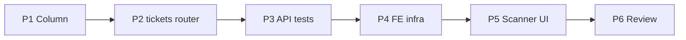

# Implementation Plan — Online QR Scanner (US-AG15, US-AG17, US-AG19)

> **Spec:** `docs/scanner/online-qr-scanner.spec.md`
> **Stack (API):** Hono · Drizzle · Cloudflare D1 · WebCrypto (`crypto.subtle`) · Vitest
> **Stack (App):** React · MUI · TanStack Query · `@yudiel/react-qr-scanner`
> **Builds on:** `src/utils/qr.ts` (`deriveOrgKey` / `verifyTicket` / `TicketPayload`),
> `folio_lines` (`qr_token`, `quantity` = `passes_total`), `authMiddleware` /
> `requireRole('agent')`, the multitenancy Enforcement Contract, the `AppLayout` shell.

The backend is **one column, one endpoint, one atomic UPDATE** — the heavy crypto already
shipped with the generation feature. The frontend is the larger surface: a live camera
scanner, a ✓/✗ result screen, and an offline guard. Backend first (shippable slice), then
the scanner UI. **No new `ErrorCode`** (the ✓/✗ outcome is 200-body data).

---

## Phases

```
Phase 1 → Data model (migration 0014 + schema column)
Phase 2 → API: tickets router (schema + scanTicket handler + mount)
Phase 3 → API tests (Scenarios 1–11 + multitenancy 12)
Phase 4 → Frontend infra (scanner lib, ticketsService, types, useScanTicket hook)
Phase 5 → Frontend UI (ScannerPage + ScanResult + offline guard + Scan nav)
Phase 6 → Review + TECH_DEBT + SPEC checklist
```

Phases 1→3 are an independently shippable backend slice. Phases 4→5 depend on it.

---

## Phase 1 — Data model

### Task 1.1 — Migration `migrations/0014_add_redeemed_count_to_folio_lines.sql`

```sql
ALTER TABLE `folio_lines` ADD COLUMN `redeemed_count` integer DEFAULT 0 NOT NULL;
```

Additive; `NOT NULL DEFAULT 0` is constant → populated-table-safe (existing tickets → 0).

### Task 1.2 — Drizzle schema (`src/db/schema.ts`)

Add to `folioLines`, after `qrToken`:

```ts
  redeemedCount: integer('redeemed_count').notNull().default(0), // passes redeemed; <= quantity
```

**Deliverable:** migration applies; `FolioLine` type carries `redeemedCount`.

---

## Phase 2 — API (`src/routes/tickets/`)

New router, mirrors the `pos/` layout, agent-only via `*` middleware.

### Task 2.1 — Schema (`src/routes/tickets/schema.ts`)

```ts
import { z } from 'zod'

// The scan body carries ONLY the raw QR contents. org/agent come from context.
export const scanTicketSchema = z.object({
  token: z.string().min(1, 'A token is required'),
})

export type ScanTicketInput = z.infer<typeof scanTicketSchema>
```

### Task 2.2 — Handler (`src/routes/tickets/handler.ts`)

```ts
export type TicketsContext = Context<{ Bindings: CloudflareBindings; Variables: AppVariables }>

type ScanReason =
  | 'INVALID_SIGNATURE' | 'EXPIRED' | 'ALREADY_CONSUMED'
  | 'CANCELLED' | 'NOT_PAID' | 'NOT_FOUND'

// 200-body helpers (NOT ApiError): keep the result shape in one place.
const invalid = (c, reason: ScanReason, ticket?: unknown) =>
  c.json({ result: 'invalid', reason, ticket: ticket ?? null })
const valid = (c, ticket) => c.json({ result: 'valid', ticket })
```

`scanTicket` (US-AG15/AG17) — deterministic order from the spec:

```
agent = c.get('user'); org = agent.organizationId
{ token } = scanTicketSchema-validated body
db = getDb(c.env)

// 1. VERIFY under the caller-org key (forged / cross-org → fake).
orgKey  = await deriveOrgKey(c.env.QR_SECRET, org)
payload = await verifyTicket(token, orgKey)
if (!payload) return invalid(c, 'INVALID_SIGNATURE')          // no ticket echoed

// 2. LOAD the line + folio status, org-scoped.
row = SELECT fl.id, fl.quantity, fl.redeemed_count,
             fl.service_name, fl.slot_date, fl.slot_start_time,
             f.status AS folio_status
      FROM folio_lines fl JOIN folios f ON fl.folio_id = f.id
      WHERE fl.id = payload.folio_line_id AND fl.organization_id = org
      LIMIT 1
if (!row) return invalid(c, 'NOT_FOUND', { client_identity: payload.client_identity })

ctx = {                                   // display context reused by every branch below
  client_identity: payload.client_identity,
  service_name: row.serviceName,
  slot_date: row.slotDate,
  slot_start_time: row.slotStartTime,
  passes_total: row.quantity,
  redeemed_count: row.redeemedCount,
}

// 3. STATUS gates.
if (row.folioStatus === 'cancelled') return invalid(c, 'CANCELLED', ctx)
if (row.folioStatus !== 'paid')      return invalid(c, 'NOT_PAID', ctx)

// 4. EXPIRY (from the signed payload).
if (Math.floor(Date.now() / 1000) > payload.expires_at) return invalid(c, 'EXPIRED', ctx)

// 5. ATOMIC redeem — the race backstop.
res = UPDATE folio_lines
        SET redeemed_count = redeemed_count + 1
        WHERE id = row.id AND organization_id = org AND redeemed_count < quantity
        RETURNING redeemed_count
if (res.length === 0)
  return invalid(c, 'ALREADY_CONSUMED', { ...ctx, redeemed_count: row.quantity })

newCount = res[0].redeemedCount
return valid(c, { ...ctx, redeemed_count: newCount, pass_number: newCount })
```

> Notes: org from context (Rules 1 & 3); both the load and the UPDATE filter
> `organization_id = org` (Rules 2 & 4). The single conditional UPDATE — no `db.batch`, no
> compensation — is enough because exactly one row and one counter move (contrast POS,
> which decrements N slots). `quantity` is `passes_total`.

### Task 2.3 — Routes (`src/routes/tickets/index.ts`)

```ts
const tickets = new Hono<{ Bindings: CloudflareBindings; Variables: AppVariables }>()
const validationHook = (r: { success: boolean }) => {
  if (!r.success) throw new ApiError('VALIDATION_ERROR', 400, 'Invalid request payload')
}
tickets.use('*', authMiddleware, requireRole('agent'))
tickets.post('/scan', zValidator('json', scanTicketSchema, validationHook), scanTicket)
export default tickets
```

### Task 2.4 — Mount (`src/index.tsx`)

```ts
import ticketsRouter from './routes/tickets'
// …
app.route('/api/tickets', ticketsRouter)
```

**Deliverable:** `POST /api/tickets/scan` returns the ✓/✗ shape; a quick `curl` with a real
token from a confirmed folio redeems a pass, a second-past-capacity scan reports
`ALREADY_CONSUMED`, a garbage token reports `INVALID_SIGNATURE`.

---

## Phase 3 — API tests (`test/tickets/online-qr-scanner.test.ts`)

Reuse the POS/QR seeders (`seedUser`, `seedService`, `seedSlot`, `seedTwoOrgs`,
`buildFakeJwt`) and `clearPosDb`. Mint real tokens by either (a) confirming a sale through
`POST /api/pos/folios` and reading `qr_token` off the response, or (b) signing directly
with `signTicket(payload, await deriveOrgKey(env.QR_SECRET, org))` for edge cases (expired,
cross-org) — import from `src/utils/qr.ts`. Assert stored `redeemed_count` via a raw
`SELECT`.

| Test | Scenario |
|---|---|
| Valid scan → `valid`, `pass_number` 1, stored `redeemed_count` 1 | 1 |
| Repeated scans → `pass_number` 2/3/4 | 2 |
| Past last pass → `invalid ALREADY_CONSUMED`, count unchanged | 3 |
| Expired token (past `expires_at`) → `invalid EXPIRED`, no redeem | 4 |
| Forged/garbage token → `invalid INVALID_SIGNATURE`, no ticket | 5 |
| Cross-org token (signed for `org_b`) scanned by `org_a` → `INVALID_SIGNATURE`, `org_b` untouched | 6 |
| Cancelled folio (seed `status='cancelled'`) → `invalid CANCELLED` | 7 |
| Valid signature, unknown `folio_line_id` → `invalid NOT_FOUND` | 8 |
| Last-pass race (two sequential scans, `quantity=1`) → one valid, one `ALREADY_CONSUMED`, stored count 1 | 9 |
| Missing / empty token → `400 VALIDATION_ERROR` | 10 |
| Admin role → `403 FORBIDDEN` | 11 |
| **B3/B4** redemption org-scoped (`seedTwoOrgs`): `org_a` cannot mutate `org_b` count | 12 |

> For Scenario 4/expired, the cleanest mint is `signTicket` with an `expires_at` in the
> past against the real folio line — avoids depending on slot-date arithmetic. For Scenario
> 8, sign a payload with a random `folio_line_id`.

**Deliverable:** `pnpm --filter api-guideme test` green.

---

## Phase 4 — Frontend infrastructure

### Task 4.1 — Scanner dependency

`pnpm --filter app-guideme add @yudiel/react-qr-scanner` — a maintained React component
using the native `BarcodeDetector` with a zxing/wasm fallback; exposes `<Scanner onScan />`.
Requires a **secure context** (HTTPS — prod custom domain ✓ — or `localhost`) and camera
permission.

### Task 4.2 — Types (`src/features/scanner/types.ts`)

```ts
export type ScanReason =
  | 'INVALID_SIGNATURE' | 'EXPIRED' | 'ALREADY_CONSUMED'
  | 'CANCELLED' | 'NOT_PAID' | 'NOT_FOUND'

export interface ScannedTicket {
  client_identity: string
  service_name: string | null
  slot_date: string | null
  slot_start_time: string | null
  passes_total: number | null
  redeemed_count: number | null
  pass_number?: number
}

export interface ScanResult {
  result: 'valid' | 'invalid'
  reason?: ScanReason
  ticket: ScannedTicket | null
}
```

### Task 4.3 — Service (`src/services/ticketsService.ts`)

```ts
import { request } from './authService'
import type { ScanResult } from '../features/scanner/types'

export const scanTicket = (token: string) =>
  request<ScanResult>('/api/tickets/scan', {
    method: 'POST',
    body: JSON.stringify({ token }),
  })
```

### Task 4.4 — Hook (`src/features/scanner/hooks/useScanTicket.ts`)

`useMutation({ mutationFn: scanTicket })`. No cache to invalidate (redemption is a fire-
and-display action). Expose `mutate`, `data`, `isPending`, `reset` (for re-arm).

> **US-AG19 (offline):** the scanner checks `navigator.onLine` **before** firing and
> treats a network-level mutation error (TCP/DNS failure, not an HTTP status) as offline —
> rendering "Validation requires an internet connection" rather than a generic error. A
> short helper `isOffline(error)` lives in the feature.

**Deliverable:** service + hook + types importable; types compile.

---

## Phase 5 — Frontend UI

Add an **agent-only** nav destination **Scan** in `AppLayout` (`QrCodeScannerRounded`
icon) and a route in `config/routes.ts`:

```ts
SCAN: '/scan',
```

`App.tsx`: a lazy `RoleGuard('agent')` route for `ScannerPage`.

### Task 5.1 — `ScannerPage` (`src/pages/ScannerPage.tsx`) — US-AG15/AG19

- If `!navigator.onLine`: render an offline banner ("Scanning requires an internet
  connection") and **do not** mount the camera.
- Else mount `<Scanner onScan={(codes) => { if (armed) { setArmed(false); scan(codes[0].rawValue) } }} />`
  inside a framed, square viewport (elegant-minimalist card). **Re-arm guard** (`armed`
  ref/state) so one physical QR fires exactly one request; re-arm on "Scan next."
- While `isPending`: a subtle scanning overlay.
- On result: render `<ScanResult>` (below) over/under the camera; a **Scan next** button
  calls `reset()` + re-arms.
- Handle camera-permission denial / no-camera with a clear message.
- On a network error from the mutation → the same offline message (US-AG19).

### Task 5.2 — `ScanResult` (`src/features/scanner/components/ScanResult.tsx`) — US-AG17

- **Valid:** large success check (`CheckCircleRounded`, success color), client name,
  service, `slot_date · slot_start_time`, and a prominent **"Pass {pass_number} of
  {passes_total} used."**
- **Invalid:** large ✗ (`CancelRounded`/`BlockRounded`, error color) and a human reason:
  - `ALREADY_CONSUMED` → "All passes already used ({passes_total} of {passes_total})."
  - `EXPIRED` → "This ticket has expired."
  - `INVALID_SIGNATURE` → "Not a valid GuideMe ticket."
  - `CANCELLED` → "This folio was cancelled."
  - `NOT_PAID` → "This folio isn't fully paid."
  - `NOT_FOUND` → "Ticket not found."
- Show the available `ticket` context (service/client/schedule) on invalid-with-context so
  the agent sees what they scanned.

**Deliverable:** an agent can open **Scan**, point the camera at a folio QR, and get an
instant ✓ "Pass 2 of 5" or ✗ with a clear reason; rescanning a consumed/expired/foreign
code is handled gracefully; offline shows the network message.

---

## Phase 6 — Review

- Walk Scenarios 1–12; mark ✅/❌.
- Enforcement Contract: token-only body; org/agent from context; load + UPDATE both
  org-filtered; cross-org token reads as fake (per-org key) **and** the org-filtered UPDATE
  is an independent backstop.
- Confirm the **atomic** `redeemed_count < quantity` guard prevents over-redemption (no
  batch/compensation needed for a single counter).
- Confirm **no new `ErrorCode`** (✓/✗ is 200-body data) and the validation order matches
  the spec.
- `docs/TECH_DEBT.md` — add:
  - (a) **Redemption audit table deferred** — `redeemed_count` is the only MVP consumer;
    a `ticket_redemptions` log lands with the first reporting/cash-drawer feature.
  - (b) **Scan is not idempotent** — a lost response may double-redeem on rescan; mitigated
    by client re-arm; revisit with an idempotency key if field data shows duplicates.
  - (c) **Strictly-online MVP** — offline validation + `POST /api/tickets/sync` is Phase 2
    (US-AG16); the signed-token structure already supports it without reissuing tickets.
- Tick **Online QR Scanner** *(US-AG15, US-AG17, US-AG19)* in `docs/SPEC.md`.

---

## Phase dependencies



---

## Checklist

### Backend
- [ ] `0014_add_redeemed_count_to_folio_lines.sql`; Drizzle `folioLines.redeemedCount`
- [ ] `tickets/schema.ts` (`scanTicketSchema` — token only)
- [ ] `tickets/handler.ts` `scanTicket` (verify → load → status → expiry → atomic redeem; 200 `{result,reason?,ticket?}`)
- [ ] Atomic `redeemed_count + 1 … WHERE redeemed_count < quantity RETURNING`; org-filtered
- [ ] `/api/tickets` router mounted with `authMiddleware` + `requireRole('agent')`
- [ ] No new `ErrorCode`
- [ ] `test/tickets/online-qr-scanner.test.ts` Scenarios 1–11 + 12 (`seedTwoOrgs`)

### Frontend
- [ ] `@yudiel/react-qr-scanner` added; `ticketsService.scan`; `scanner` types
- [ ] `useScanTicket` + `isOffline` helper
- [ ] `ScannerPage` (camera, re-arm guard, offline guard, permission handling) + `/scan` route + agent-only **Scan** nav
- [ ] `ScanResult` (✓ client/service/schedule + "Pass N of M"; ✗ per-reason copy)

### Docs
- [ ] `docs/TECH_DEBT.md`: audit-table deferred, non-idempotent scan, online-only/Phase-2 boundary
- [ ] `docs/SPEC.md` MUST-HAVE item ticked (US-AG15, US-AG17, US-AG19)
