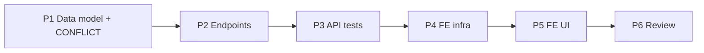

# Implementation Plan — Schedules & Slots (US-A10)

> **Spec:** `docs/schedules/schedules-slots.spec.md`
> **Stack (API):** Hono · Drizzle · Cloudflare D1 · Vitest (`cloudflare:test`)
> **Stack (App):** React 18 · MUI · TanStack Query · React Hook Form + Zod
> **Builds on:** the Service Catalog feature (`services` table, `default_capacity` seed,
> the admin-only `src/routes/services/` router, the `requireService` org-scoped parent
> guard), `authMiddleware`, `requireRole`, the multitenancy Enforcement Contract, and the
> `AppLayout` / `CatalogDetailPage` shell.

Slots are the **inventory unit**: concrete `(service, date, time, capacity)` rows that
the POS will decrement and the dashboard will read. Schedules are a **weekly recurrence
rule** that materializes slots over a bounded window. Both are nested under a service,
mirroring catalog's extras. Backend first (a self-contained shippable slice), then the
admin scheduling UI.

---

## Phases

```
Phase 1 → Data model (2 migrations + Drizzle schema + CONFLICT error code)
Phase 2 → API: schemas + handlers + routes (slots & schedules, nested under :id)
Phase 3 → API tests (scenarios 1–17 + multitenancy B1/B3/B4)
Phase 4 → Frontend infra (service, types/schemas, hooks, date/time helpers)
Phase 5 → Frontend UI (Schedules & Slots section on the service detail page)
Phase 6 → Review against spec + SPEC checklist + TECH_DEBT note
```

Phases 1→3 (backend) are independently shippable. Phases 4→5 depend on the backend.

---

## Phase 1 — Data Model

### Task 1.1 — Migration `migrations/0008_create_schedules.sql`

`schedules` is created **before** `slots` (slots FK-reference it).

```sql
CREATE TABLE `schedules` (
	`id` text PRIMARY KEY NOT NULL,
	`organization_id` text NOT NULL,
	`service_id` text NOT NULL,
	`recurrence` text DEFAULT 'weekly' NOT NULL,
	`weekdays` text NOT NULL,
	`start_time` text NOT NULL,
	`capacity` integer NOT NULL,
	`start_date` text NOT NULL,
	`end_date` text NOT NULL,
	`status` text DEFAULT 'active' NOT NULL,
	`created_at` integer DEFAULT (unixepoch()) NOT NULL,
	`updated_at` integer DEFAULT (unixepoch()) NOT NULL,
	FOREIGN KEY (`organization_id`) REFERENCES `organizations`(`id`) ON UPDATE no action ON DELETE no action,
	FOREIGN KEY (`service_id`) REFERENCES `services`(`id`) ON UPDATE no action ON DELETE no action
);
--> statement-breakpoint
CREATE INDEX `schedules_org_service_idx` ON `schedules` (`organization_id`, `service_id`);
```

### Task 1.2 — Migration `migrations/0009_create_slots.sql`

```sql
CREATE TABLE `slots` (
	`id` text PRIMARY KEY NOT NULL,
	`organization_id` text NOT NULL,
	`service_id` text NOT NULL,
	`schedule_id` text,
	`date` text NOT NULL,
	`start_time` text NOT NULL,
	`capacity` integer NOT NULL,
	`booked` integer DEFAULT 0 NOT NULL,
	`status` text DEFAULT 'active' NOT NULL,
	`created_at` integer DEFAULT (unixepoch()) NOT NULL,
	`updated_at` integer DEFAULT (unixepoch()) NOT NULL,
	FOREIGN KEY (`organization_id`) REFERENCES `organizations`(`id`) ON UPDATE no action ON DELETE no action,
	FOREIGN KEY (`service_id`) REFERENCES `services`(`id`) ON UPDATE no action ON DELETE no action,
	FOREIGN KEY (`schedule_id`) REFERENCES `schedules`(`id`) ON UPDATE no action ON DELETE no action
);
--> statement-breakpoint
CREATE INDEX `slots_org_service_date_idx` ON `slots` (`organization_id`, `service_id`, `date`);
--> statement-breakpoint
CREATE UNIQUE INDEX `slots_active_unique_idx` ON `slots` (`organization_id`, `service_id`, `date`, `start_time`) WHERE `status` = 'active';
```

- Both tables carry `organization_id` directly (Rule 5); the partial unique index makes a
  duplicate **active** slot impossible at the DB layer while letting inactive rows coexist.
- `date` / `start_time` are TEXT (`YYYY-MM-DD` / `HH:MM`) — see spec "Date & time
  representation". Money is irrelevant here; capacity is a plain integer count.

### Task 1.3 — Drizzle schema (`src/db/schema.ts`)

Append after `serviceExtras`:

```ts
export const schedules = sqliteTable('schedules', {
  id: text('id').primaryKey(),
  organizationId: text('organization_id').notNull().references(() => organizations.id),
  serviceId: text('service_id').notNull().references(() => services.id),
  recurrence: text('recurrence', { enum: ['weekly'] }).notNull().default('weekly'),
  weekdays: text('weekdays').notNull(),           // CSV of 0–6, e.g. "1,3,5"
  startTime: text('start_time').notNull(),        // 'HH:MM'
  capacity: integer('capacity').notNull(),
  startDate: text('start_date').notNull(),        // 'YYYY-MM-DD'
  endDate: text('end_date').notNull(),
  status: text('status', { enum: ['active', 'inactive'] }).notNull().default('active'),
  createdAt: integer('created_at', { mode: 'timestamp' }).notNull().default(sql`(unixepoch())`),
  updatedAt: integer('updated_at', { mode: 'timestamp' }).notNull().default(sql`(unixepoch())`),
})

export const slots = sqliteTable('slots', {
  id: text('id').primaryKey(),
  organizationId: text('organization_id').notNull().references(() => organizations.id),
  serviceId: text('service_id').notNull().references(() => services.id),
  scheduleId: text('schedule_id').references(() => schedules.id),  // nullable
  date: text('date').notNull(),                   // 'YYYY-MM-DD'
  startTime: text('start_time').notNull(),        // 'HH:MM'
  capacity: integer('capacity').notNull(),
  booked: integer('booked').notNull().default(0),
  status: text('status', { enum: ['active', 'inactive'] }).notNull().default('active'),
  createdAt: integer('created_at', { mode: 'timestamp' }).notNull().default(sql`(unixepoch())`),
  updatedAt: integer('updated_at', { mode: 'timestamp' }).notNull().default(sql`(unixepoch())`),
})

export type Schedule = typeof schedules.$inferSelect
export type NewSchedule = typeof schedules.$inferInsert
export type Slot = typeof slots.$inferSelect
export type NewSlot = typeof slots.$inferInsert
```

> Drizzle's `text(..., { enum })` does not emit the partial unique index — keep that in the
> hand-written `0009` migration. If migrations are generated via `drizzle-kit`, verify the
> generated `0009` includes the `WHERE status = 'active'` clause; otherwise hand-write it
> to match the `0001`–`0007` style.

### Task 1.4 — Add `CONFLICT` to the `ErrorCode` union (`src/types/errors.ts`)

```ts
export type ErrorCode =
  | 'VALIDATION_ERROR'
  // …existing…
  | 'NOT_FOUND'
  | 'CONFLICT'        // ← new: duplicate active slot, edit collision, capacity < booked
  | 'INTERNAL_ERROR'
```

The global error handler already maps `ApiError.status` → response, so no other change is
needed. This is the first `CONFLICT` consumer (analogous to how catalog was the first
`NOT_FOUND` consumer).

**Deliverable:** Migrations apply cleanly; `Schedule` / `Slot` types available; `CONFLICT`
in the union.

---

## Phase 2 — API Endpoints

Slots & schedules live **on the existing `services` router** (admin-only is already
applied to `*`). To keep `handler.ts` focused, add **`slots.handler.ts`** and
**`slots.schema.ts`** in `src/routes/services/` and register their routes in the existing
`index.ts` (after the extras routes).

### Task 2.1 — Schemas (`src/routes/services/slots.schema.ts`)

```ts
import { z } from 'zod'

const dateStr = z.string().regex(/^\d{4}-\d{2}-\d{2}$/, 'Expected YYYY-MM-DD')
  .refine((s) => !Number.isNaN(Date.parse(`${s}T00:00:00Z`)), 'Invalid calendar date')
const timeStr = z.string().regex(/^([01]\d|2[0-3]):[0-5]\d$/, 'Expected HH:MM (24h)')
const capacity = z.number().int().min(1)

// capacity optional → handler defaults to service.default_capacity
export const createSlotSchema = z.object({
  date: dateStr,
  start_time: timeStr,
  capacity: capacity.optional(),
})
export const updateSlotSchema = z.object({
  date: dateStr,
  start_time: timeStr,
  capacity,                         // required on full-replace edit
})

export const createScheduleSchema = z
  .object({
    weekdays: z.array(z.number().int().min(0).max(6)).nonempty()
      .refine((a) => new Set(a).size === a.length, 'weekdays must be distinct'),
    start_time: timeStr,
    capacity: capacity.optional(),
    start_date: dateStr,
    end_date: dateStr,
  })
  .refine((v) => v.start_date <= v.end_date, {
    message: 'end_date must be ≥ start_date', path: ['end_date'],
  })
  .refine((v) => daysBetween(v.start_date, v.end_date) <= MAX_HORIZON_DAYS, {
    message: 'window exceeds 366 days', path: ['end_date'],
  })

export type CreateSlotInput = z.infer<typeof createSlotSchema>
export type UpdateSlotInput = z.infer<typeof updateSlotSchema>
export type CreateScheduleInput = z.infer<typeof createScheduleSchema>
```

> No `organizationId` / `status` / `booked` / `schedule_id` fields (Rule 1; Zod strips
> unknowns). `MAX_HORIZON_DAYS = 366` and a small `daysBetween` / date-iteration helper
> live in a local `slots.dates.ts` (pure, unit-testable; lexicographic string dates make
> range math easy, but iterate via `Date` in UTC to avoid DST drift, formatting back to
> `YYYY-MM-DD`).

### Task 2.2 — Handlers (`src/routes/services/slots.handler.ts`)

Reuse `requireService` (export it from `handler.ts` if not already) and the
`ServicesContext` type. Shared serializer:

```ts
const serializeSlot = (row) => ({
  id, service_id, schedule_id, date, start_time,
  capacity, booked, remaining: row.capacity - row.booked, status,
})
const serializeSchedule = (row) => ({
  id, service_id, recurrence, weekdays: row.weekdays.split(',').map(Number),
  start_time, capacity, start_date, end_date, status,
})
```

- **`createSlot`** (US-A10) — `requireService`; resolve `capacity ?? service.defaultCapacity`
  (so fetch `default_capacity` in the parent guard, or re-select it); **collision check**:
  SELECT an active slot at `(org, serviceId, date, start_time)` → `409 CONFLICT`; else
  `INSERT` `schedule_id: null`, `booked: 0`, `status: 'active'`; return `201 { slot }`.
- **`listSlots`** — `WHERE organizationId = ctx AND serviceId = :id` `[AND date >= from]`
  `[AND date <= to]` `[AND status = ?]` (default `status='active'`; `all` drops the
  filter) `ORDER BY date, start_time`; return `{ slots }`.
- **`updateSlot`** (US-A10) — triple filter (`slotId + serviceId + org`). Read the row
  first (for `booked` + collision check); `capacity < booked` → `409`; if `(date,
  start_time)` changed and another **active** slot occupies it → `409`; else
  `UPDATE date, start_time, capacity, updatedAt`; 0 rows → `404`. Return `{ slot }`.
- **`setSlotStatus`** (`deactivate`/`reactivate`) — triple filter; on **reactivate**,
  collision check first (`409` if the time is taken by another active slot);
  `UPDATE status`; 0 rows → `404`; idempotent. Return `{ slot }`.
- **`createSchedule`** (US-A10) — `requireService`; resolve capacity default; `INSERT`
  schedule (`weekdays.join(',')`, `recurrence: 'weekly'`, `status: 'active'`).
  **Materialize:** iterate dates in `[start_date, end_date]`; for each whose weekday ∈
  `weekdays`, **skip** if an active slot already occupies `(serviceId, date, start_time)`,
  else collect a slot row (`scheduleId`, `booked: 0`, `status: 'active'`). Bulk-`INSERT`
  the collected rows (chunk if needed for D1 bind limits). Return
  `201 { schedule, slots_generated: collected.length }`.
- **`listSchedules`** — `WHERE org AND serviceId [AND status]` `ORDER BY start_date`;
  return `{ schedules }`.
- **`deactivateSchedule`** (US-A10) — triple filter (`scheduleId + serviceId + org`);
  `UPDATE schedules SET status='inactive'`; 0 rows → `404`. Then cascade:
  `UPDATE slots SET status='inactive' WHERE org AND serviceId AND scheduleId = :id AND
  booked = 0 AND status='active'` `.returning({id})` → `slots_closed = rows.length`.
  Return `{ schedule: {id,status}, slots_closed }`.

> Every query org-filters (Rules 2 & 4); inserts set `organizationId` from context (Rule
> 3). Collision pre-checks return a clean `409` before the partial unique index would
> raise a raw constraint error (which stays as a defense-in-depth backstop).

### Task 2.3 — Routes (extend `src/routes/services/index.ts`)

Register after the extras routes (same `validationHook`, same router instance):

```ts
services.post('/:id/slots',   zValidator('json', createSlotSchema, validationHook), createSlot)
services.get('/:id/slots',    listSlots)
services.put('/:id/slots/:slotId', zValidator('json', updateSlotSchema, validationHook), updateSlot)
services.post('/:id/slots/:slotId/deactivate', deactivateSlot)
services.post('/:id/slots/:slotId/reactivate', reactivateSlot)

services.post('/:id/schedules', zValidator('json', createScheduleSchema, validationHook), createSchedule)
services.get('/:id/schedules',  listSchedules)
services.post('/:id/schedules/:scheduleId/deactivate', deactivateSchedule)
```

> Route ordering: `/:id/slots` and `/:id/slots/:slotId/...` are unambiguous under Hono;
> they sit after the existing extras routes. No mount change in `src/index.tsx` (already
> mounted at `/api/services`).

**Deliverable:** Eight endpoints respond per spec; manual `curl` check passes.

---

## Phase 3 — API Tests (`test/catalog/schedules-slots.test.ts`)

Reuse `seedUser` / `seedTwoOrgs` (`test/helpers/tenancy.ts`), `buildFakeJwt`
(`test/helpers/jwt.ts`), and the catalog suite's `seedService` pattern. Add local
seeders `seedSlot` / `seedSchedule` (raw `env.DB.prepare(...)`). Extend the suite's
`beforeEach` cleanup to also clear `slots` + `schedules` (delete **before** `services`
to respect FKs).

| Test | Spec scenario |
|---|---|
| Create specific-date slot → 201, schedule_id null, booked 0, remaining set | 1 |
| Capacity omitted → defaults to service.default_capacity | 2 |
| Bad date/time/capacity → 400 | 3 |
| Duplicate active slot → 409, original intact | 4 |
| List active-only, ordered by date+time; `from`/`to`/`status=all` filters | 5 |
| Edit time/capacity → 200, advances updated_at, keeps org/service/booked | 6 |
| Edit into colliding time → 409, both intact | 7 |
| Deactivate ×2 idempotent; reactivate → active; never deleted | 8 |
| Reactivate into taken time → 409 | 9 |
| Create weekly schedule materializes Mon/Wed/Fri; slots_generated correct | 10 |
| Materialization skips occupied times (no dup, no 409) | 11 |
| `end_date < start_date` / horizon > 366 → 400, nothing written | 12 |
| Empty / out-of-range weekdays → 400 | 13 |
| List schedules ordered by start_date; weekdays as int[] | 14 |
| Deactivate schedule closes only booked=0 slots; slots_closed correct | 15 |
| Agent role → 403 on a slots/schedules route | 16 |
| Unknown / foreign parent service → 404 | 17, 19 |
| **B4** slot/schedule lists scoped to caller org (`seedTwoOrgs`) | 18 |
| **B3** cross-org slot/schedule ops → 404, targets untouched | 19 |
| **B1** injected organizationId/booked/status ignored | 20 |

**Deliverable:** `pnpm --filter api-guideme test` green.

---

## Phase 4 — Frontend Infrastructure

New feature dir `app-guideme/src/features/schedules/`. Reuse the `request()` wrapper +
`ServiceError` from `authService.ts` (same as `catalogService.ts`).

### Task 4.1 — Types + date/time helpers (`src/features/schedules/types.ts`)

```ts
export type SlotStatus = 'active' | 'inactive'
export interface Slot {
  id: string; service_id: string; schedule_id: string | null
  date: string; start_time: string
  capacity: number; booked: number; remaining: number; status: SlotStatus
}
export interface Schedule {
  id: string; service_id: string; recurrence: 'weekly'
  weekdays: number[]; start_time: string; capacity: number
  start_date: string; end_date: string; status: SlotStatus
}
export const WEEKDAY_LABELS = ['Sun','Mon','Tue','Wed','Thu','Fri','Sat'] as const
```

### Task 4.2 — Zod form schemas (`src/features/schedules/schemas.ts`)

`slotFormSchema` (date, start_time, capacity≥1) and `scheduleFormSchema` (non-empty
`weekdays`, start_time, capacity≥1, start_date ≤ end_date) — mirror the API regexes so
the client blocks bad input before the round-trip. The `capacity` field can default to the
service's `default_capacity` (passed in as the form's `defaultValues`).

### Task 4.3 — Service (`src/services/schedulesService.ts`)

| Function | Endpoint |
|---|---|
| `listSlots(serviceId, {from?, to?, status?})` | `GET /api/services/:id/slots` |
| `createSlot(serviceId, data)` | `POST /api/services/:id/slots` |
| `updateSlot(serviceId, slotId, data)` | `PUT /api/services/:id/slots/:slotId` |
| `deactivateSlot(serviceId, slotId)` / `reactivateSlot(...)` | `POST …/slots/:slotId/(de|re)activate` |
| `listSchedules(serviceId, status?)` | `GET /api/services/:id/schedules` |
| `createSchedule(serviceId, data)` | `POST /api/services/:id/schedules` |
| `deactivateSchedule(serviceId, scheduleId)` | `POST …/schedules/:scheduleId/deactivate` |

### Task 4.4 — Hooks (`src/features/schedules/hooks/`)

| Hook | Type | Invalidates |
|---|---|---|
| `useSlots(serviceId, filters)` | `useQuery(['slots', serviceId, filters])` | — |
| `useSchedules(serviceId, status?)` | `useQuery(['schedules', serviceId, status])` | — |
| `useCreateSlot` / `useUpdateSlot` | `useMutation` | `['slots', serviceId]` |
| `useDeactivateSlot` / `useReactivateSlot` | `useMutation` | `['slots', serviceId]` |
| `useCreateSchedule` | `useMutation` | `['slots', serviceId]` + `['schedules', serviceId]` |
| `useDeactivateSchedule` | `useMutation` | `['slots', serviceId]` + `['schedules', serviceId]` |

**Deliverable:** service + hooks importable; types compile.

---

## Phase 5 — Frontend UI

US-A10 is reached from a **service**, so the UI lands on the existing service detail page
(`CatalogDetailPage`, route `CATALOG_DETAIL = '/catalog/:id'`) as a **Schedules & Slots**
section — no new nav destination (Catalog already exists). The catalog `ServiceRow`'s
"Manage extras" sibling gets a **Schedules** action linking to `/catalog/:id`.

### Task 5.1 — `SchedulesSection` (`src/features/schedules/components/SchedulesSection.tsx`)

- Mounted on `CatalogDetailPage` below the service header + extras.
- Two CTAs: **Add date** (opens `SlotFormDialog`) and **Add recurring schedule** (opens
  `ScheduleFormDialog`).
- A date-range filter (default: today → +30 days) feeding `useSlots`.
- Loading → `CircularProgress`; error → `Alert`; empty → muted "No slots yet — add a date
  or a recurring schedule."

### Task 5.2 — `SlotList` / `SlotRow` (`src/features/schedules/components/`)

- Slots grouped by `date` (elegant-minimalist `Card elevation={0}`, subtle divider).
- Each row: `start_time`, `remaining / capacity` (e.g. "12 / 12"), a recurring badge when
  `schedule_id` is set, a `status` chip.
- Actions: **Edit** (capacity/time), **Close**/**Reopen** (deactivate/reactivate with
  confirm). `inactive` rows rendered muted; rows with `booked > 0` show booked count.

### Task 5.3 — `SlotFormDialog` (`src/features/schedules/components/`)

- MUI `Dialog` + RHF + `slotFormSchema`; create + edit.
- Fields: `date` (date picker), `start_time` (time picker / masked input), `capacity`
  (number, prefilled with `service.default_capacity`).
- Submit → `useCreateSlot` / `useUpdateSlot`; `409` → inline "A slot already exists at
  that date and time" / "capacity below already-booked spots"; `400`/`404` → alert.

### Task 5.4 — `ScheduleFormDialog` (`src/features/schedules/components/`)

- RHF + `scheduleFormSchema`. Fields: weekday multi-toggle (`WEEKDAY_LABELS`), `start_time`,
  `capacity`, `start_date` / `end_date` (range). Inline error when `end_date < start_date`.
- On success: toast "Generated N slots" from `slots_generated`; invalidate slot + schedule
  queries; close.
- A small **Schedules** list (from `useSchedules`) with a **Deactivate** action
  (confirm: "Closes its unbooked slots") showing `slots_closed` in the toast.

**Deliverable:** Admin can define specific-date slots and recurring weekly schedules with
independent per-slot capacity, view them grouped by date, edit/close individual slots, and
deactivate a whole schedule — end-to-end.

---

## Phase 6 — Review

- Walk spec Scenarios 1–20; mark ✅/❌.
- Confirm the Enforcement Contract: every query org-filtered; no
  `organizationId`/`status`/`booked` in any Zod schema; inserts set `organizationId` from
  context; slot/schedule ops filtered by the `id + serviceId + organizationId` triple;
  parent guarded by `requireService`.
- Confirm soft-deactivation (no hard deletes) for both slots and schedules; schedule
  deactivate cascades only to `booked = 0` slots.
- Confirm `remaining` is derived in responses, never stored; `capacity < booked` rejected.
- Add a short `docs/TECH_DEBT.md` note: `CONFLICT` error code introduced **and consumed**
  by this feature (no open debt) — analogous to the resolved §1 `NOT_FOUND` entry.
- Update the SPEC checklist: tick **Schedules/slots with capacity by date and time**
  *(US-A10)* in `docs/SPEC.md`.

---

## Phase Dependencies



---

## Checklist

### Backend
- [ ] `0008_create_schedules.sql` + `0009_create_slots.sql` (+ org-leading indexes + partial unique active-slot index)
- [ ] Drizzle `schedules` + `slots` tables and types
- [ ] `'CONFLICT'` added to the `ErrorCode` union (`src/types/errors.ts`)
- [ ] `slots.schema.ts` (slot create/update, schedule create with horizon + weekday refines)
- [ ] `slots.handler.ts`: createSlot/listSlots/updateSlot/(de)reactivateSlot; createSchedule/listSchedules/deactivateSchedule
- [ ] Capacity defaults to `service.default_capacity`; `remaining` derived; `booked` always 0 here
- [ ] Duplicate-active-slot / edit / reactivate collisions → 409; horizon/weekday/format → 400
- [ ] Schedule materialization skips occupied times; deactivate cascade closes only booked=0 slots
- [ ] Routes registered on the existing admin-only `services` router
- [ ] `test/catalog/schedules-slots.test.ts` Scenarios 1–17
- [ ] Multitenancy B1/B3/B4 (Scenarios 18–20) via `seedTwoOrgs`

### Frontend
- [ ] `schedulesService` (slots + schedules)
- [ ] `features/schedules` types + `slotFormSchema`/`scheduleFormSchema` + weekday helpers
- [ ] `useSlots`/`useSchedules` + create/update/(de/re)activate slot + create/deactivate schedule hooks
- [ ] `SchedulesSection` on `CatalogDetailPage`; **Schedules** action on `ServiceRow`
- [ ] `SlotList` / `SlotRow` (grouped by date, remaining/capacity, recurring badge)
- [ ] `SlotFormDialog` (create + edit, 409 inline handling)
- [ ] `ScheduleFormDialog` (weekday toggles, date range, slots_generated toast) + schedule list with deactivate

### Docs
- [ ] `docs/TECH_DEBT.md` note: `CONFLICT` introduced-and-consumed here
- [ ] `docs/SPEC.md` MUST-HAVE item ticked (US-A10)
