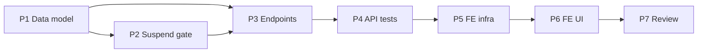

# Implementation Plan — Staff Management (US-A06, US-A07, US-A08)

> **Spec:** `docs/staff/staff-management.spec.md`
> **Stack (API):** Hono · Drizzle · Cloudflare D1 · Vitest (`cloudflare:test`)
> **Stack (App):** React 18 · MUI v6 · TanStack Query · React Hook Form + Zod
> **Builds on:** existing `agents` router (invite), `authMiddleware`, multitenancy contract

US-A05 (invite) already ships. This plan adds **list / edit / deactivate / reactivate**
on the backend, then the admin UI to drive them.

---

## Phases

```
Phase 1 → Data model (migration + schema)
Phase 2 → Cross-cutting: suspended users lose access (authMiddleware)
Phase 3 → API endpoints (list, edit, deactivate, reactivate)
Phase 4 → API tests (scenarios + multitenancy B1/B3/B4)
Phase 5 → Frontend: agents service, hooks, schemas
Phase 6 → Frontend: Agents list + edit + (de)activate UI
Phase 7 → Review against spec
```

Phases 1→4 (backend) are a self-contained, shippable slice. Phases 5→6 (frontend)
depend on the backend being merged.

---

## Phase 1 — Data Model

### Task 1.1 — Migration `migrations/0005_add_base_commission_to_users.sql`

```sql
ALTER TABLE `users` ADD `base_commission` integer DEFAULT 0 NOT NULL;
--> statement-breakpoint
CREATE INDEX `users_org_role_status_idx` ON `users` (`organization_id`, `role`, `status`);
```

- `base_commission` is **basis points** (`0`–`10000`; `1050` = 10.50%).
- The index satisfies Multitenancy Rule 6 (org-leading index on a tenant-scoped table).
- No new table → Rule 5 not triggered.

### Task 1.2 — Drizzle schema (`src/db/schema.ts`)

Add to `users`:

```ts
baseCommission: integer('base_commission').notNull().default(0),
```

> If migrations are generated with `drizzle-kit`, generate from the schema change
> instead of hand-writing 0005; otherwise hand-write to match the existing
> `0001`–`0004` style. Keep the file numbering/format consistent.

**Deliverable:** Migration applies cleanly; `User` type carries `baseCommission`.

---

## Phase 2 — Suspended Users Lose Access (US-A08 enforcement)

### Task 2.1 — Error codes (`src/types/errors.ts`)

Add to the `ErrorCode` union: `'ACCOUNT_SUSPENDED'` and `'NOT_FOUND'`.

### Task 2.2 — `authMiddleware` status check (`src/middleware/auth.ts`)

- Extend `buildUserPayload`'s `select` to include `status: users.status`.
- After resolving the user (on **both** the valid-token branch and the post-refresh
  branch), if `status === 'suspended'`:
  - `clearSessionCookies(c)`
  - `throw new ApiError('ACCOUNT_SUSPENDED', 403, 'Account suspended')`
- `status` is used only for the gate; it does not need to be added to `UserPayload`
  (keep `c.var.user` shape stable) unless a handler needs it. Prefer a local check.

**Deliverable:** A suspended user is rejected from every authenticated route, and
cannot refresh back in (spec Scenarios 8, 9).

---

## Phase 3 — API Endpoints

All live on the existing `src/routes/agents/` router, which already applies
`authMiddleware` + `requireRole('admin')` on `*`.

### Task 3.1 — Schemas (`src/routes/agents/schema.ts`)

Add:

```ts
export const updateAgentSchema = z.object({
  name: z.string().min(1, 'Name is required'),
  phone: z.string().nullable().optional(),
  base_commission: z.number().int().min(0).max(10000),
})
export type UpdateAgentInput = z.infer<typeof updateAgentSchema>
```

> No `organizationId` field (Multitenancy Rule 1). `email`/`role`/`status` are not editable here.

### Task 3.2 — Handlers (`src/routes/agents/handler.ts`)

A shared serializer keeps `password_hash`/`password_salt` out of every response and
maps DB columns to the API shape (`base_commission`, etc.).

- **`listAgents`** (US-A06)
  - `SELECT` `id, name, email, phone, status, baseCommission` from `users`
  - `WHERE organizationId = user.organizationId AND role = 'agent'` (Rule 2)
  - `ORDER BY name ASC`
  - return `{ agents: [...] }`

- **`updateAgent`** (US-A07)
  - `id = c.req.param('id')`
  - `UPDATE users SET name, phone, baseCommission, updatedAt = now`
    `WHERE id = :id AND organizationId = user.organizationId AND role = 'agent'` (Rule 4)
  - Use a returning-style read (update, then `SELECT` the row by the same filter);
    if no row matched → `throw new ApiError('NOT_FOUND', 404, ...)`
  - return `{ agent }`

- **`deactivateAgent`** (US-A08) / **`reactivateAgent`**
  - `UPDATE users SET status = 'suspended' | 'active', updatedAt = now`
    `WHERE id = :id AND organizationId = user.organizationId AND role = 'agent'`
  - If 0 rows matched → `404 NOT_FOUND`. Idempotent (re-running yields same state).
  - return `{ agent: { id, name, status } }`

> The `role = 'agent'` predicate is what makes an `admin` `:id` (including the caller)
> resolve to `404` rather than being mutated.

### Task 3.3 — Routes (`src/routes/agents/index.ts`)

```ts
agents.get('/', listAgents)
agents.put('/:id', zValidator('json', updateAgentSchema, validationHook), updateAgent)
agents.post('/:id/deactivate', deactivateAgent)
agents.post('/:id/reactivate', reactivateAgent)
```

(Existing `agents.post('/invite', ...)` stays. `agents.use('*', authMiddleware, requireRole('admin'))` already guards all of these.)

**Deliverable:** Four endpoints respond per spec; `curl`/manual check passes.

---

## Phase 4 — API Tests (`test/staff/staff-management.test.ts`)

Reuse `seedUser` / `seedTwoOrgs` from `test/helpers/tenancy.ts` and `buildFakeJwt`
from `test/helpers/jwt.ts`. Extend the local seed helper to accept `baseCommission`
if needed (default 0). Cover:

| Test | Spec scenario |
|---|---|
| Admin lists agents (excludes admin, ordered, has commission, no hashes) | 1 |
| Empty roster → `{ agents: [] }` | 2 |
| Agent role → 403 FORBIDDEN | 3 |
| Edit name/phone/commission → 200, email/role/status unchanged | 4 |
| `base_commission` `-1` / `10001` / float → 400 | 5 |
| Edit unknown / admin id → 404 | 6 |
| Deactivate → 200, status suspended | 7 |
| Suspended user hits `GET /api/me` → 403 ACCOUNT_SUSPENDED + cookies cleared | 8 |
| Suspended + expired access, valid refresh → 403 ACCOUNT_SUSPENDED | 9 |
| Reactivate → 200, status active | 10 |
| Deactivate twice → idempotent 200 | 11 |
| Deactivate unknown / admin id → 404 | 12 |
| **B4** list scoped to caller org (`seedTwoOrgs`) | 13 |
| **B3** cross-org edit/deactivate/reactivate → 404, target unchanged | 14 |
| **B1** injected `organizationId` in PUT body ignored | 15 |

> Scenarios 8/9 need a JWT whose `sub` is the suspended agent's email; assert the
> `Set-Cookie` header clears `gm_access`/`gm_refresh`. Mirror the cookie assertions
> already used in `test/auth/agent-invitation.test.ts`.

**Deliverable:** `pnpm --filter api-turistear test` green.

---

## Phase 5 — Frontend Infrastructure

> Lives under `app-turistear/src/features/agents/` alongside the existing invite code.
> Reuse the exported `request()` wrapper + `ServiceError` from `authService.ts`.

### Task 5.1 — Service (`src/services/agentsService.ts`)

Add to the existing file:

| Function | Endpoint |
|---|---|
| `listAgents()` | `GET /api/agents` |
| `updateAgent(id, data)` | `PUT /api/agents/:id` |
| `deactivateAgent(id)` | `POST /api/agents/:id/deactivate` |
| `reactivateAgent(id)` | `POST /api/agents/:id/reactivate` |

### Task 5.2 — Types + Zod (`src/features/agents/types.ts`, `schemas.ts`)

```ts
interface Agent {
  id: string; name: string; email: string
  phone: string | null
  status: 'active' | 'suspended'
  base_commission: number // basis points
}
```

`editAgentSchema`: `name` (required), `phone` (optional), and a **percent** field the
admin types (e.g. `10.5`), validated `0`–`100` with ≤2 decimals. Convert
percent → basis points (`Math.round(pct * 100)`) when calling the API, and basis
points → percent (`bp / 100`) when populating the form. Keep this conversion in one
helper to avoid drift.

### Task 5.3 — Hooks (`src/features/agents/hooks/`)

| Hook | Type | Invalidates |
|---|---|---|
| `useAgents` | `useQuery(['agents'])` | — |
| `useUpdateAgent` | `useMutation` | `['agents']` |
| `useDeactivateAgent` | `useMutation` | `['agents']` |
| `useReactivateAgent` | `useMutation` | `['agents']` |

**Deliverable:** Service + hooks importable; types compile.

---

## Phase 6 — Frontend UI

### Task 6.1 — Route, entry point, and MD3-style navigation shell

Goal: instead of a bare text link, give authenticated pages a persistent,
Material-Design-3-flavored navigation shell — a **navigation rail** on
desktop/tablet and a **bottom navigation bar** on mobile — with a pill-shaped
active indicator in the brand accent. "Agents" becomes a nav destination, not a link.

#### Reality check — what MUI v9 actually gives us (read before coding)

This repo runs **`@mui/material@^9`** (CLAUDE.md says v6 — it is stale; v9 is still a
Material-Design-2 codebase). Two consequences shape the approach:

- **No first-class `NavigationRail`** exists in MUI, and **no shippable MD3 theme**
  (`@mui/material-next` was the experimental MD3 package and is discontinued). So we
  do **not** "switch MUI to MD3." We **approximate MD3** with real MUI primitives +
  `sx` styling. Anyone reading this plan should not go looking for a `<NavigationRail>`
  import — it isn't there.
- What *is* real and we will use: `createTheme({ cssVariables: true })` (CSS theme
  variables, supported in v6+), `BottomNavigation` / `BottomNavigationAction`,
  `Drawer variant="permanent"` (or a styled `Box`) for the rail, the default MUI
  **ripple** (already subtle — satisfies "ripple-style hover" without anything bouncy),
  and the **Rounded** icon set (`*Rounded` imports from `@mui/icons-material`).

#### Reconciliation with the elegant-minimalist design system (CLAUDE.md)

The MD3 ask and the project's design system actually agree once mapped:

| MD3 ask | How we honor it within elegant-minimalist |
|---|---|
| "Vibrant accent for the active pill" | Use the **existing** accent `secondary.main` = indigo `#4F46E5`. CLAUDE.md explicitly reserves the single accent for "CTAs and **active states**" — the active pill is exactly that. Used sparingly (only the active destination). |
| "Surface Container background" | Map to the existing neutral tones: app surface `background.default` (`#F8F9FA`), rail/bar surface `background.paper` with a `1px solid divider`, active pill `secondary` at low opacity (`alpha(secondary, 0.12)`) with `secondary.main` icon/label. No new saturated colors. |
| "Rounded, modern icons" | `@mui/icons-material` **Rounded** variants. |
| "Smooth micro-animations / ripple" | MUI default ripple (subtle) + a short `transition` on the pill background/`color`. **No** scale-bounce or flashy motion (CLAUDE.md: "No bouncy or flashy animations"). |

> Net: this is an MD3-*styled* shell built on MUI v2 primitives, kept inside the
> restrained palette. If the team later wants true MD3 tokens, that's a separate
> theming spike — out of scope for Staff Management.

#### 6.1a — Routing

- Add `AGENTS: '/agents'` to `src/config/routes.ts`.
- Wire the route in `App.tsx` with `AuthGuard` + `RoleGuard role="admin"` (same
  pattern as `INVITE_AGENT`).

#### 6.1b — Theme: enable CSS variables + a reusable nav-item style

- In `src/config/theme.ts`, switch to `createTheme({ cssVariables: true, ... })`
  (keep all existing palette/typography/shape/shadows/overrides).
- No palette changes required — `secondary.main` (indigo) is the accent; surface
  tones come from `background.*` + `grey.*` already present.

#### 6.1c — `AppLayout` shell (`src/layout/AppLayout.tsx`)

A new shared layout for **authenticated** pages (the dashboard, the agents list, and
future POS/catalog screens all render inside it — fits the `layout/` layer in the
folder architecture). Responsibilities:

- Top `AppBar` (transparent, `elevation={0}`, `1px solid divider`) with the Turistear Ya!
  wordmark, the `name (role)` chip, and the logout button — lifted out of
  `DashboardPage` so every page shares it.
- **Responsive navigation**, driven by `useMediaQuery(theme.breakpoints.up('md'))`:
  - **md and up → navigation rail**: a left `Drawer variant="permanent"` (or styled
    `Box`, width ~88px) of vertical destinations. Each destination = Rounded icon over
    a short label inside a **pill** container.
  - **below md → bottom bar**: MUI `BottomNavigation` fixed to the bottom with the same
    destinations (mobile-first; thumb-reachable).
- A `<Box component="main">` that renders `children`/`<Outlet/>` with comfortable
  padding and `bgcolor: background.default`.

- **Destinations** come from a single `NAV_ITEMS` array
  (`{ label, to, icon, roles? }`) so rail and bottom bar stay in sync and the
  **Agents** item can be gated to `role === 'admin'` (filtered against
  `authStore.user.role`). MVP destinations: **Dashboard** (`DashboardRounded`) and
  **Agents** (`GroupsRounded`, admin-only). Invite stays a button on the Agents page.

- **Active pill indicator** (shared `sx`, applied to the active rail item and the
  active `BottomNavigationAction`):
  ```ts
  // active
  bgcolor: (t) => alpha(t.palette.secondary.main, 0.12),
  color: 'secondary.main',
  borderRadius: 999,            // full pill
  transition: 'background-color 160ms ease, color 160ms ease',
  // inactive
  color: 'text.secondary',
  '&:hover': { bgcolor: (t) => alpha(t.palette.secondary.main, 0.06) },
  ```
  Active state derived from `useLocation().pathname` (`startsWith(item.to)`). Ripple
  is MUI's default — no extra config.

#### 6.1d — Adopt the shell

- Wrap the authenticated routes (`DASHBOARD`, `AGENTS`) in `<AppLayout>` in `App.tsx`
  (rail/bar render once; pages render in the main slot).
- Simplify `DashboardPage` to its content only (its inline `AppBar`/`Toolbar` moves
  into `AppLayout`); keep the `Fade` page transition.

**Deliverable for 6.1:** Logging in shows the MD3-styled shell — rail on desktop,
bottom bar on mobile — with **Agents** visible only to admins and highlighted by an
indigo pill when active. `/agents` is reachable and admin-guarded.

### Task 6.2 — `AgentsListPage` (`src/pages/AgentsListPage.tsx`)

- `useAgents()`; loading → `CircularProgress`; error → `Alert`.
- Header with an "Invite agent" button → `/agents/invite` (reuses existing flow).
- Render `AgentList`. Empty state: muted "No agents yet — invite your first agent."

### Task 6.3 — `AgentList` / `AgentRow` (`src/features/agents/components/`)

Each row (elegant-minimalist: `Card elevation={0}`, subtle divider):
- name, email, commission (`base_commission / 100` → `10.50%`)
- a `status` chip (`active` / `suspended`)
- actions: **Edit** (opens dialog), **Deactivate** (active rows) / **Reactivate**
  (suspended rows), each with a confirmation.
- Suspended rows rendered visually muted.

### Task 6.4 — `EditAgentDialog` (`src/features/agents/components/`)

- MUI `Dialog` with React Hook Form + `editAgentSchema`.
- Fields: `name`, `phone`, `commission` (percent, `%` adornment, helperText "0–100").
- Prefill from the selected agent (basis points → percent).
- Submit → `useUpdateAgent`; on success close + toast; `400`/`404` → inline/alert.

### Task 6.5 — Deactivate / reactivate confirmation

- Lightweight confirm (MUI `Dialog`): "Suspend <name>? They lose access immediately
  but their sales history is kept."
- Calls the matching mutation; list refreshes via `['agents']` invalidation.

**Deliverable:** Admin can view the roster, edit profile/commission, and
deactivate/reactivate agents end-to-end.

---

## Phase 7 — Review

- Walk spec Scenarios 1–15; mark ✅/❌.
- Confirm Enforcement Contract: every query org-filtered, no `organizationId` in
  schemas, no password fields leaked.
- Confirm a suspended agent is bounced from the app (frontend should map
  `403 ACCOUNT_SUSPENDED` to a clear "your account has been suspended" screen via the
  global interceptor — currently it treats non-auth `401` only; extend it to also
  handle `ACCOUNT_SUSPENDED`).

### Phase 7 — Results

**Interceptor change (done):** `services/authService.ts` now bounces any
`403 ACCOUNT_SUSPENDED` via `handleSuspended()` (clears the store, redirects to
`/login?reason=suspended`); `LoginForm` shows "Your account has been suspended.
Contact your administrator." when that param is present.

**Spec scenario walkthrough** — every scenario is backed by an automated test in
`test/staff/staff-management.test.ts` (18 tests) unless noted; suite is green (60/60
across the API project).

| # | Scenario | Status |
|---|---|---|
| 1 | List agents: commission shown, admin excluded, name-ordered, no password fields | ✅ test |
| 2 | Empty roster → `{ agents: [] }` | ✅ test |
| 3 | Agent role → `403 FORBIDDEN` | ✅ test |
| 4 | Edit name/phone/commission; email/role/status unchanged | ✅ test |
| 5 | `base_commission` `-1` / `10001` / float → `400` | ✅ test |
| 6 | Edit unknown id / admin id → `404` | ✅ test (both) |
| 7 | Deactivate → `suspended` | ✅ test |
| 8 | Suspended user on valid token → `403 ACCOUNT_SUSPENDED` + cookies cleared | ✅ test |
| 9 | Suspended user cannot refresh back in (post-refresh re-check) | ✅ test (mocked successful refresh) |
| 10 | Reactivate → `active` | ✅ test |
| 11 | Deactivate idempotent | ✅ test |
| 12 | Deactivate unknown id / admin id → `404` | ✅ test (both) |
| 13 | B4 — list scoped to caller's org | ✅ test (`seedTwoOrgs`) |
| 14 | B3 — cross-org edit/deactivate/reactivate → `404`, target untouched | ✅ test |
| 15 | B1 — injected `organizationId` in PUT body ignored | ✅ test |

**Enforcement Contract** (verified by re-reading `routes/agents/handler.ts` +
`schema.ts`):
- Rule 1 — `organization_id` always from `c.var.user.organizationId`; no
  `organizationId` in `updateAgentSchema`. ✅
- Rule 2 — `listAgents` SELECT org-filtered. ✅
- Rule 4 — `updateAgent` / `setAgentStatus` UPDATEs org-filtered (0 rows → 404). ✅
- No password fields — `agentColumns` / `serializeAgent` never select or emit
  `password_hash` / `password_salt`. ✅
- Rule 6 — `users_org_role_status_idx` (org-leading) added in `0005`. ✅

**Verification performed:** `pnpm --filter api-turistear test` → 60/60; `pnpm build`
(app) → `tsc -b && vite build` clean; `eslint` clean.

**Not yet performed — interactive/visual:** the UI has no test harness, so the rail
pill, dialogs, and the live suspended-bounce were **not** click-tested in a browser.
Recommend a manual pass (or `/run`) logged in as an admin before shipping.

**Known limitations (out of MVP scope):**
- `POST /api/auth/login` does not itself reject a suspended user; such a login
  succeeds, then the next authenticated call bounces them with `ACCOUNT_SUSPENDED`
  (they still land on the login screen with the suspended message). Tightening login
  belongs to the auth feature, not Staff Management.
- The agents list shows onboarded agents only; pending (un-accepted) invitations are
  not merged in — a deliberate scope choice (see spec).

---

## Phase Dependencies



---

## Checklist

### Backend
- [x] `0005` migration: `base_commission` + `users_org_role_status_idx`
- [x] Drizzle `users.baseCommission`
- [x] `ErrorCode` += `ACCOUNT_SUSPENDED`, `NOT_FOUND`
- [x] `authMiddleware` suspends on both branches + clears cookies
- [x] `updateAgentSchema`
- [x] `listAgents` / `updateAgent` / `deactivateAgent` / `reactivateAgent` handlers
- [x] Routes mounted; password fields never serialized
- [x] `test/staff/staff-management.test.ts` Scenarios 1–12
- [x] Multitenancy B1/B3/B4 (Scenarios 13–15) via `seedTwoOrgs`

### Frontend
- [x] `agentsService` list/update/deactivate/reactivate
- [x] `features/agents` types + `editAgentSchema` + bp↔percent helper
- [x] `useAgents` / `useUpdateAgent` / `useDeactivateAgent` / `useReactivateAgent`
- [x] `AGENTS` route (AuthGuard + RoleGuard admin)
- [x] Theme `cssVariables: true`
- [x] `AppLayout` MD3-style shell: nav rail (md+) / bottom bar (mobile), shared `NAV_ITEMS`
- [x] Admin-only **Agents** destination with indigo pill active indicator
- [x] `DashboardPage` slimmed to content; AppBar moved into `AppLayout`
- [x] `AgentsListPage` + `AgentList` / `AgentRow`
- [x] `EditAgentDialog`
- [x] Deactivate/reactivate confirmation
- [x] Global interceptor handles `403 ACCOUNT_SUSPENDED` (Phase 7)
- [x] Spec scenarios reviewed (Phase 7)
```
